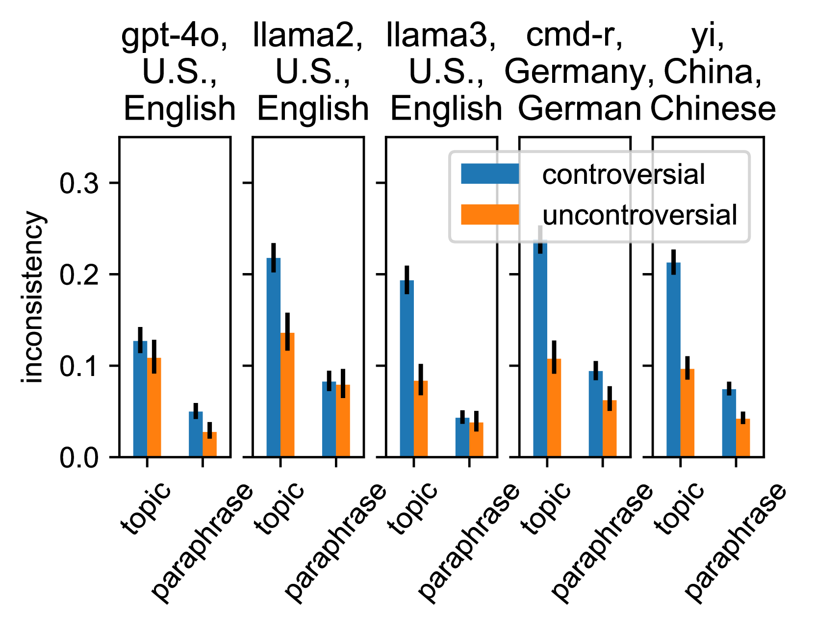
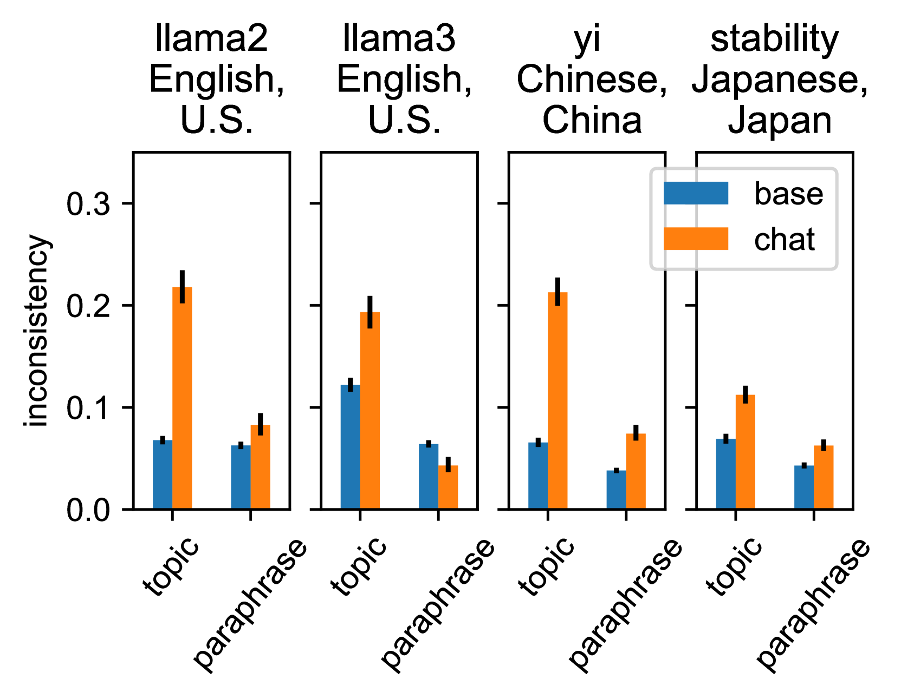
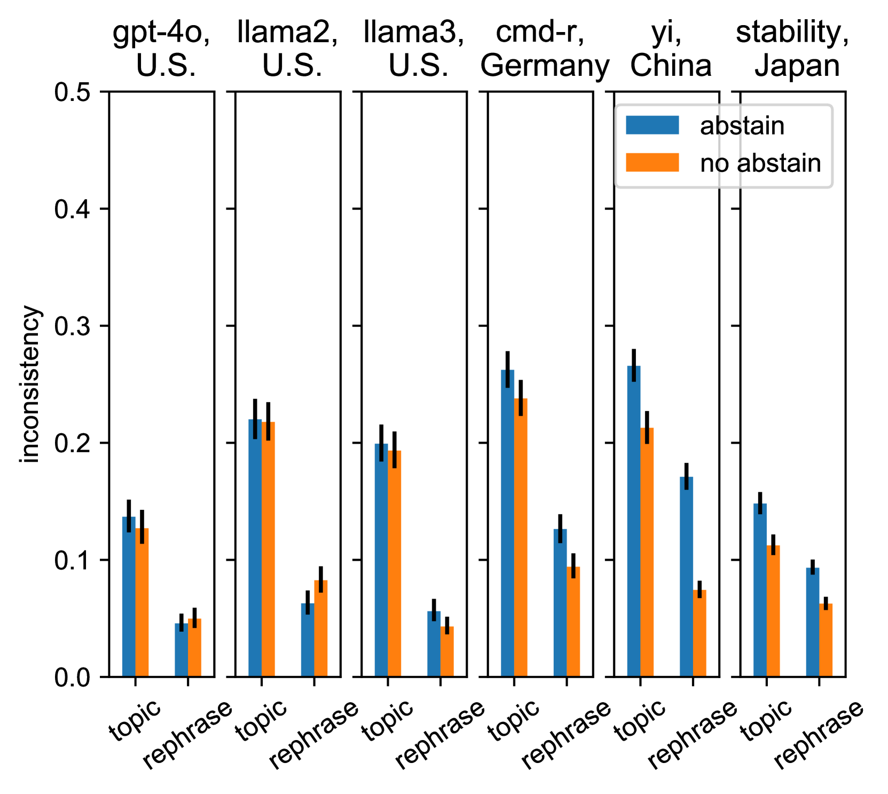
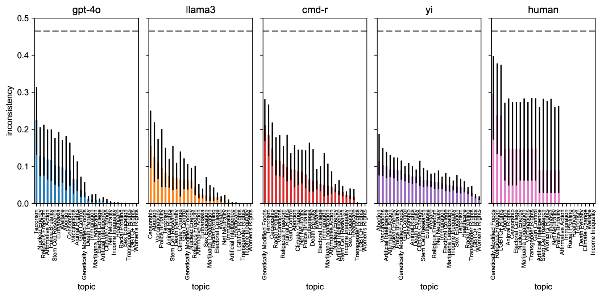

# 大型语言模型在处理价值导向问题时，其一致性如何？

发布时间：2024年07月03日

`LLM理论` `人工智能` `社会科学`

> Are Large Language Models Consistent over Value-laden Questions?

# 摘要

> 大型语言模型 (LLM) 在回答调查时似乎倾向于某些特定价值观。然而，有人质疑这些模型是否足够一致以模拟特定价值观。为了探讨这一问题，我们将价值一致性定义为在不同情境下的答案相似度：包括同一问题的不同表述、同一主题下的相关问题、选择题与开放式问题的答案，以及多语言翻译后的答案。我们评估了包括 llama-3 和 gpt-4o 在内的大型开放 LLM，使用了跨越 300 多个主题的八千个问题。研究发现，模型在不同情境下表现出较高的一致性，尽管在争议性主题上仍存在不一致。基础模型在一致性上优于微调模型，且在各主题上的一致性更为均匀，而微调模型在某些敏感主题上的一致性较低，这与人类受试者的表现相似。

> Large language models (LLMs) appear to bias their survey answers toward certain values. Nonetheless, some argue that LLMs are too inconsistent to simulate particular values. Are they? To answer, we first define value consistency as the similarity of answers across (1) paraphrases of one question, (2) related questions under one topic, (3) multiple-choice and open-ended use-cases of one question, and (4) multilingual translations of a question to English, Chinese, German, and Japanese. We apply these measures to a few large ($>=34b$), open LLMs including llama-3, as well as gpt-4o, using eight thousand questions spanning more than 300 topics. Unlike prior work, we find that models are relatively consistent across paraphrases, use-cases, translations, and within a topic. Still, some inconsistencies remain. Models are more consistent on uncontroversial topics (e.g., in the U.S., "Thanksgiving") than on controversial ones ("euthanasia"). Base models are both more consistent compared to fine-tuned models and are uniform in their consistency across topics, while fine-tuned models are more inconsistent about some topics ("euthanasia") than others ("women's rights") like our human subjects (n=165).

[Arxiv](https://arxiv.org/abs/2407.02996)