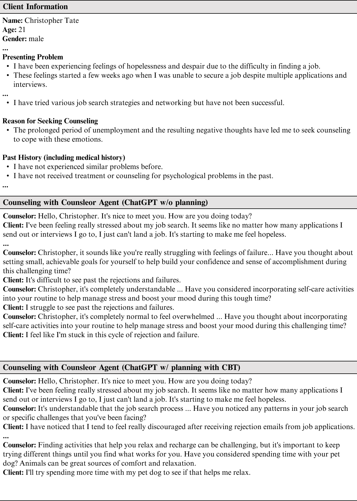

# Cactus：借助认知行为理论，迈向心理咨询对话的新领域

发布时间：2024年07月03日

`LLM应用` `心理健康` `人工智能`

> Cactus: Towards Psychological Counseling Conversations using Cognitive Behavioral Theory

# 摘要

> 随着心理健康问题的关注度上升，心理咨询需求激增，推动了利用大型语言模型（LLM）作为咨询师的应用。然而，保护客户隐私的同时，开源LLM的训练面临数据集缺失的难题。为此，我们推出了Cactus数据集，模拟真实对话，结合认知行为疗法（CBT）的结构化方法。通过设定多样化的客户角色和系统化的CBT应用，我们构建了一个真实且多元的数据集。为确保数据质量，我们依据专业心理评估标准进行验证。实验显示，基于Cactus训练的Camel模型在咨询技能上表现卓越，展现了其作为咨询工具的潜力。我们公开了所有相关资源，以促进心理咨询技术的发展。

> Recently, the demand for psychological counseling has significantly increased as more individuals express concerns about their mental health. This surge has accelerated efforts to improve the accessibility of counseling by using large language models (LLMs) as counselors. To ensure client privacy, training open-source LLMs faces a key challenge: the absence of realistic counseling datasets. To address this, we introduce Cactus, a multi-turn dialogue dataset that emulates real-life interactions using the goal-oriented and structured approach of Cognitive Behavioral Therapy (CBT). We create a diverse and realistic dataset by designing clients with varied, specific personas, and having counselors systematically apply CBT techniques in their interactions. To assess the quality of our data, we benchmark against established psychological criteria used to evaluate real counseling sessions, ensuring alignment with expert evaluations. Experimental results demonstrate that Camel, a model trained with Cactus, outperforms other models in counseling skills, highlighting its effectiveness and potential as a counseling agent. We make our data, model, and code publicly available.

[Arxiv](https://arxiv.org/abs/2407.03103)