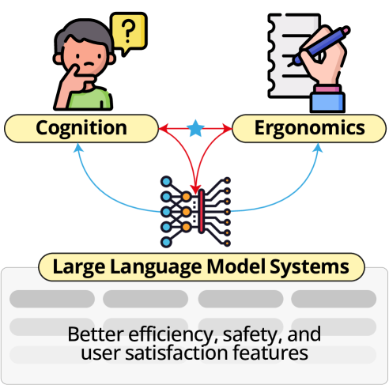
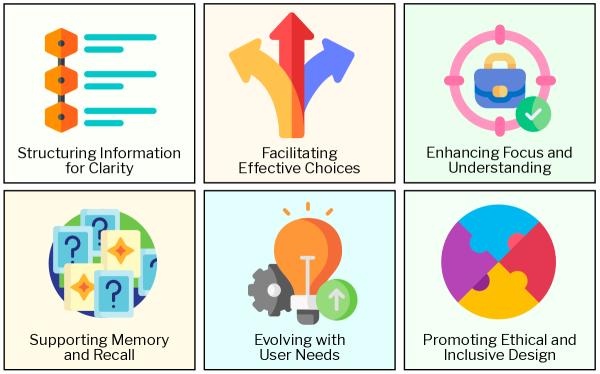
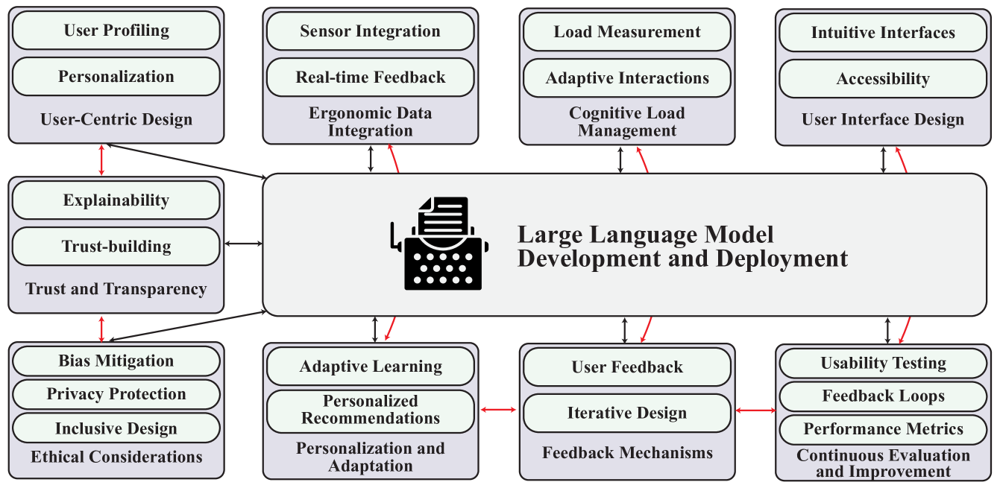

# CogErgLLM：从认知工效学角度探究大型语言模型的系统设计

发布时间：2024年07月03日

`LLM理论` `人机交互` `伦理开发`

> CogErgLLM: Exploring Large Language Model Systems Design Perspective Using Cognitive Ergonomics

# 摘要

> 将认知工效学融入 LLM 设计，对于提升人机交互的安全性、可靠性和用户满意度至关重要。然而，当前 LLM 设计往往忽视了这一点，导致系统与人类认知能力不匹配。缺乏对认知科学方法的整合，不仅加剧了 LLM 输出的偏见，还导致了用户体验的不佳。为此，我们的立场文件深入探讨了如何将认知工效学原则融入 LLM 设计，旨在构建一个全面的伦理开发框架和实用指南。我们的目标是推动认知工效学在 LLM 系统中的应用，从而促进更安全、更可靠且符合伦理的人机交互。

> Integrating cognitive ergonomics with LLMs is essential for enhancing safety, reliability, and user satisfaction in human-AI interactions. Current LLM design often lacks this integration, leading to systems that may not fully align with human cognitive capabilities and limitations. Insufficient focus on incorporating cognitive science methods exacerbates biases in LLM outputs, while inconsistent application of user-centered design principles results in sub-optimal user experiences. To address these challenges, our position paper explores the critical integration of cognitive ergonomics principles into LLM design, aiming to provide a comprehensive framework and practical guidelines for ethical LLM development. Through our contributions, we seek to advance understanding and practice in integrating cognitive ergonomics into LLM systems, fostering safer, more reliable, and ethically sound human-AI interactions.

[Arxiv](https://arxiv.org/abs/2407.02885)