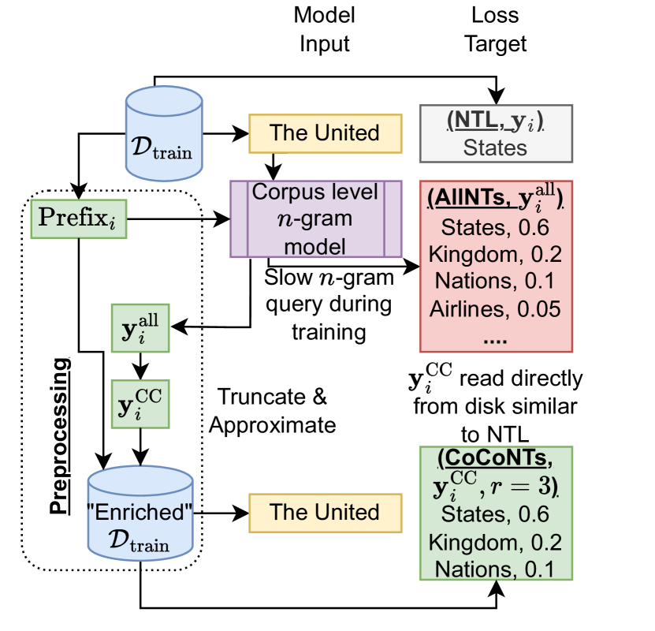
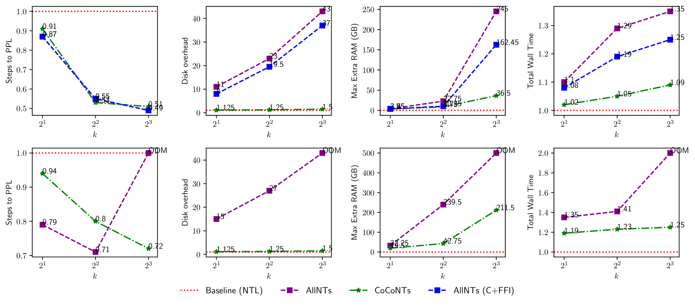
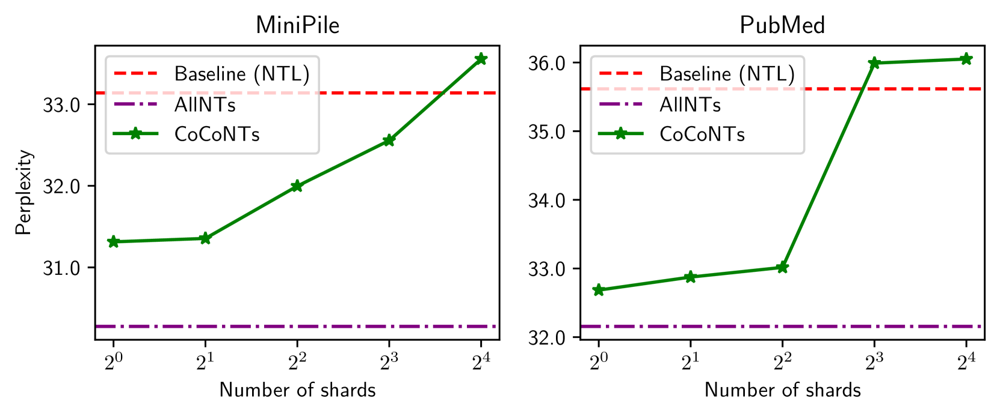
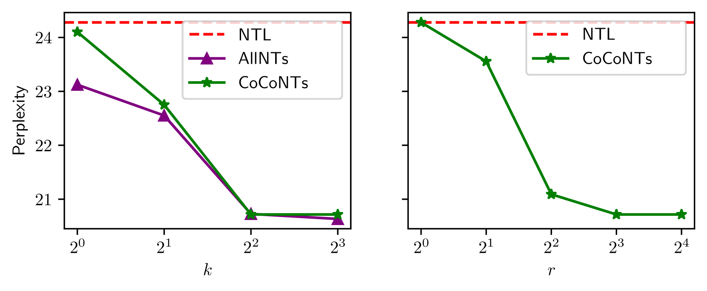
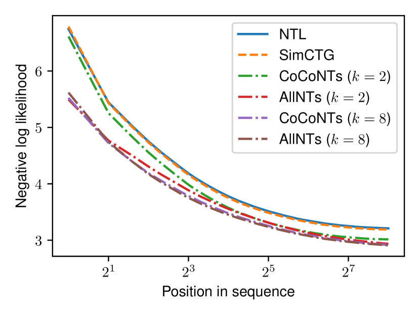
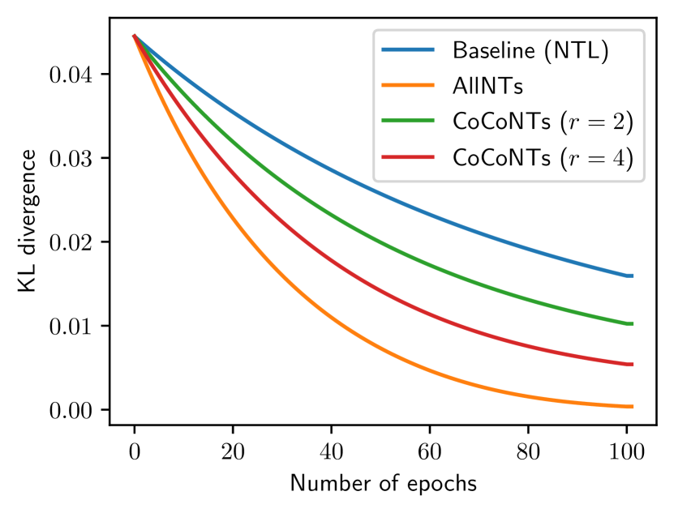
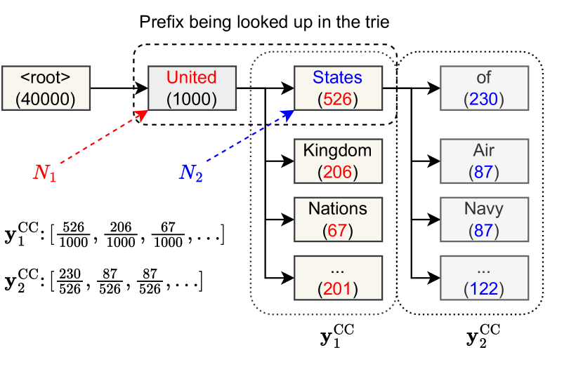

# 通过紧凑一致的下一词分布，实现语言模型的高效训练

发布时间：2024年07月03日

`LLM理论` `人工智能`

> Efficient Training of Language Models with Compact and Consistent Next Token Distributions

# 摘要

> 在预训练语言模型中，最大化下一个词元的似然性是一个既定且统计上合理的优化目标。本文通过预先聚合具有压缩 $n$-gram 分布的语料库，展示了如何更快地训练出更优秀的模型。尽管先前研究提出将语料库级别的 $n$-gram 统计作为正则化器，但其构建和查询过程若处理不当，成本高昂且显著阻碍训练速度，限制了其在大型语言模型预训练中的应用。为此，我们引入了一种紧凑的替代表示方法，该方法在期望上与完整 $n$-gram 分布一致，同时显著减少了小批量间的方差。实证结果显示，无论是 $n$-gram 正则化模型还是我们的近似方法，都显著提升了模型质量和收敛速度。此外，我们的近似方法相较于直接的 $n$-gram 正则化，更有利于在大规模数据集和模型上扩展这些增益。

> Maximizing the likelihood of the next token is an established, statistically sound objective for pre-training language models. In this paper we show that we can train better models faster by pre-aggregating the corpus with a collapsed $n$-gram distribution. Previous studies have proposed corpus-level $n$-gram statistics as a regularizer; however, the construction and querying of such $n$-grams, if done naively, prove to be costly and significantly impede training speed, thereby limiting their application in modern large language model pre-training.
  We introduce an alternative compact representation of the next token distribution that, in expectation, aligns with the complete $n$-gram distribution while markedly reducing variance across mini-batches compared to the standard next-token loss. Empirically, we demonstrate that both the $n$-gram regularized model and our approximation yield substantial improvements in model quality and convergence rate compared to existing methods. Furthermore, our approximation facilitates scalability of gains to larger datasets and models compared to the straightforward $n$-gram regularization method.

[Arxiv](https://arxiv.org/abs/2407.02819)