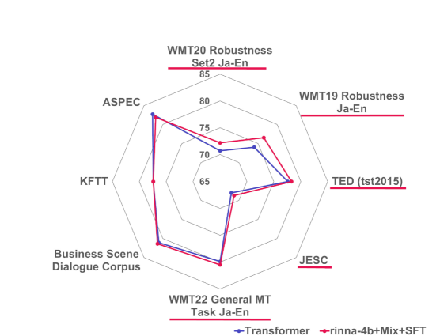
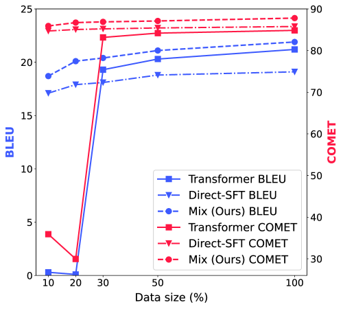
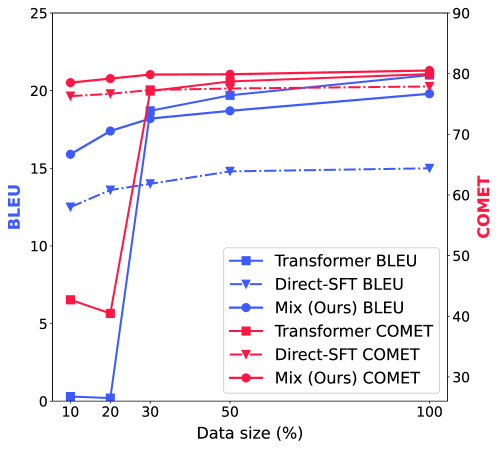
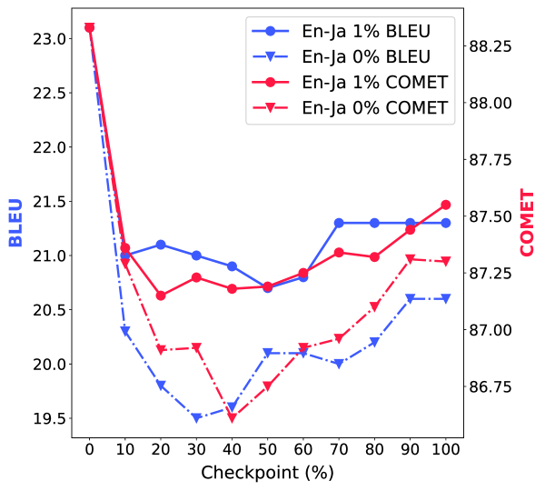

# 借助平行数据的持续预训练，我们能够显著提升大型语言模型的翻译精准度。

发布时间：2024年07月03日

`LLM应用` `机器学习`

> Enhancing Translation Accuracy of Large Language Models through Continual Pre-Training on Parallel Data

# 摘要

> 本文提出了一种两阶段训练策略，先在平行数据上对大型预训练语言模型进行持续预训练，再以少量高质量平行数据进行监督微调。我们通过3.8B参数模型和八种平行数据格式验证了此方法的有效性，并在日英和英日翻译的十三组测试集上进行了评估。实验表明，持续预训练中交替使用源句和目标句至关重要，且翻译准确性仅在预训练与推理的句子顺序一致时提升。此外，基于LLM的翻译模型在处理口语时更稳健，且在较少训练数据下优于传统监督模型。我们还发现，当预训练数据包含交错源句和目标句，并给源句添加标签时，翻译准确性最高。

> In this paper, we propose a two-phase training approach where pre-trained large language models are continually pre-trained on parallel data and then supervised fine-tuned with a small amount of high-quality parallel data. To investigate the effectiveness of our proposed approach, we conducted continual pre-training with a 3.8B-parameter model and parallel data across eight different formats. We evaluate these methods on thirteen test sets for Japanese-to-English and English-to-Japanese translation. The results demonstrate that when utilizing parallel data in continual pre-training, it is essential to alternate between source and target sentences. Additionally, we demonstrated that the translation accuracy improves only for translation directions where the order of source and target sentences aligns between continual pre-training data and inference. In addition, we demonstrate that the LLM-based translation model is more robust in translating spoken language and achieves higher accuracy with less training data compared to supervised encoder-decoder models. We also show that the highest accuracy is achieved when the data for continual pre-training consists of interleaved source and target sentences and when tags are added to the source sentences.

[Arxiv](https://arxiv.org/abs/2407.03145)