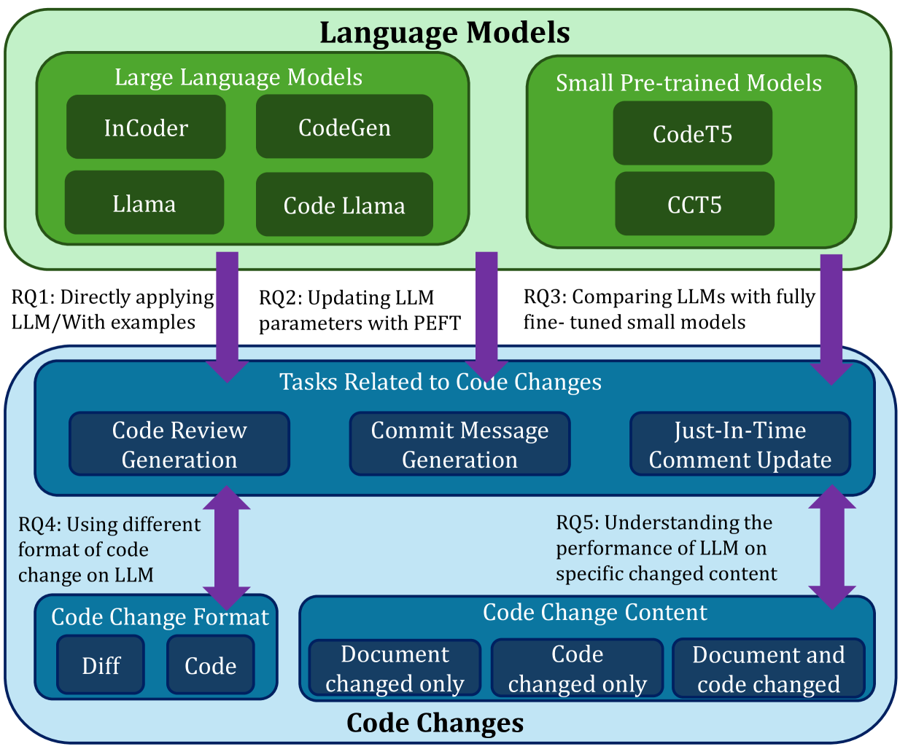
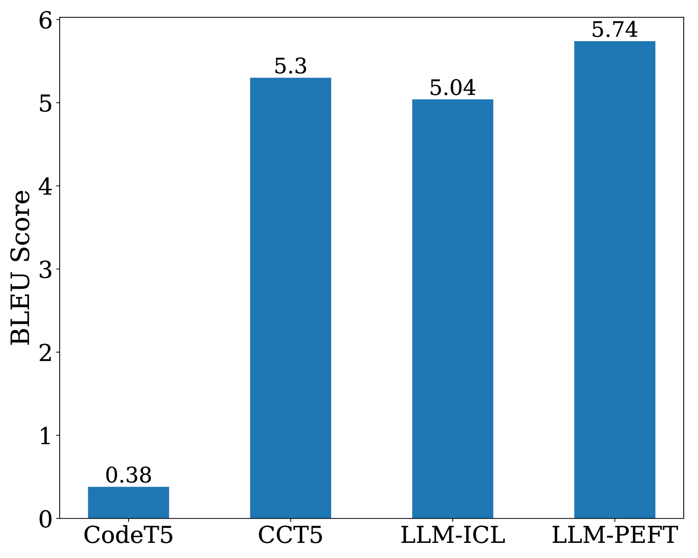
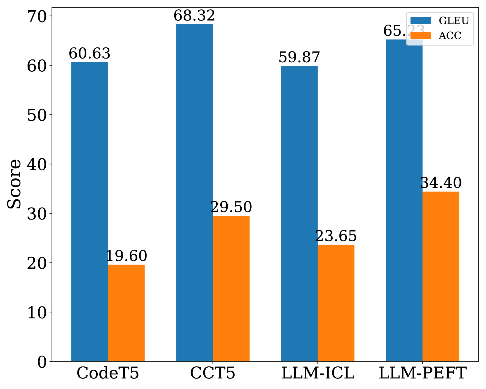
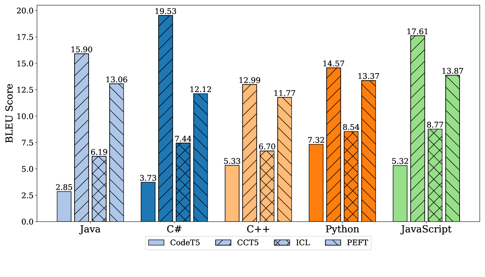

# 探究 LLM 在代码变更任务中的潜能

发布时间：2024年07月03日

`LLM应用` `软件开发` `人工智能`

> Exploring the Capabilities of LLMs for Code Change Related Tasks

# 摘要

> 开发者日常处理代码变更任务，如代码审查。预训练模型已助力此类工作。近期，大型语言模型（LLMs）在代码任务中表现出色，但主要关注通用代码特性，而非版本差异。我们通过实证研究，利用超10亿参数的LLMs，针对代码审查生成等三项任务，结合上下文学习和参数高效微调（PEFT），发现无示例时性能不佳，示例增多性能提升，但并非越多越好。LoRA微调的LLMs与顶尖小型模型性能相当，大模型未必更优，但Llama 2和Code Llama系列始终领先。最佳LLMs在注释修改上超越小型模型，其他变更中表现相当。未来研究应聚焦于指导LLMs掌握代码变更的特定知识，而非仅注释相关。

> Developers deal with code-change-related tasks daily, e.g., reviewing code. Pre-trained code and code-change-oriented models have been adapted to help developers with such tasks. Recently, large language models (LLMs) have shown their effectiveness in code-related tasks. However, existing LLMs for code focus on general code syntax and semantics rather than the differences between two code versions. Thus, it is an open question how LLMs perform on code-change-related tasks.
  To answer this question, we conduct an empirical study using \textgreater 1B parameters LLMs on three code-change-related tasks, i.e., code review generation, commit message generation, and just-in-time comment update, with in-context learning (ICL) and parameter-efficient fine-tuning (PEFT, including LoRA and prefix-tuning). We observe that the performance of LLMs is poor without examples and generally improves with examples, but more examples do not always lead to better performance. LLMs tuned with LoRA have comparable performance to the state-of-the-art small pre-trained models. Larger models are not always better, but \textsc{Llama~2} and \textsc{Code~Llama} families are always the best. The best LLMs outperform small pre-trained models on the code changes that only modify comments and perform comparably on other code changes. We suggest future work should focus more on guiding LLMs to learn the knowledge specific to the changes related to code rather than comments for code-change-related tasks.

[Arxiv](https://arxiv.org/abs/2407.02824)