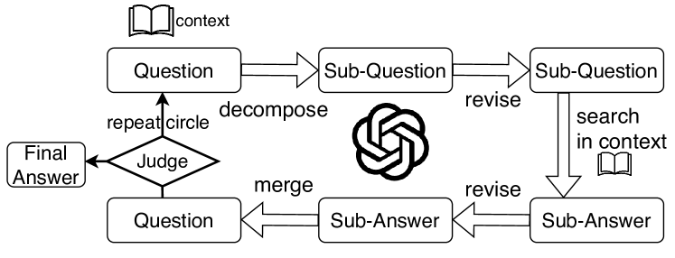
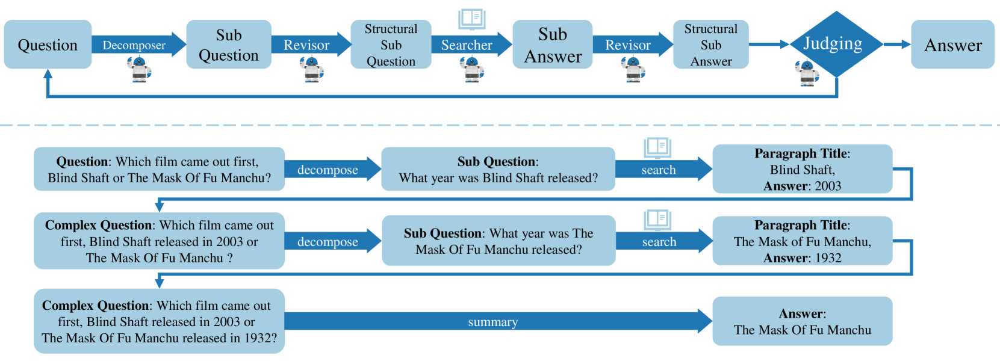
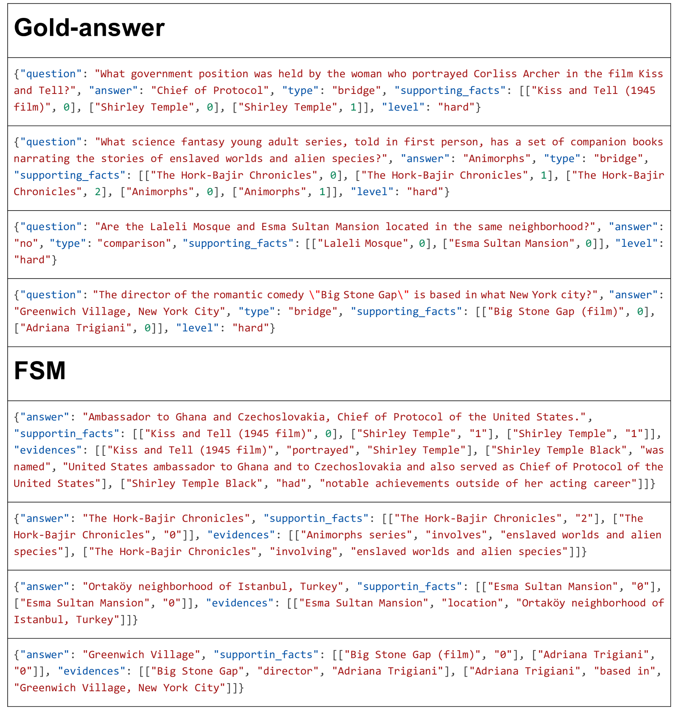
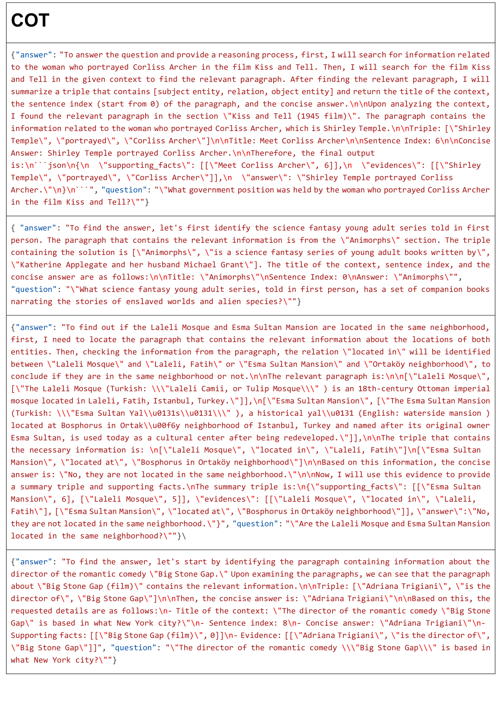
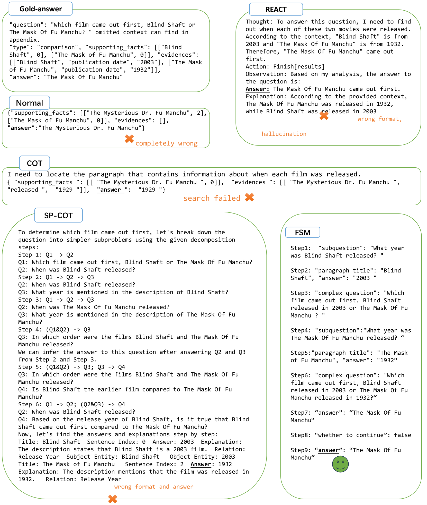

# FSM：一种基于有限状态机的零-shot 提示方法，专为多跳问题回答设计

发布时间：2024年07月03日

`LLM应用` `人工智能`

> FSM: A Finite State Machine Based Zero-Shot Prompting Paradigm for Multi-Hop Question Answering

# 摘要

> 结合思维链提示的大型语言模型在简单推理任务上表现卓越，但在多跳问答任务中因幻觉、错误传播等问题表现欠佳。为此，我们引入了有限状态机提示法，通过迭代分解问题并实时自校，显著提升复杂任务的推理精度和可信度。实验表明，该方法在挑战性数据集上超越基线，有效缓解了中间错误导致的幻觉问题，并强化了模型遵循输出格式的能力，大幅简化了答案解读与格式调整的复杂性。

> Large Language Models (LLMs) with chain-of-thought (COT) prompting have demonstrated impressive abilities on simple nature language inference tasks. However, they tend to perform poorly on Multi-hop Question Answering (MHQA) tasks due to several challenges, including hallucination, error propagation and limited context length. We propose a prompting method, Finite State Machine (FSM) to enhance the reasoning capabilities of LLM for complex tasks in addition to improved effectiveness and trustworthiness. Different from COT methods, FSM addresses MHQA by iteratively decomposing a question into multi-turn sub-questions, and self-correcting in time, improving the accuracy of answers in each step. Specifically, FSM addresses one sub-question at a time and decides on the next step based on its current result and state, in an automaton-like format. Experiments on benchmarks show the effectiveness of our method. Although our method performs on par with the baseline on relatively simpler datasets, it excels on challenging datasets like Musique. Moreover, this approach mitigates the hallucination phenomenon, wherein the correct final answer can be recovered despite errors in intermediate reasoning. Furthermore, our method improves LLMs' ability to follow specified output format requirements, significantly reducing the difficulty of answer interpretation and the need for reformatting.

[Arxiv](https://arxiv.org/abs/2407.02964)