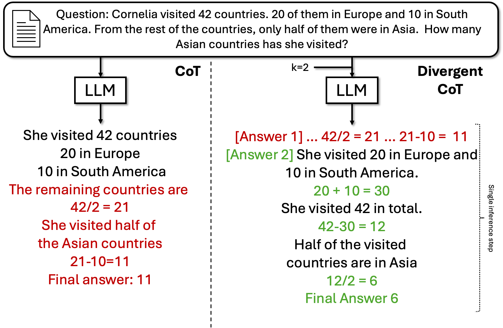
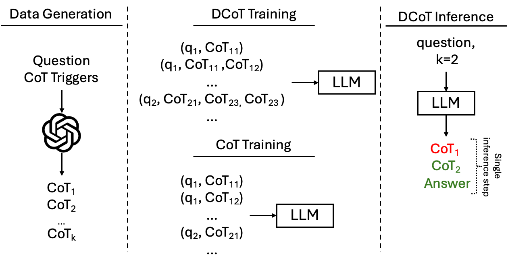
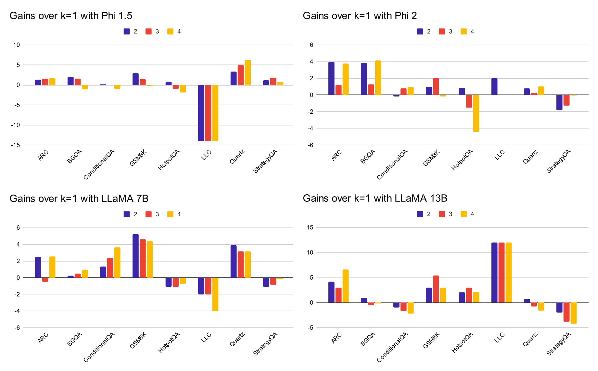

# 采用多样化的思维链进行微调，能显著提升语言模型通过自我纠错机制进行推理的能力。

发布时间：2024年07月03日

`LLM应用` `人工智能`

> Fine-Tuning with Divergent Chains of Thought Boosts Reasoning Through Self-Correction in Language Models

# 摘要

> 我们发现，要求大型语言模型生成中间推理步骤能显著提升性能。为此，我们创新性地提出了Divergent CoT（DCoT）方法，即在生成答案前比较多个推理链。实验证明，对DCoT数据集进行指令调整不仅能提升大型模型性能，还能使更小、更易获取的LLM受益。跨越多样任务的严格实验显示，DCoT微调始终优于传统方法，且性能提升源自模型在单步推理中展现的多链发散能力，这标志着语言模型自我修正能力的增强。相关代码和数据已公开，详见https://github.com/UKPLab/arxiv2024-divergent-cot。

> Requiring a Large Language Model to generate intermediary reasoning steps has been shown to be an effective way of boosting performance. In fact, it has been found that instruction tuning on these intermediary reasoning steps improves model performance. In this work, we present a novel method of further improving performance by requiring models to compare multiple reasoning chains before generating a solution in a single inference step. We call this method Divergent CoT (DCoT). We find that instruction tuning on DCoT datasets boosts the performance of even smaller, and therefore more accessible, LLMs. Through a rigorous set of experiments spanning a wide range of tasks that require various reasoning types, we show that fine-tuning on DCoT consistently improves performance over the CoT baseline across model families and scales (1.3B to 70B). Through a combination of empirical and manual evaluation, we additionally show that these performance gains stem from models generating multiple divergent reasoning chains in a single inference step, indicative of the enabling of self-correction in language models. Our code and data are publicly available at https://github.com/UKPLab/arxiv2024-divergent-cot.

[Arxiv](https://arxiv.org/abs/2407.03181)