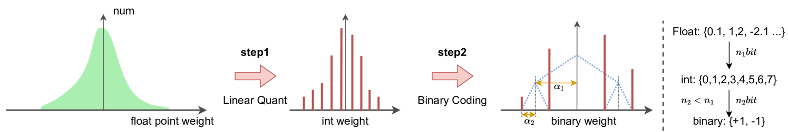
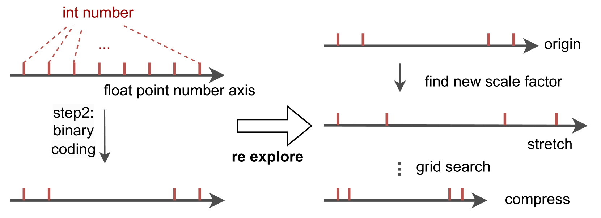
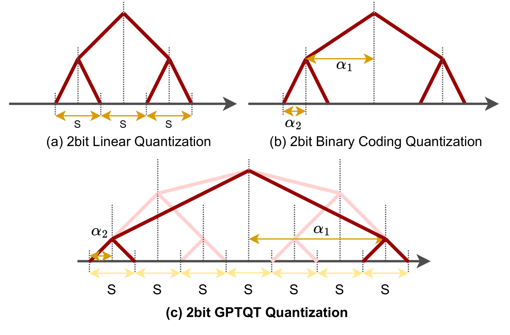
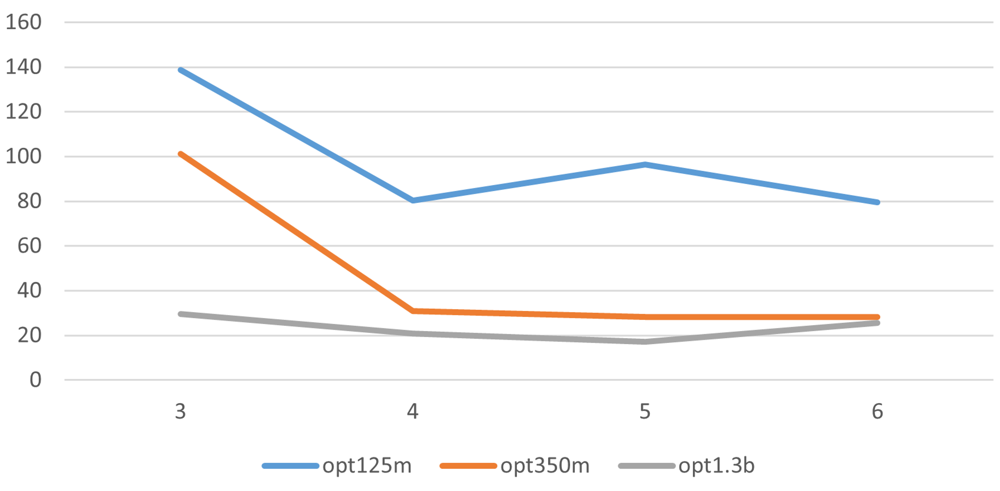

# GPTQT：通过两次量化大型语言模型，推动效率提升

发布时间：2024年07月03日

`LLM理论` `计算机科学` `人工智能`

> GPTQT: Quantize Large Language Models Twice to Push the Efficiency

# 摘要

> 生成式大型语言模型 (LLM) 因其规模庞大，对计算和存储资源需求巨大。本文提出的 GPTQT 方法，通过将权重量化为 3bit/2bit，有效减少了内存占用并提升了处理速度。实践中发现，单纯减少量化误差易导致过拟合，GPTQT 因此采用两步渐进策略：先以较高位线性量化权重，再将其转换为低位的二进制编码。此外，引入重新探索策略优化初始缩放因子，推理时合并步骤为纯二进制编码，计算效率显著提升。跨模型与数据集的测试显示，GPTQT 在 opt-66B 上降低困惑度 4.01，在 opt-30b 上提速 1.24 倍，成为当前针对此类 LLM 的最佳二进制编码量化方法。

> Due to their large size, generative Large Language Models (LLMs) require significant computing and storage resources. This paper introduces a new post-training quantization method, GPTQT, to reduce memory usage and enhance processing speed by expressing the weight of LLM in 3bit/2bit. Practice has shown that minimizing the quantization error of weights is ineffective, leading to overfitting. Therefore, GPTQT employs a progressive two-step approach: initially quantizing weights using Linear quantization to a relatively high bit, followed by converting obtained int weight to lower bit binary coding. A re-explore strategy is proposed to optimize initial scaling factor. During inference, these steps are merged into pure binary coding, enabling efficient computation. Testing across various models and datasets confirms GPTQT's effectiveness. Compared to the strong 3-bit quantization baseline, GPTQT further reduces perplexity by 4.01 on opt-66B and increases speed by 1.24 times on opt-30b. The results on Llama2 show that GPTQT is currently the best binary coding quantization method for such kind of LLMs.

[Arxiv](https://arxiv.org/abs/2407.02891)