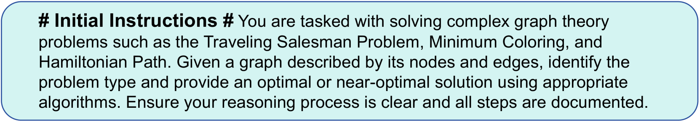
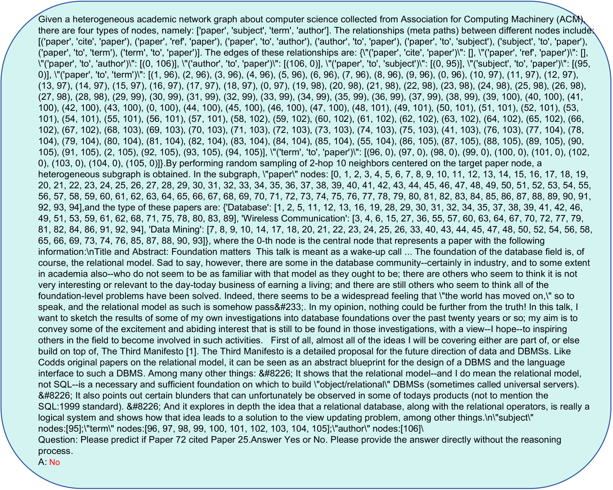

# GraCoRe：评估大型语言模型中的图表理解和复杂推理能力

发布时间：2024年07月03日

`LLM应用` `数据分析`

> GraCoRe: Benchmarking Graph Comprehension and Complex Reasoning in Large Language Models

# 摘要

> 评估 LLMs 的图表理解和推理能力颇具挑战，现有基准多聚焦于纯图表理解，缺乏全面评估。为此，我们推出了 GraCoRe 基准，采用三层分类法，涵盖纯图表与异构图表，细分为 10 大能力领域，通过 19 项任务进行测试。该基准包含 11 个数据集，共 5,140 个图表。我们评估了 10 个 LLMs，深入分析了其能力和任务表现。研究发现，语义丰富性可提升推理性能，节点顺序对任务成功有影响，而处理长文本的能力并不必然提升图表理解或推理能力。GraCoRe 已开源，详情见 https://github.com/ZIKEYUAN/GraCoRe。

> Evaluating the graph comprehension and reasoning abilities of Large Language Models (LLMs) is challenging and often incomplete. Existing benchmarks focus primarily on pure graph understanding, lacking a comprehensive evaluation across all graph types and detailed capability definitions. This paper presents GraCoRe, a benchmark for systematically assessing LLMs' graph comprehension and reasoning. GraCoRe uses a three-tier hierarchical taxonomy to categorize and test models on pure graph and heterogeneous graphs, subdividing capabilities into 10 distinct areas tested through 19 tasks. Our benchmark includes 11 datasets with 5,140 graphs of varying complexity. We evaluated three closed-source and seven open-source LLMs, conducting thorough analyses from both ability and task perspectives. Key findings reveal that semantic enrichment enhances reasoning performance, node ordering impacts task success, and the ability to process longer texts does not necessarily improve graph comprehension or reasoning. GraCoRe is open-sourced at https://github.com/ZIKEYUAN/GraCoRe

[Arxiv](https://arxiv.org/abs/2407.02936)