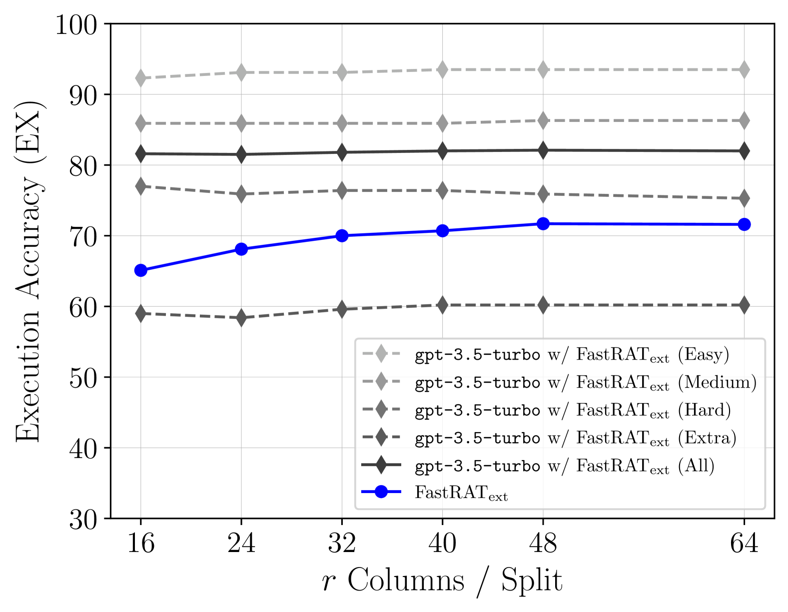
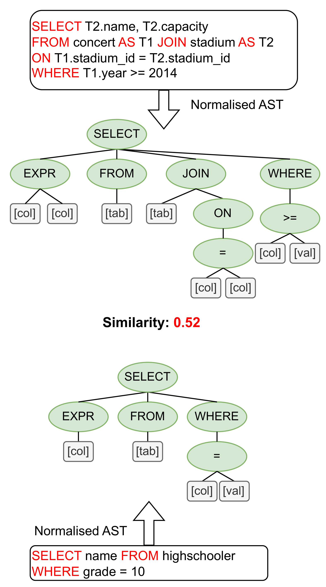

# 通过结合基于抽象语法树的排序和模式剪枝技术，提升检索增强型文本到SQL的转换效率。

发布时间：2024年07月03日

`LLM应用` `商业智能` `数据库`

> Improving Retrieval-augmented Text-to-SQL with AST-based Ranking and Schema Pruning

# 摘要

> 我们聚焦于大型语言模型视角下的 Text-to-SQL 语义解析。鉴于商业数据库模式庞大与商业智能解决方案的可部署性挑战，我们提出动态检索数据库信息，并利用抽象语法树精选少量样本进行上下文学习。同时，我们探索并行语义解析器在生成预期 SQL 查询近似版本中的应用，以支持检索。我们甚至将此方法推向极致，调整一个仅含 5 亿参数的模型，使其成为高效近似器，并赋予其并行处理模式的能力。在单语与跨语语义解析基准测试中，我们的方法超越了现有最佳基线。详尽实验不仅凸显了检索增强生成设置中各模块的贡献，更为未来研究指明了新方向。

> We focus on Text-to-SQL semantic parsing from the perspective of Large Language Models. Motivated by challenges related to the size of commercial database schemata and the deployability of business intelligence solutions, we propose an approach that dynamically retrieves input database information and uses abstract syntax trees to select few-shot examples for in-context learning.
  Furthermore, we investigate the extent to which an in-parallel semantic parser can be leveraged for generating $\textit{approximated}$ versions of the expected SQL queries, to support our retrieval. We take this approach to the extreme--we adapt a model consisting of less than $500$M parameters, to act as an extremely efficient approximator, enhancing it with the ability to process schemata in a parallelised manner. We apply our approach to monolingual and cross-lingual benchmarks for semantic parsing, showing improvements over state-of-the-art baselines. Comprehensive experiments highlight the contribution of modules involved in this retrieval-augmented generation setting, revealing interesting directions for future work.

[Arxiv](https://arxiv.org/abs/2407.03227)