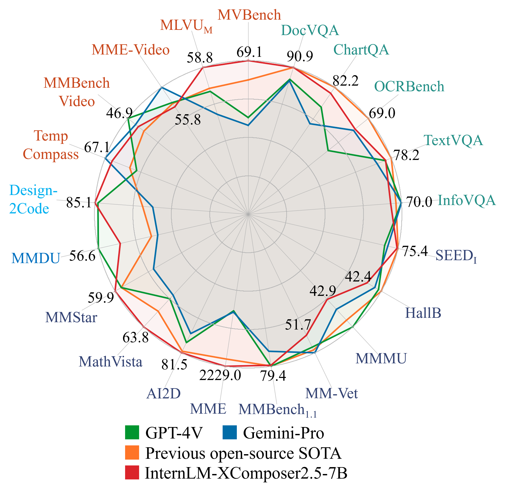
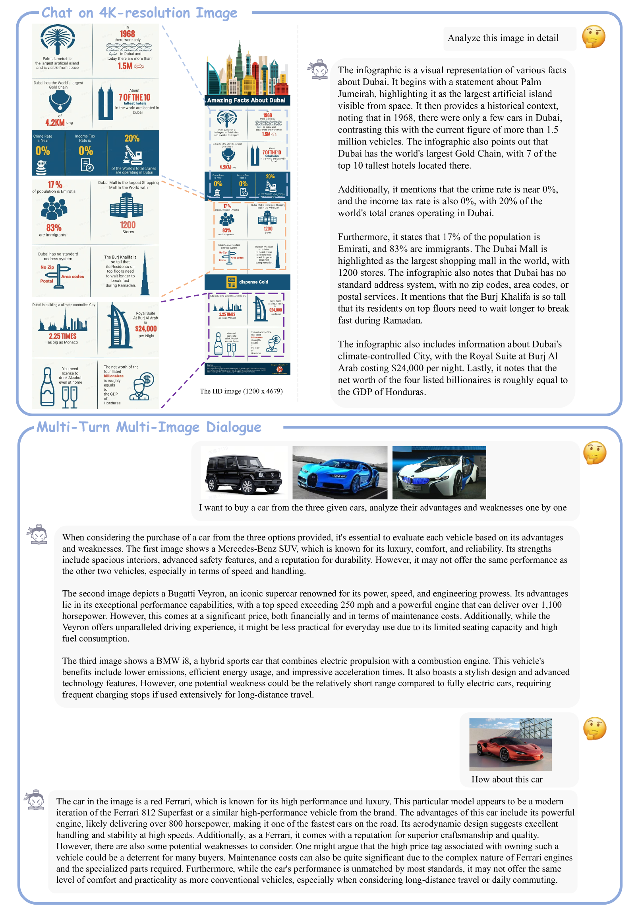
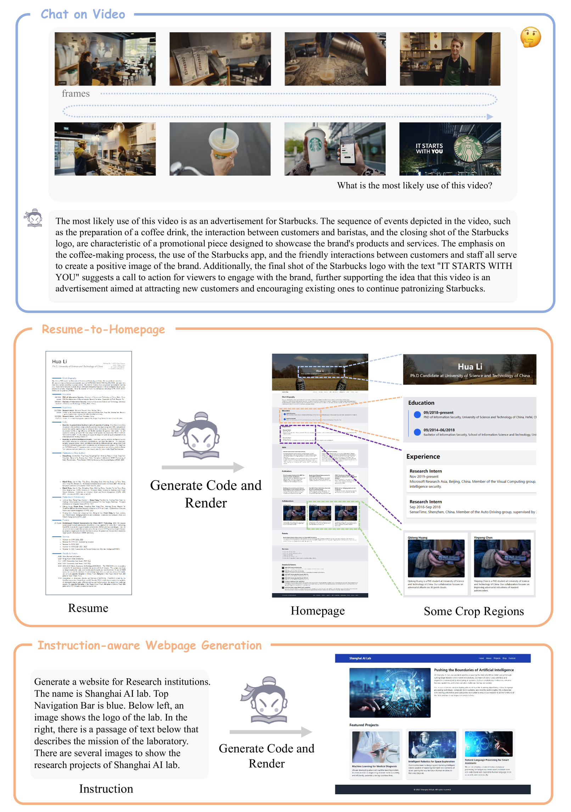
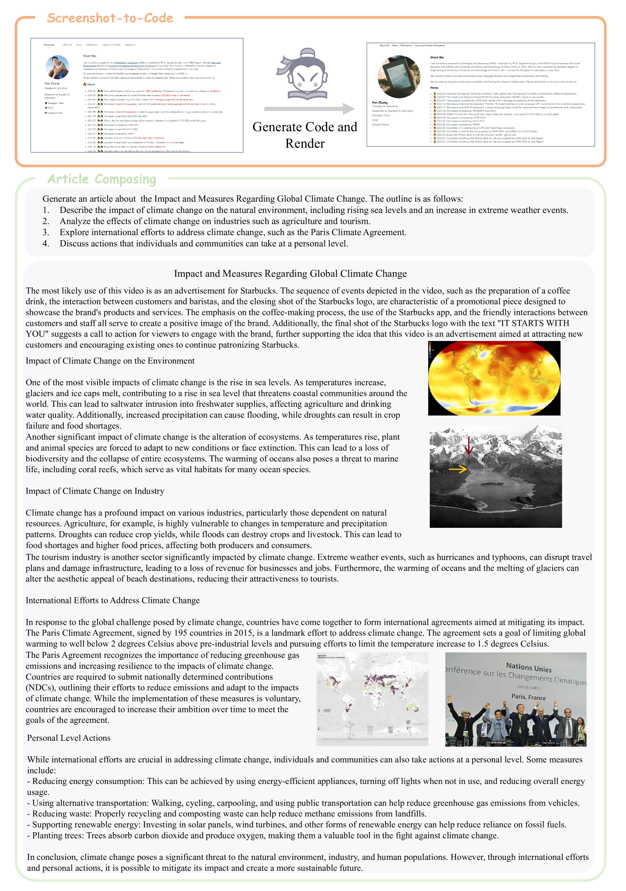
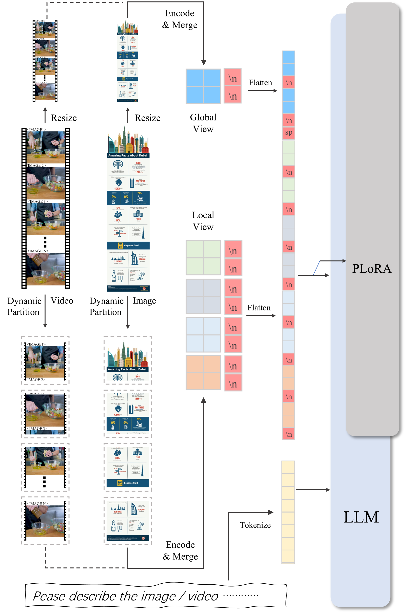

# InternLM-XComposer-2.5：一款多功能大型视觉语言模型，专为长上下文输入与输出设计。

发布时间：2024年07月03日

`LLM应用` `网页制作` `媒体创作`

> InternLM-XComposer-2.5: A Versatile Large Vision Language Model Supporting Long-Contextual Input and Output

# 摘要

> 我们推出了 InternLM-XComposer-2.5（IXC-2.5），一款支持长上下文输入输出的多功能大型视觉语言模型。IXC-2.5 在文本图像理解和合成领域表现卓越，仅凭 7B LLM 后端即达到 GPT-4V 级性能。经过 24K 交错图像文本上下文的训练，它能通过 RoPE 外推无缝扩展至 96K 长上下文，从而在需要大量上下文的任务中大放异彩。相较于 2.0 版本，IXC-2.5 在视觉语言理解方面实现了三大飞跃：超高分辨率理解、细粒度视频理解及多轮多图像对话。此外，IXC-2.5 利用额外 LoRA 参数，拓展至两大创新应用：网页制作与高质量文本图像文章创作。在 28 个基准测试中，IXC-2.5 在 16 个项目上超越了现有开源顶尖模型，并在 16 个关键任务上与 GPT-4V 和 Gemini Pro 一较高下。该模型已公开，访问地址为 https://github.com/InternLM/InternLM-XComposer。

> We present InternLM-XComposer-2.5 (IXC-2.5), a versatile large-vision language model that supports long-contextual input and output. IXC-2.5 excels in various text-image comprehension and composition applications, achieving GPT-4V level capabilities with merely 7B LLM backend. Trained with 24K interleaved image-text contexts, it can seamlessly extend to 96K long contexts via RoPE extrapolation. This long-context capability allows IXC-2.5 to excel in tasks requiring extensive input and output contexts. Compared to its previous 2.0 version, InternLM-XComposer-2.5 features three major upgrades in vision-language comprehension: (1) Ultra-High Resolution Understanding, (2) Fine-Grained Video Understanding, and (3) Multi-Turn Multi-Image Dialogue. In addition to comprehension, IXC-2.5 extends to two compelling applications using extra LoRA parameters for text-image composition: (1) Crafting Webpages and (2) Composing High-Quality Text-Image Articles. IXC-2.5 has been evaluated on 28 benchmarks, outperforming existing open-source state-of-the-art models on 16 benchmarks. It also surpasses or competes closely with GPT-4V and Gemini Pro on 16 key tasks. The InternLM-XComposer-2.5 is publicly available at https://github.com/InternLM/InternLM-XComposer.

[Arxiv](https://arxiv.org/abs/2407.03320)