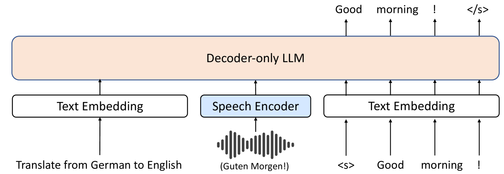

# 探索仅解码器大型语言模型在语音转文本翻译中的应用

发布时间：2024年07月03日

`LLM应用` `语音识别` `机器翻译`

> Investigating Decoder-only Large Language Models for Speech-to-text Translation

# 摘要

> 大型语言模型 (LLM) 因其卓越的推理能力和跨领域的流畅性，为提升语音相关任务展现了光明前景。本文聚焦于将仅解码器的 LLM 应用于语音到文本翻译 (S2TT) 任务。我们设计了一种仅解码器架构，使 LLM 能直接处理语音编码并输出文本翻译。同时，我们探讨了参数高效微调技术和任务设计的效用。在没有使用专有数据训练的模型中，我们的模型在 CoVoST 2 和 FLEURS 上表现卓越。此外，我们通过分析验证了模型设计的合理性，并为 LLM 在 S2TT 任务中的应用提供了新视角。

> Large language models (LLMs), known for their exceptional reasoning capabilities, generalizability, and fluency across diverse domains, present a promising avenue for enhancing speech-related tasks. In this paper, we focus on integrating decoder-only LLMs to the task of speech-to-text translation (S2TT). We propose a decoder-only architecture that enables the LLM to directly consume the encoded speech representation and generate the text translation. Additionally, we investigate the effects of different parameter-efficient fine-tuning techniques and task formulation. Our model achieves state-of-the-art performance on CoVoST 2 and FLEURS among models trained without proprietary data. We also conduct analyses to validate the design choices of our proposed model and bring insights to the integration of LLMs to S2TT.

[Arxiv](https://arxiv.org/abs/2407.03169)