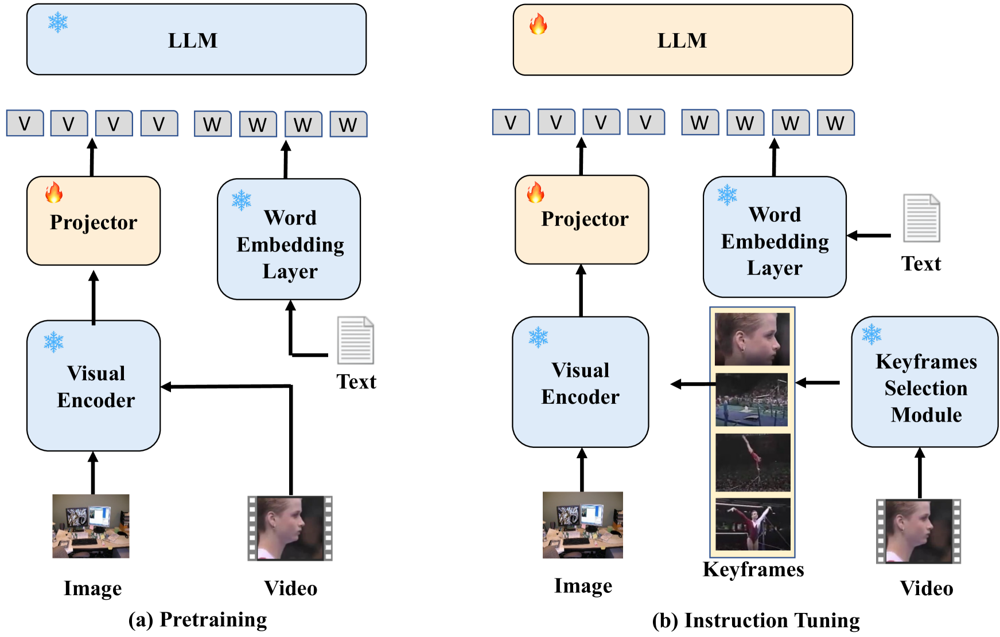

# KeyVideoLLM：探索大规模视频关键帧的精选之道

发布时间：2024年07月03日

`LLM应用` `视频处理` `人工智能`

> KeyVideoLLM: Towards Large-scale Video Keyframe Selection

# 摘要

> 随着网络视频的兴起，大规模视频数据集的管理与理解变得愈发关键。视频大型语言模型（VideoLLMs）因其卓越的视频理解能力而崭露头角，但其对海量数据的需求给数据管理带来了挑战，尤其是在效率、鲁棒性和有效性方面。为此，我们推出了KeyVideoLLM，一种基于文本-视频帧相似性的关键帧选择方法，旨在高效、稳健且有效地管理VideoLLM数据。KeyVideoLLM不仅实现了高达60.9倍的数据压缩率，大幅节省了存储空间，还保持了100%的选择成功率，并在处理速度上比现有方法快200倍，且无需调整超参数。此外，它在视频问答任务中显著提升了模型性能，并在多个数据集上持续刷新最先进（SoTA）的实验记录。

> Recently, with the rise of web videos, managing and understanding large-scale video datasets has become increasingly important. Video Large Language Models (VideoLLMs) have emerged in recent years due to their strong video understanding capabilities. However, training and inference processes for VideoLLMs demand vast amounts of data, presenting significant challenges to data management, particularly regarding efficiency, robustness, and effectiveness. In this work, we present KeyVideoLLM, a text-video frame similarity-based keyframe selection method designed to manage VideoLLM data efficiently, robustly, and effectively. Specifically, KeyVideoLLM achieves a remarkable data compression rate of up to 60.9 times, substantially lowering disk space requirements, which proves its high efficiency. Additionally, it maintains a 100% selection success rate across all video formats and scales, enhances processing speed by up to 200 times compared to existing keyframe selection methods, and does not require hyperparameter tuning. Beyond its outstanding efficiency and robustness, KeyVideoLLM further improves model performance in video question-answering tasks during both training and inference stages. Notably, it consistently achieved the state-of-the-art (SoTA) experimental results on diverse datasets.

[Arxiv](https://arxiv.org/abs/2407.03104)