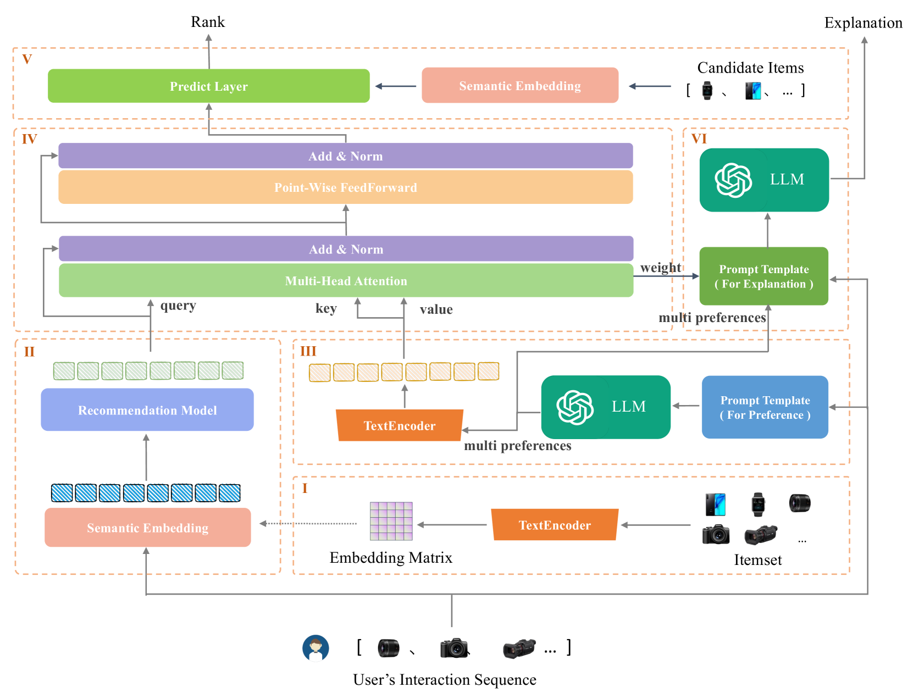
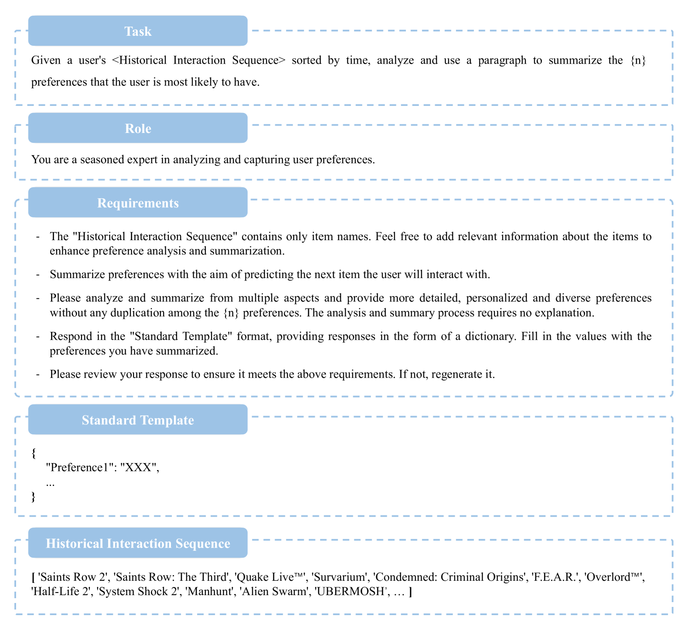
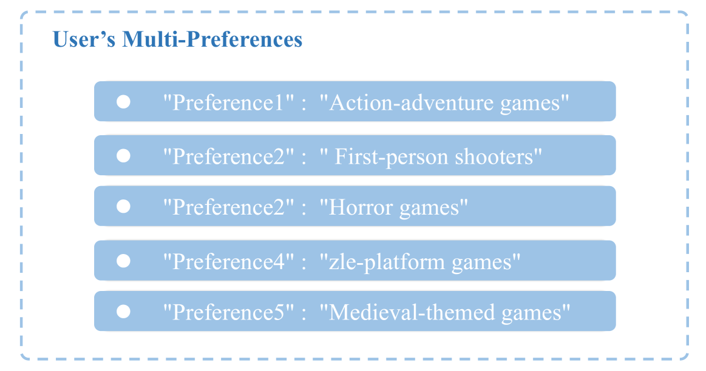
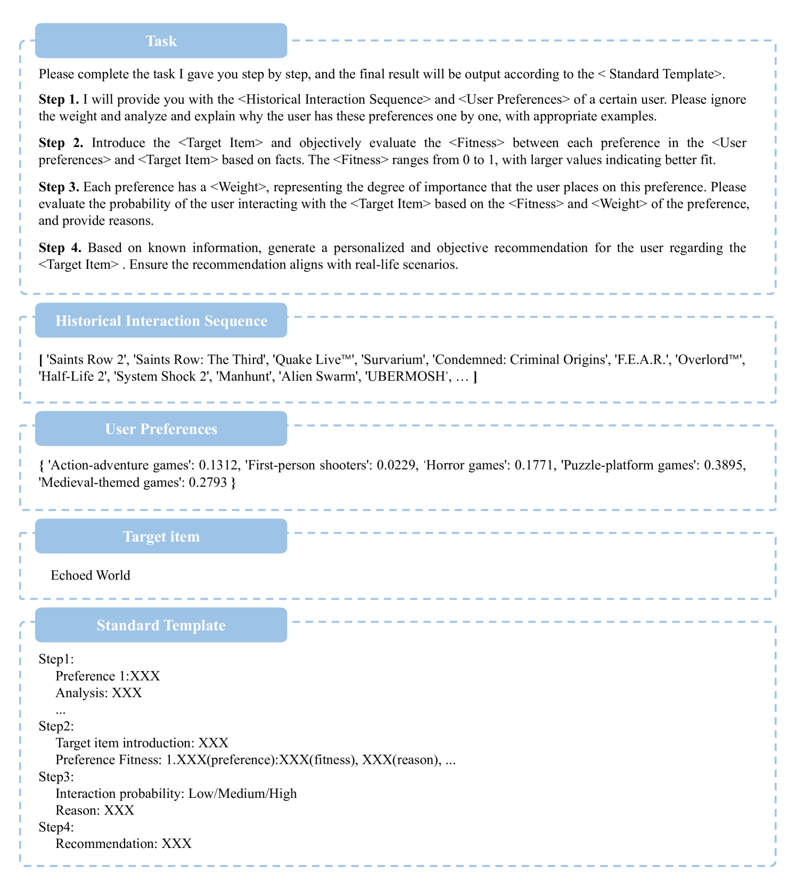
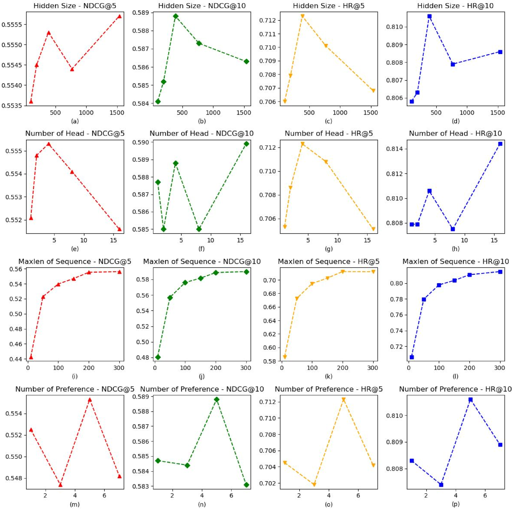
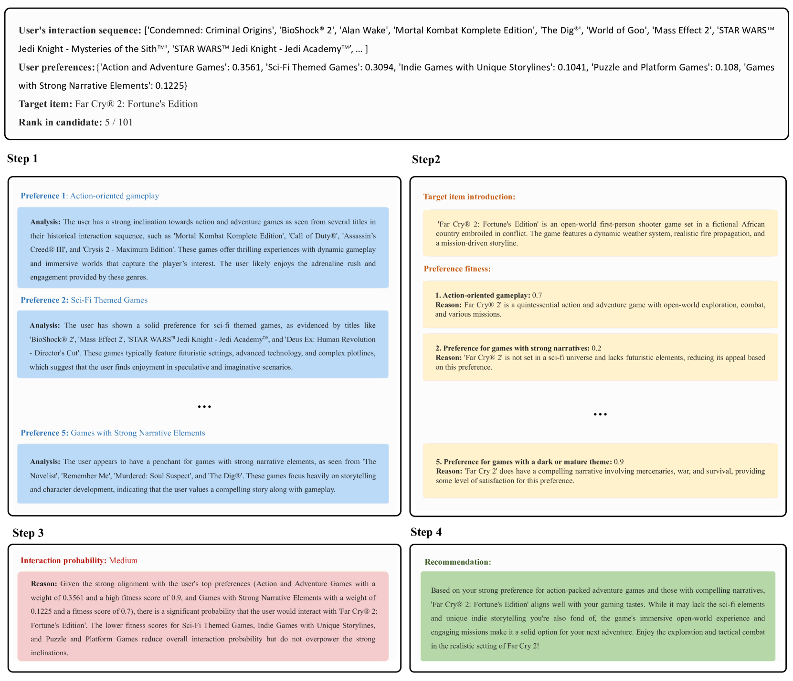
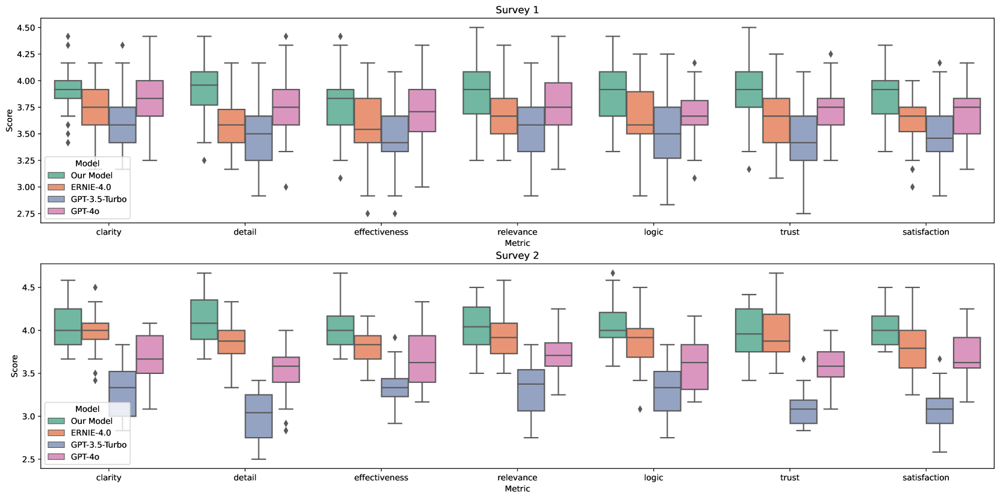
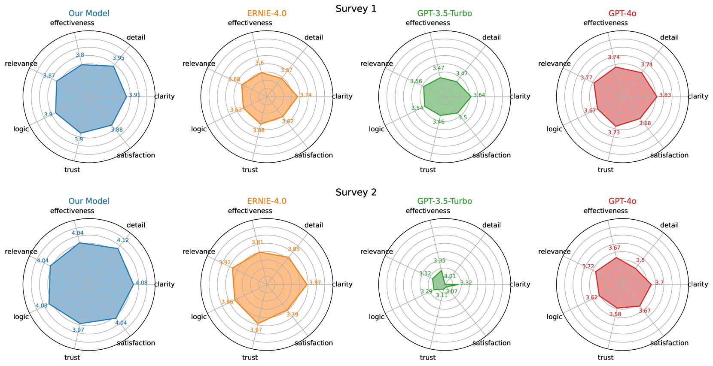

# LANE：实现非调优大型语言模型与在线推荐系统的逻辑对齐，旨在生成可解释的推理。

发布时间：2024年07月03日

`LLM应用` `推荐系统` `用户体验`

> LANE: Logic Alignment of Non-tuning Large Language Models and Online Recommendation Systems for Explainable Reason Generation

# 摘要

> 推荐系统的透明度是提升用户信任与满意度的关键。借助大型语言模型（LLM），我们迎来了全面推荐逻辑生成的新契机。然而，现有研究在为推荐任务微调LLM时，面临高昂计算成本及与现有系统对齐的难题，这限制了如GPT-4等专有/闭源LLM模型的应用前景。为此，我们创新性地提出了LANE策略，无需额外微调即可实现LLM与在线推荐系统的无缝对接，既降低了成本，又增强了可解释性。该策略通过语义嵌入、零-shot提示下的用户多偏好提取、语义对齐及思维链（CoT）提示下的可解释推荐生成等关键环节，确保了用户偏好与候选项目的语义一致性，从而提供连贯且贴合用户需求的推荐。实验结果显示，我们的方法不仅保障了推荐质量，更以直观易懂的方式呈现了推荐逻辑，赢得了用户的广泛认可。

> The explainability of recommendation systems is crucial for enhancing user trust and satisfaction. Leveraging large language models (LLMs) offers new opportunities for comprehensive recommendation logic generation. However, in existing related studies, fine-tuning LLM models for recommendation tasks incurs high computational costs and alignment issues with existing systems, limiting the application potential of proven proprietary/closed-source LLM models, such as GPT-4. In this work, our proposed effective strategy LANE aligns LLMs with online recommendation systems without additional LLMs tuning, reducing costs and improving explainability. This innovative approach addresses key challenges in integrating language models with recommendation systems while fully utilizing the capabilities of powerful proprietary models. Specifically, our strategy operates through several key components: semantic embedding, user multi-preference extraction using zero-shot prompting, semantic alignment, and explainable recommendation generation using Chain of Thought (CoT) prompting. By embedding item titles instead of IDs and utilizing multi-head attention mechanisms, our approach aligns the semantic features of user preferences with those of candidate items, ensuring coherent and user-aligned recommendations. Sufficient experimental results including performance comparison, questionnaire voting, and visualization cases prove that our method can not only ensure recommendation performance, but also provide easy-to-understand and reasonable recommendation logic.

[Arxiv](https://arxiv.org/abs/2407.02833)