# LLM 的内部状态暴露了在面对查询时可能产生的幻觉风险。

发布时间：2024年07月03日

`LLM理论` `人工智能`

> LLM Internal States Reveal Hallucination Risk Faced With a Query

# 摘要

> 大型语言模型的幻觉问题严重影响了其可靠性和可信度。借鉴人类的自我意识，我们研究了模型在生成回答前能否预估幻觉风险。通过分析训练数据和15种NLG任务，我们发现模型内部状态能揭示其是否见过查询及是否可能产生幻觉。进一步探索关键神经元和激活层，我们利用模型自我评估，实现了高达84.32%的幻觉风险实时准确预估。

> The hallucination problem of Large Language Models (LLMs) significantly limits their reliability and trustworthiness. Humans have a self-awareness process that allows us to recognize what we don't know when faced with queries. Inspired by this, our paper investigates whether LLMs can estimate their own hallucination risk before response generation. We analyze the internal mechanisms of LLMs broadly both in terms of training data sources and across 15 diverse Natural Language Generation (NLG) tasks, spanning over 700 datasets. Our empirical analysis reveals two key insights: (1) LLM internal states indicate whether they have seen the query in training data or not; and (2) LLM internal states show they are likely to hallucinate or not regarding the query. Our study explores particular neurons, activation layers, and tokens that play a crucial role in the LLM perception of uncertainty and hallucination risk. By a probing estimator, we leverage LLM self-assessment, achieving an average hallucination estimation accuracy of 84.32\% at run time.

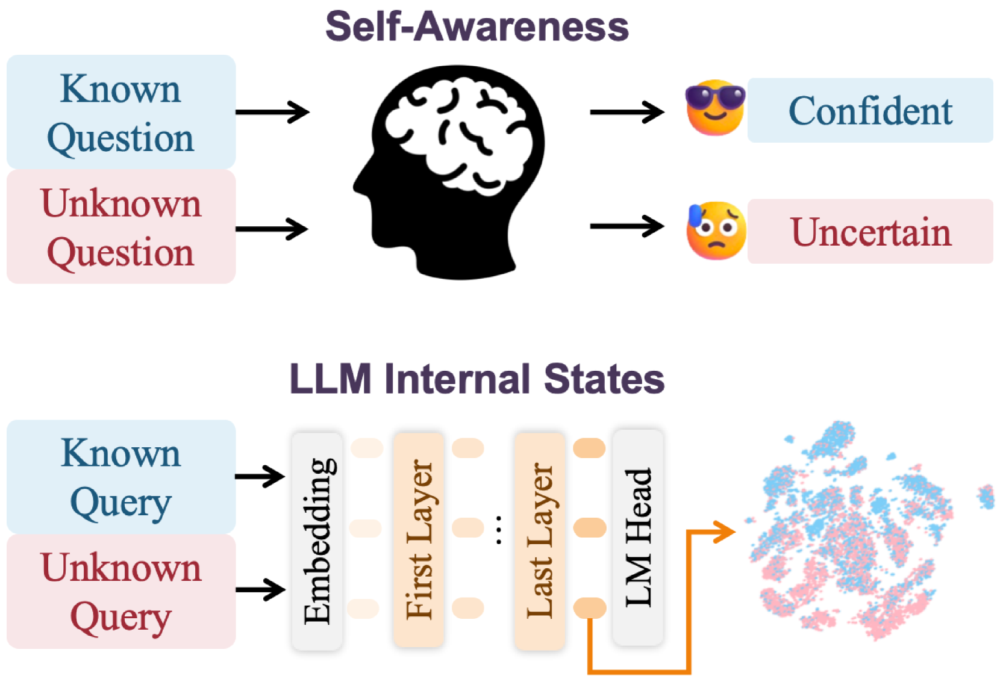

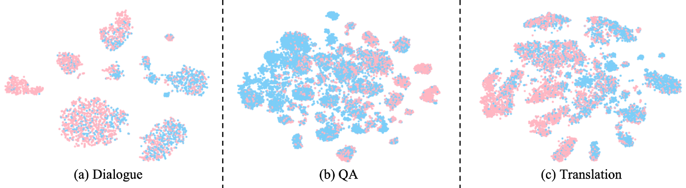

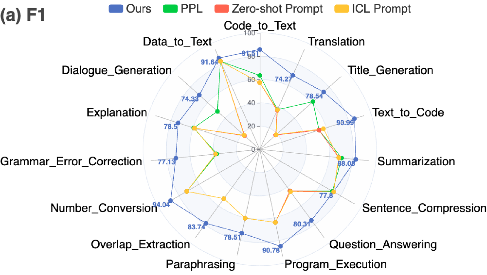

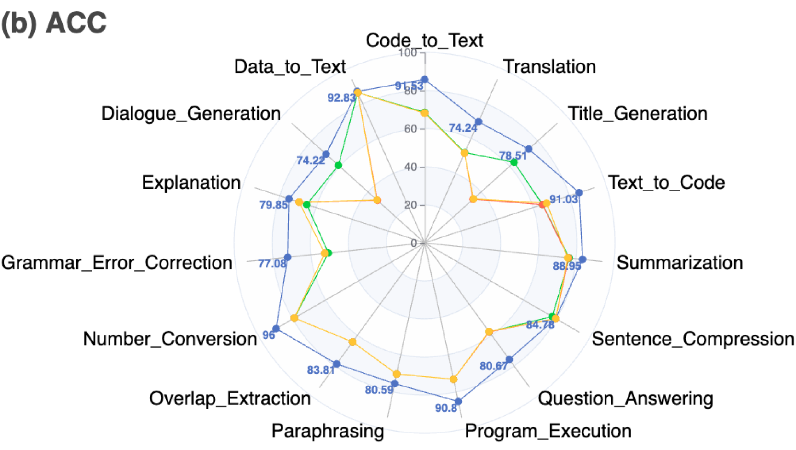

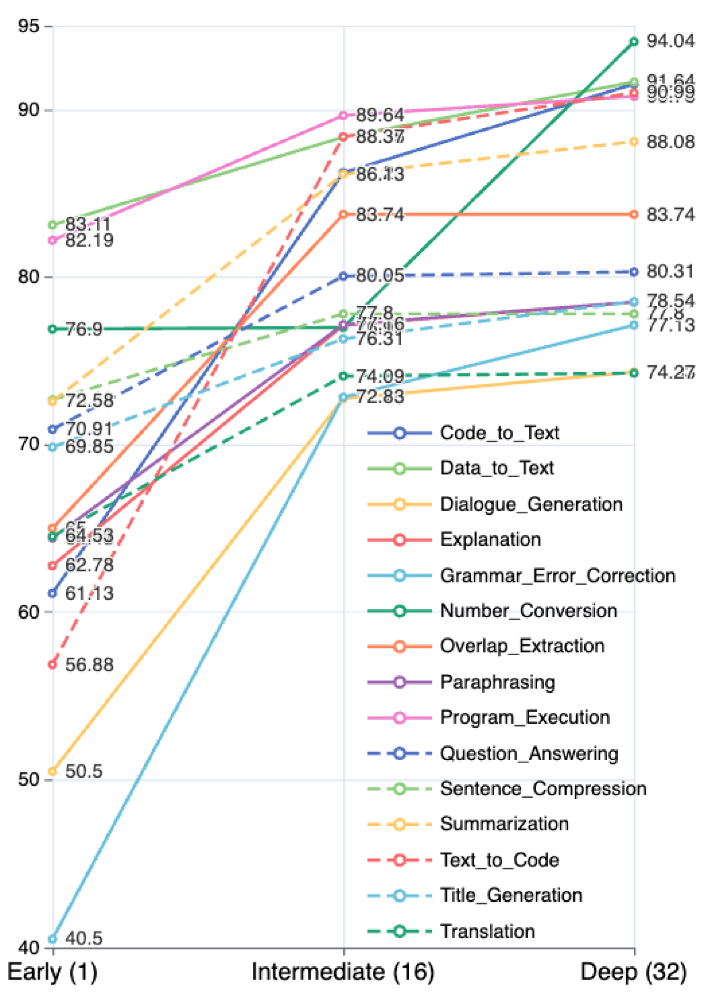

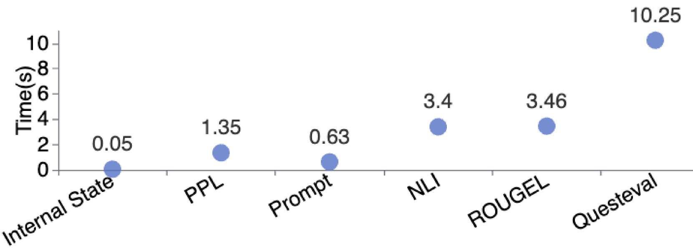

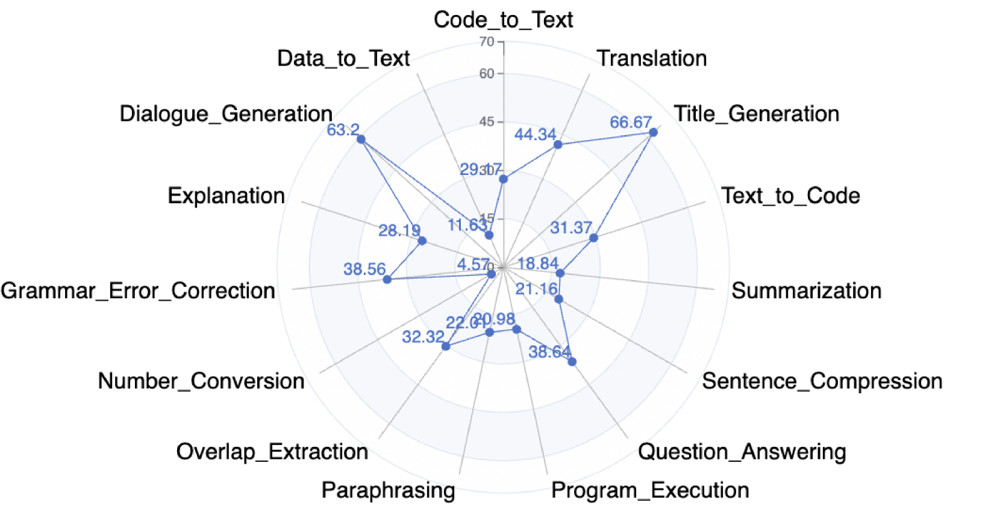

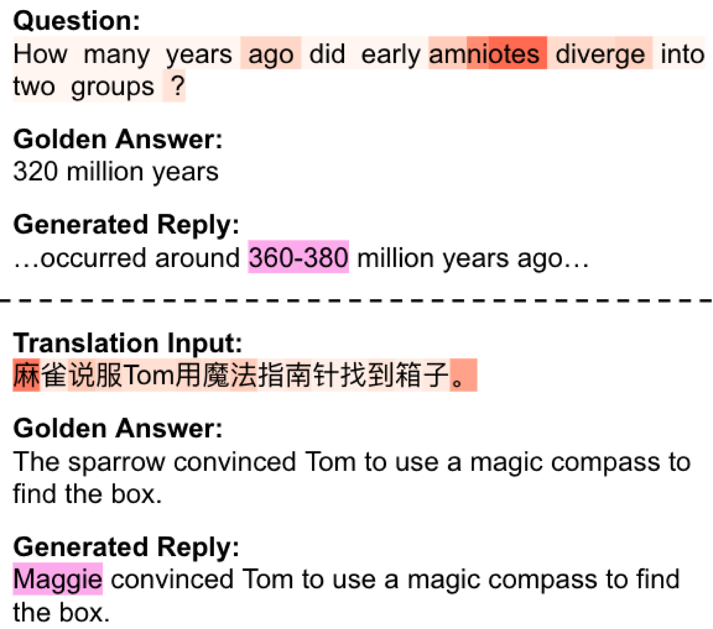

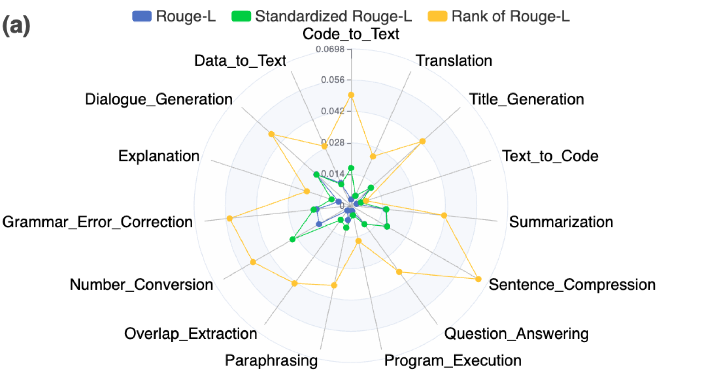

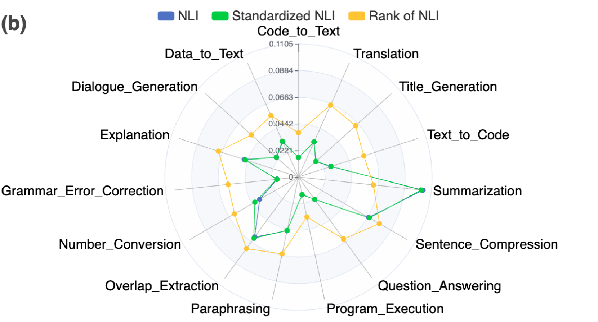

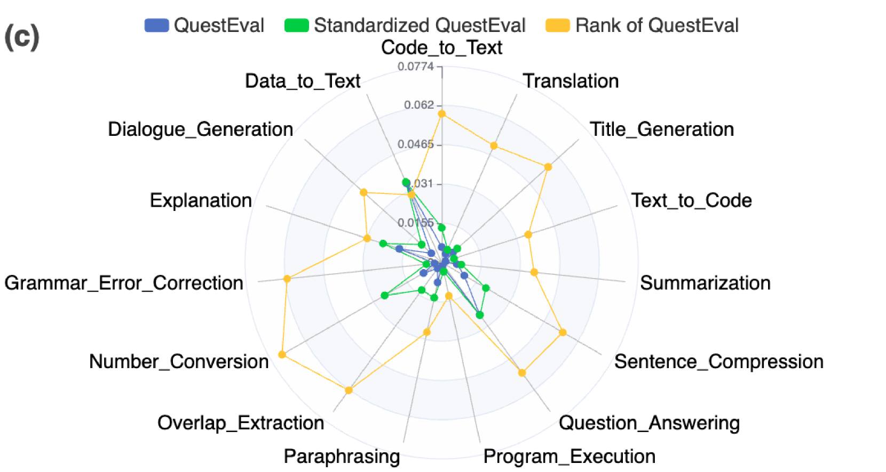

[Arxiv](https://arxiv.org/abs/2407.03282)