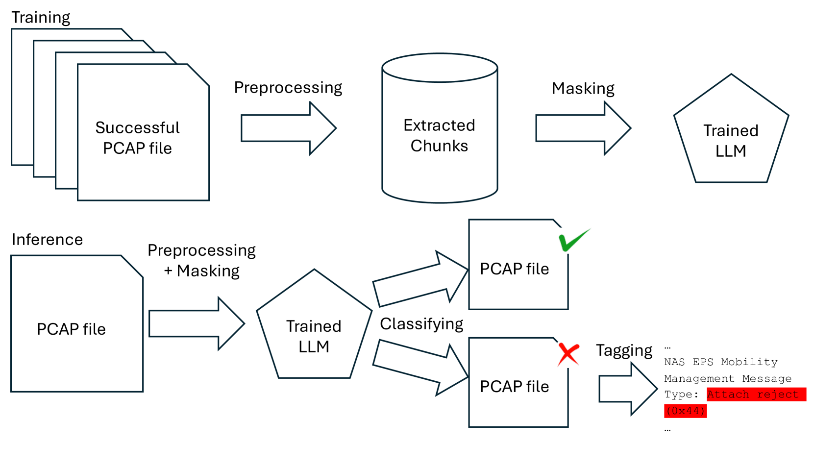
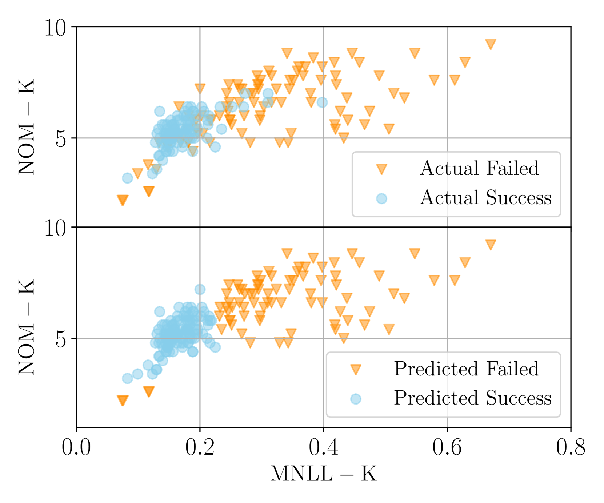

# LLMcap：一款专为无监督 PCAP 故障检测设计的大型语言模型

发布时间：2024年07月03日

`LLM应用` `网络服务`

> LLMcap: Large Language Model for Unsupervised PCAP Failure Detection

# 摘要

> 随着先进技术融入电信网络，故障排查变得更加复杂，手动识别PCAP数据中的错误变得困难重重。传统的手动方法在大规模应用时资源消耗巨大，难以实施。虽然机器学习方法提供了替代方案，但标记数据的稀缺性限制了其准确性。本研究提出了一种基于大型语言模型的自监督方法LLMcap，用于PCAP故障检测。LLMcap运用语言学习技巧，通过掩码语言建模掌握语法、上下文和结构。在多种PCAP数据上进行严格测试后，即使训练时缺乏标记数据，LLMcap仍展现出高准确性，为网络分析的高效性提供了新的希望。关键词：网络故障排查，PCAP数据分析，自监督学习，大型语言模型，网络服务质量，网络性能。

> The integration of advanced technologies into telecommunication networks complicates troubleshooting, posing challenges for manual error identification in Packet Capture (PCAP) data. This manual approach, requiring substantial resources, becomes impractical at larger scales. Machine learning (ML) methods offer alternatives, but the scarcity of labeled data limits accuracy. In this study, we propose a self-supervised, large language model-based (LLMcap) method for PCAP failure detection. LLMcap leverages language-learning abilities and employs masked language modeling to learn grammar, context, and structure. Tested rigorously on various PCAPs, it demonstrates high accuracy despite the absence of labeled data during training, presenting a promising solution for efficient network analysis. Index Terms: Network troubleshooting, Packet Capture Analysis, Self-Supervised Learning, Large Language Model, Network Quality of Service, Network Performance.

[Arxiv](https://arxiv.org/abs/2407.06085)