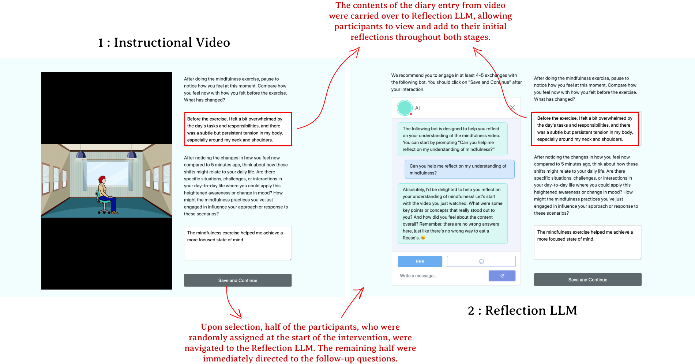

# 大型语言模型代理助力提升行为改变干预的参与度，特别应用于数字正念领域。

发布时间：2024年07月03日

`LLM应用` `健康科技`

> Large Language Model Agents for Improving Engagement with Behavior Change Interventions: Application to Digital Mindfulness

# 摘要

> 虽然自我导向的健康练习参与度随时间下降，但融入教练等社会支持可维持其参与。传统支持因高成本和复杂性而难以触及，而大型语言模型（LLMs）通过提供类人对话，有望模拟社会支持。我们对LLMs在行为改变支持方面的深入研究尚显不足。为此，我们开展了两次随机实验，评估LLM代理对正念练习参与度的影响。首次实验涉及502名众包工作者，进行单次会话；第二次实验为期三周，包含54名参与者。我们测试了两类LLM代理：信息提供型和自我反思促进型。两者均增强了用户练习正念的意愿，但仅信息提供型LLM，以其友好角色，显著提升了练习参与度。研究结果暗示，特定LLM代理或能在数字健康干预中填补社会支持的空白。

> Although engagement in self-directed wellness exercises typically declines over time, integrating social support such as coaching can sustain it. However, traditional forms of support are often inaccessible due to the high costs and complex coordination. Large Language Models (LLMs) show promise in providing human-like dialogues that could emulate social support. Yet, in-depth, in situ investigations of LLMs to support behavior change remain underexplored. We conducted two randomized experiments to assess the impact of LLM agents on user engagement with mindfulness exercises. First, a single-session study, involved 502 crowdworkers; second, a three-week study, included 54 participants. We explored two types of LLM agents: one providing information and another facilitating self-reflection. Both agents enhanced users' intentions to practice mindfulness. However, only the information-providing LLM, featuring a friendly persona, significantly improved engagement with the exercises. Our findings suggest that specific LLM agents may bridge the social support gap in digital health interventions.

[Arxiv](https://arxiv.org/abs/2407.13067)