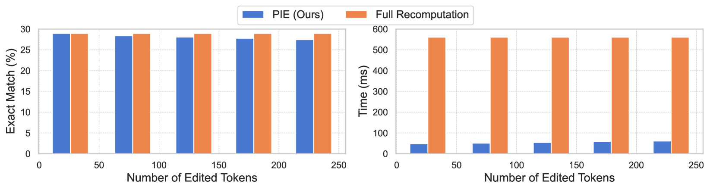
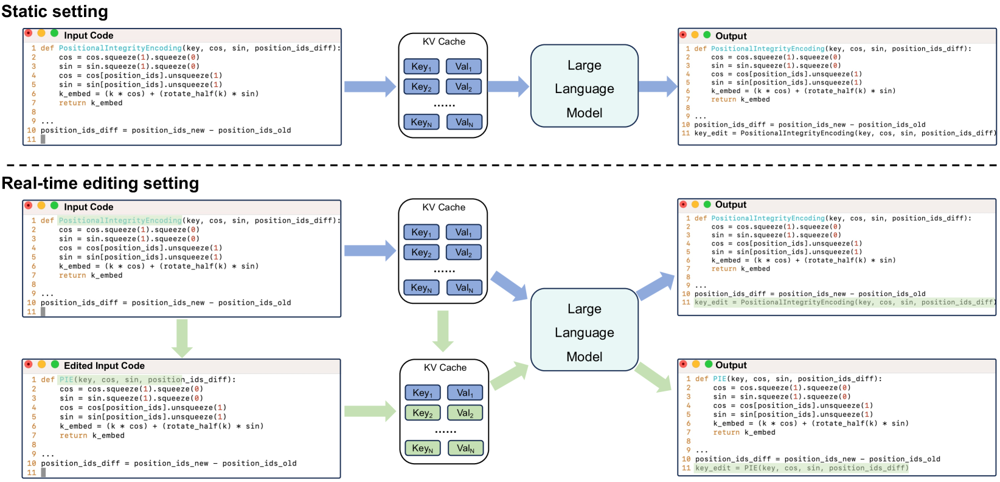
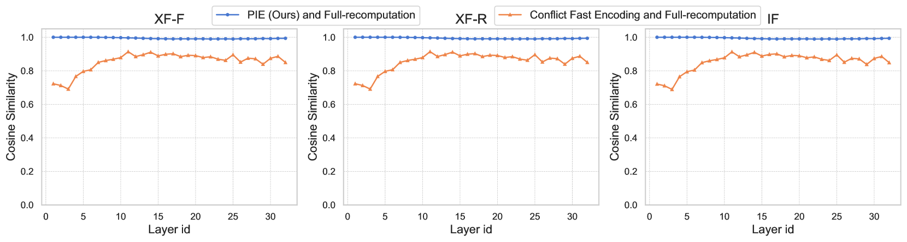
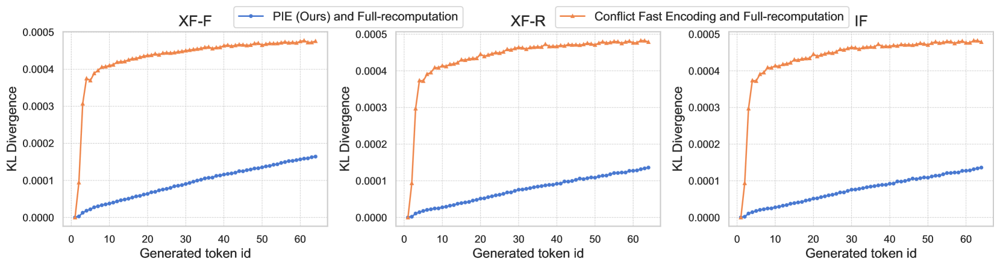

# 代码 LLM 在你修改代码时，也能自我修正。

发布时间：2024年07月03日

`LLM应用` `软件开发` `人工智能`

> Let the Code LLM Edit Itself When You Edit the Code

# 摘要

> 在本研究中，我们探讨了一个代码生成的典型场景：开发者在实时编辑代码时，请求代码助手（如大型语言模型）即时预测下一个代码片段。传统的做法是LLM需重新编码整个KV缓存，这在长序列时计算成本高昂。我们通过引入**位置完整性编码（PIE）**，解决了这一效率与准确性的难题。PIE通过优化旋转位置编码，确保了令牌间位置关系的正确性，并大幅降低了计算需求。实验证明，PIE在多个实际编码任务中，相比传统方法，计算开销减少了85%以上，同时保持了模型性能。

> In this work, we investigate a typical scenario in code generation where a developer edits existing code in real time and requests a code assistant, e.g., a large language model, to re-predict the next token or next line on the fly. Naively, the LLM needs to re-encode the entire KV cache to provide an accurate prediction. However, this process is computationally expensive, especially when the sequence length is long. Simply encoding the edited subsequence and integrating it to the original KV cache meets the temporal confusion problem, leading to significantly worse performance. We address this efficiency and accuracy trade-off by introducing \underline{\textbf{Positional \textbf{I}ntegrity \textbf{E}ncoding} (PIE). Building upon the rotary positional encoding, PIE first removes the rotary matrices in the Key cache that introduce temporal confusion and then reapplies the correct rotary matrices. This process ensures that positional relationships between tokens are correct and requires only a single round of matrix multiplication. We validate the effectiveness of PIE through extensive experiments on the RepoBench-C-8k dataset, utilizing DeepSeek-Coder models with 1.3B, 6.7B, and 33B parameters. Our evaluation includes three real-world coding tasks: code insertion, code deletion, and multi-place code editing. Results demonstrate that PIE reduces computational overhead by over 85% compared to the standard full recomputation approach across all model sizes and tasks while well approximating the model performance.

[Arxiv](https://arxiv.org/abs/2407.03157)