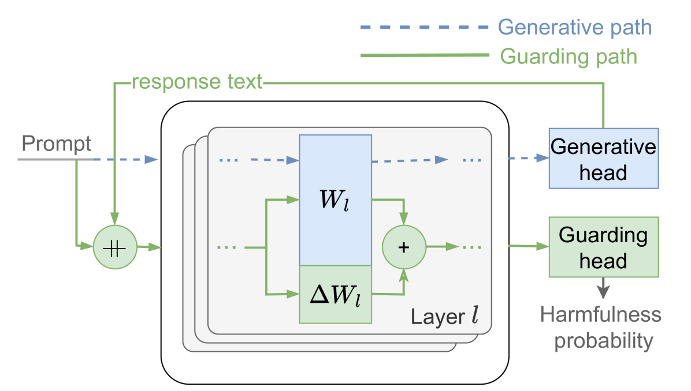
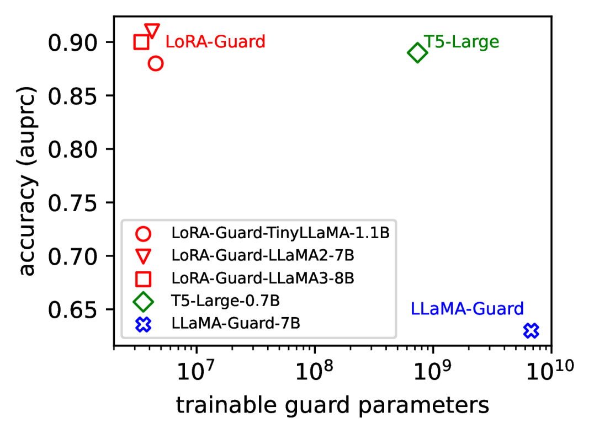

# LoRA-Guard：为大型语言模型提供参数高效的内容审核护栏适应方案

发布时间：2024年07月03日

`LLM应用` `移动设备` `内容审核`

> LoRA-Guard: Parameter-Efficient Guardrail Adaptation for Content Moderation of Large Language Models

# 摘要

> 护栏作为大型语言模型内容审核的安全对齐替代方案崭露头角。然而，现有基于模型的护栏设计并未考虑资源受限的便携设备，如手机，这些设备正越来越多地运行本地 LLM 应用。为此，我们推出了 LoRA-Guard，一种高效利用参数的护栏适应方法，它通过 LLM 与护栏模型间的知识共享，提取语言特征并借助低秩适配器进行内容审核，同时采用双路径设计确保生成任务性能不受影响。实验表明，LoRA-Guard 在保持高准确率的同时，参数开销大幅降低，为设备端内容审核提供了新可能。

> Guardrails have emerged as an alternative to safety alignment for content moderation of large language models (LLMs). Existing model-based guardrails have not been designed for resource-constrained computational portable devices, such as mobile phones, more and more of which are running LLM-based applications locally. We introduce LoRA-Guard, a parameter-efficient guardrail adaptation method that relies on knowledge sharing between LLMs and guardrail models. LoRA-Guard extracts language features from the LLMs and adapts them for the content moderation task using low-rank adapters, while a dual-path design prevents any performance degradation on the generative task. We show that LoRA-Guard outperforms existing approaches with 100-1000x lower parameter overhead while maintaining accuracy, enabling on-device content moderation.

[Arxiv](https://arxiv.org/abs/2407.02987)