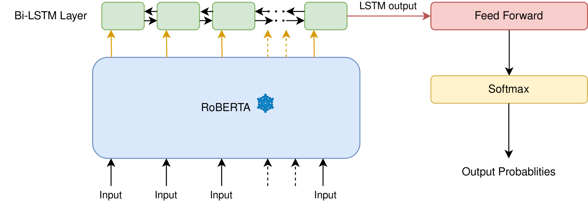

# Mast Kalandar 参与 SemEval-2024 任务 8，探索文本源头：采用 RoBERTa-BiLSTM 方法，精准识别 AI 生成文本。

发布时间：2024年07月03日

`LLM应用`

> Mast Kalandar at SemEval-2024 Task 8: On the Trail of Textual Origins: RoBERTa-BiLSTM Approach to Detect AI-Generated Text

# 摘要

> 大型语言模型 (LLM) 在生成流畅的用户查询响应方面表现出色，但其在新闻、教育和学术领域的潜在滥用引发了关注。SemEval 2024 的 Multigenerator、Multidomain 和 Multilingual Black-Box Machine-Generated Text Detection 任务，旨在开发自动识别和防范机器生成文本滥用的系统。本文提出了一种基于 RoBERTa-BiLSTM 的分类器，用于区分 AI 和人类生成的文本，并通过对比研究验证了其有效性。我们的工作有助于提升自动文本检测技术，以应对机器生成文本滥用的挑战。在 125 个参赛者中，我们的架构以 80.83% 的准确率位列第 46 名。

> Large Language Models (LLMs) have showcased impressive abilities in generating fluent responses to diverse user queries. However, concerns regarding the potential misuse of such texts in journalism, educational, and academic contexts have surfaced. SemEval 2024 introduces the task of Multigenerator, Multidomain, and Multilingual Black-Box Machine-Generated Text Detection, aiming to develop automated systems for identifying machine-generated text and detecting potential misuse. In this paper, we i) propose a RoBERTa-BiLSTM based classifier designed to classify text into two categories: AI-generated or human ii) conduct a comparative study of our model with baseline approaches to evaluate its effectiveness. This paper contributes to the advancement of automatic text detection systems in addressing the challenges posed by machine-generated text misuse. Our architecture ranked 46th on the official leaderboard with an accuracy of 80.83 among 125.

[Arxiv](https://arxiv.org/abs/2407.02978)