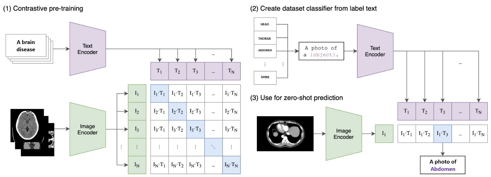

# MedPix 2.0：一款集大成的多模态生物医学数据集，专为尖端AI应用打造

发布时间：2024年07月03日

`LLM应用` `人工智能`

> MedPix 2.0: A Comprehensive Multimodal Biomedical Dataset for Advanced AI Applications

# 摘要

> 随着医疗领域对AI应用的兴趣日益增长，高质量数据集的缺乏成为一大难题，主要原因是隐私问题。同时，多模态大型语言模型（MLLM）的兴起，使得我们需要结合临床报告与CT或MR扫描的多模态医疗数据集。本文详细介绍了构建MedPix 2.0数据集的全过程。我们从广泛用于继续医学教育的MedPix\textsuperscript{\textregistered}数据集出发，通过半自动化流程提取视觉与文本信息，并手动剔除噪声样本，最终构建了一个MongoDB数据库。此外，我们还设计了一个图形用户界面（GUI），方便用户高效访问数据库，并轻松获取用于训练或微调MLLM的原始数据。为了展示其应用潜力，我们基于MedPix 2.0训练了一个CLIP模型，用于扫描分类任务。

> The increasing interest in developing Artificial Intelligence applications in the medical domain, suffers from the lack of high-quality dataset, mainly due to privacy-related issues. Moreover, the recent rising of Multimodal Large Language Models (MLLM) leads to a need for multimodal medical datasets, where clinical reports and findings are attached to the corresponding CT or MR scans. This paper illustrates the entire workflow for building the data set MedPix 2.0. Starting from the well-known multimodal dataset MedPix\textsuperscript{\textregistered}, mainly used by physicians, nurses and healthcare students for Continuing Medical Education purposes, a semi-automatic pipeline was developed to extract visual and textual data followed by a manual curing procedure where noisy samples were removed, thus creating a MongoDB database. Along with the dataset, we developed a GUI aimed at navigating efficiently the MongoDB instance, and obtaining the raw data that can be easily used for training and/or fine-tuning MLLMs. To enforce this point, we also propose a CLIP-based model trained on MedPix 2.0 for scan classification tasks.

[Arxiv](https://arxiv.org/abs/2407.02994)