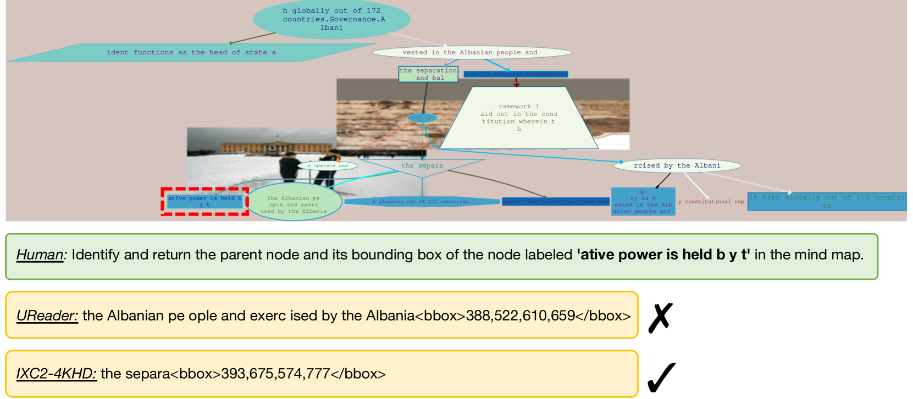

# MindBench：全面评估思维导图结构识别与分析的基准

发布时间：2024年07月03日

`LLM应用` `文档分析` `人工智能`

> MindBench: A Comprehensive Benchmark for Mind Map Structure Recognition and Analysis

# 摘要

> 多模态大型语言模型在文档分析领域取得了显著进展，但现有基准往往忽视了结构化文档中元素间的复杂交互。为此，我们推出了新基准 MindBench，它不仅包含精心构建的双语图像、详细注释和评估体系，还特别设计了五类结构化理解和解析任务，涵盖文本识别、空间意识等关键领域。实验表明，当前模型在处理结构化文档信息方面仍有巨大潜力。我们期待 MindBench 能推动结构化文档分析技术的研究与应用。MindBench 现已上线，访问地址为：https://miasanlei.github.io/MindBench.github.io/。

> Multimodal Large Language Models (MLLM) have made significant progress in the field of document analysis. Despite this, existing benchmarks typically focus only on extracting text and simple layout information, neglecting the complex interactions between elements in structured documents such as mind maps and flowcharts. To address this issue, we introduce the new benchmark named MindBench, which not only includes meticulously constructed bilingual authentic or synthetic images, detailed annotations, evaluation metrics and baseline models, but also specifically designs five types of structured understanding and parsing tasks. These tasks include full parsing, partial parsing, position-related parsing, structured Visual Question Answering (VQA), and position-related VQA, covering key areas such as text recognition, spatial awareness, relationship discernment, and structured parsing. Extensive experimental results demonstrate the substantial potential and significant room for improvement in current models' ability to handle structured document information. We anticipate that the launch of MindBench will significantly advance research and application development in structured document analysis technology. MindBench is available at: https://miasanlei.github.io/MindBench.github.io/.

[Arxiv](https://arxiv.org/abs/2407.02842)