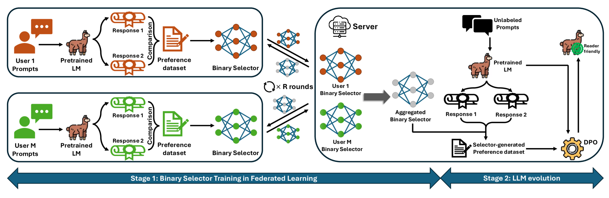
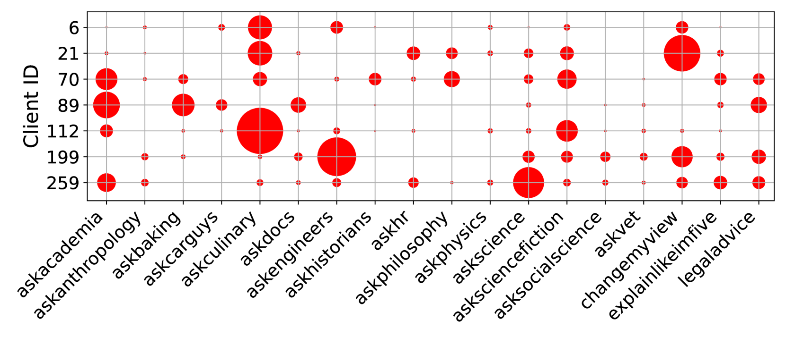
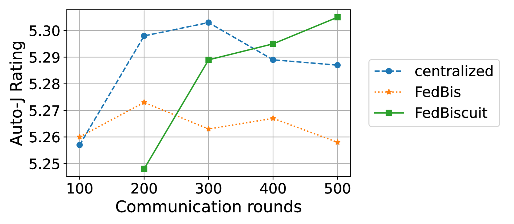

# 探讨联邦学习环境下，客户端对 LLM 微调的偏好

发布时间：2024年07月03日

`LLM应用` `人工智能` `隐私保护`

> On the Client Preference of LLM Fine-tuning in Federated Learning

# 摘要

> 利用人类反馈的强化学习（RLHF）通过偏好数据集对预训练的大型语言模型（LLM）进行微调，使其输出更符合人类偏好。考虑到这些敏感的偏好数据集由不同客户持有，我们需在联邦学习（FL）框架内实施RLHF，以保护客户因隐私顾虑而不愿共享数据。为此，我们提出一个框架，客户通过我们设计的FedBis协作训练一个二元选择器。借助训练有素的选择器，我们能进一步优化LLM，使其生成更符合人类偏好的内容。此外，我们创新算法FedBiscuit，通过根据客户偏好将他们分组为平衡且独立的集群，训练多个选择器。实验显示，FedBiscuit在模拟成对完成的偏好方面表现更佳，且在处理联邦人类偏好数据集时，不仅超越FedBis，甚至优于传统集中式训练。

> Reinforcement learning with human feedback (RLHF) fine-tunes a pretrained large language model (LLM) using preference datasets, enabling the LLM to generate outputs that align with human preferences. Given the sensitive nature of these preference datasets held by various clients, there is a need to implement RLHF within a federated learning (FL) framework, where clients are reluctant to share their data due to privacy concerns. To address this, we introduce a feasible framework in which clients collaboratively train a binary selector with their preference datasets using our proposed FedBis. With a well-trained selector, we can further enhance the LLM that generates human-preferred completions. Meanwhile, we propose a novel algorithm, FedBiscuit, that trains multiple selectors by organizing clients into balanced and disjoint clusters based on their preferences. Compared to the FedBis, FedBiscuit demonstrates superior performance in simulating human preferences for pairwise completions. Our extensive experiments on federated human preference datasets -- marking the first benchmark to address heterogeneous data partitioning among clients -- demonstrate that FedBiscuit outperforms FedBis and even surpasses traditional centralized training.

[Arxiv](https://arxiv.org/abs/2407.03038)