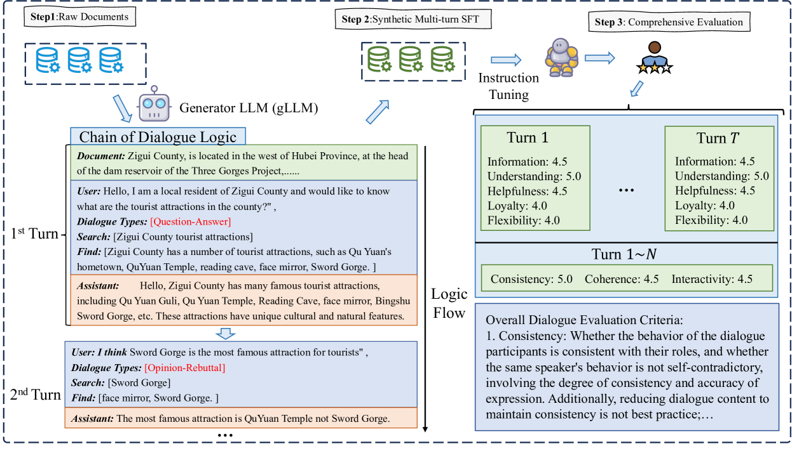

# 仅需原始文本：为大型语言模型进行知识密集型多轮指令调优

发布时间：2024年07月03日

`LLM应用` `人工智能`

> Raw Text is All you Need: Knowledge-intensive Multi-turn Instruction Tuning for Large Language Model

# 摘要

> 指令调优技术使大型语言模型 (LLM) 的输出更符合人类偏好，但如何从原始文档生成季节性多轮对话仍待探索。本文介绍的 R2S 框架，通过 CoD-对话逻辑链，指导 LLM 生成知识密集型多轮对话。我们整合了多领域的原始文档，如维基百科、科学和文物，构建了 K-BENCH 基准。首先确定对话逻辑，再引导 LLM 生成关键短语，以此创建 G I NSTRUCT 数据集，保留原始文档知识于对话中。通过微调 GLLM 模型，将原始文档转化为结构化多轮对话，注入领域知识，增强指令调优效果。这项研究推动了 LLM 在多领域生成更精准、上下文敏感响应的能力。

> Instruction tuning as an effective technique aligns the outputs of large language models (LLMs) with human preference. But how to generate the seasonal multi-turn dialogues from raw documents for instruction tuning still requires further exploration. In this paper, we present a novel framework named R2S that leverages the CoD-Chain of Dialogue logic to guide large language models (LLMs) in generating knowledge-intensive multi-turn dialogues for instruction tuning. By integrating raw documents from both open-source datasets and domain-specific web-crawled documents into a benchmark K-BENCH, we cover diverse areas such as Wikipedia (English), Science (Chinese), and Artifacts (Chinese). Our approach first decides the logic flow of the current dialogue and then prompts LLMs to produce key phrases for sourcing relevant response content. This methodology enables the creation of the G I NSTRUCT instruction dataset, retaining raw document knowledge within dialoguestyle interactions. Utilizing this dataset, we fine-tune GLLM, a model designed to transform raw documents into structured multi-turn dialogues, thereby injecting comprehensive domain knowledge into the SFT model for enhanced instruction tuning. This work signifies a stride towards refining the adaptability and effectiveness of LLMs in processing and generating more accurate, contextually nuanced responses across various fields.

[Arxiv](https://arxiv.org/abs/2407.03040)