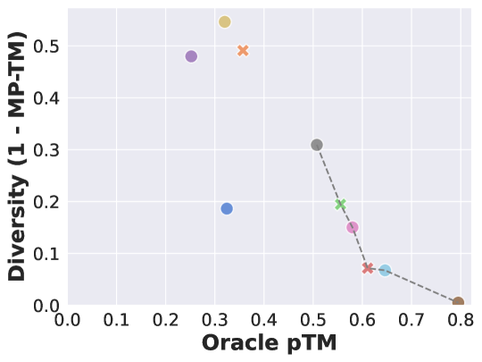

# 借助蛋白质语言模型，强化学习在序列设计领域大放异彩。

发布时间：2024年07月03日

`Agent` `药物发现` `生物信息学`

> Reinforcement Learning for Sequence Design Leveraging Protein Language Models

# 摘要

> 蛋白质序列设计的核心在于氨基酸序列，这对药物发现中的蛋白质工程至关重要。传统方法如进化策略或蒙特卡洛方法虽被采用，但未能充分挖掘组合搜索空间的结构，也难以适应新序列。在大规模搜索空间中，利用强化学习学习突变策略生成新序列的方法引人注目。近期，蛋白质语言模型（PLMs）的发展，通过评估蛋白质的生物学合理性（如TM-score），为解决这一难题提供了新思路。我们提出将PLMs作为奖励函数来设计新序列，但考虑到其庞大的计算需求，我们创新性地提出了一种优化策略，即在一个定期微调的小型代理模型上进行评分，同时学习突变策略。通过广泛的实验，我们验证了基于RL的方法在生物学合理性和多样性方面的优势，证实了RL在生物序列设计中的潜力。此外，我们提供的开源模块化实现，易于集成到RL训练流程中，并支持替换奖励模型，旨在推动该领域的深入研究。所有实验代码均已公开。

> Protein sequence design, determined by amino acid sequences, are essential to protein engineering problems in drug discovery. Prior approaches have resorted to evolutionary strategies or Monte-Carlo methods for protein design, but often fail to exploit the structure of the combinatorial search space, to generalize to unseen sequences. In the context of discrete black box optimization over large search spaces, learning a mutation policy to generate novel sequences with reinforcement learning is appealing. Recent advances in protein language models (PLMs) trained on large corpora of protein sequences offer a potential solution to this problem by scoring proteins according to their biological plausibility (such as the TM-score). In this work, we propose to use PLMs as a reward function to generate new sequences. Yet the PLM can be computationally expensive to query due to its large size. To this end, we propose an alternative paradigm where optimization can be performed on scores from a smaller proxy model that is periodically finetuned, jointly while learning the mutation policy. We perform extensive experiments on various sequence lengths to benchmark RL-based approaches, and provide comprehensive evaluations along biological plausibility and diversity of the protein. Our experimental results include favorable evaluations of the proposed sequences, along with high diversity scores, demonstrating that RL is a strong candidate for biological sequence design. Finally, we provide a modular open source implementation can be easily integrated in most RL training loops, with support for replacing the reward model with other PLMs, to spur further research in this domain. The code for all experiments is provided in the supplementary material.

[Arxiv](https://arxiv.org/abs/2407.03154)