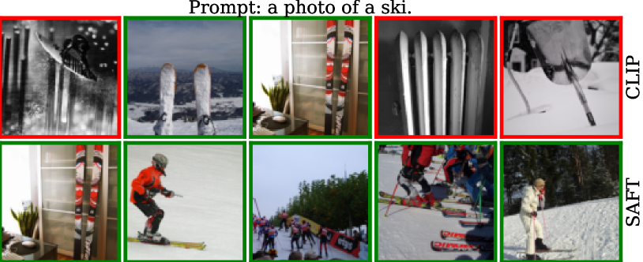

# SAFT：致力于在微调过程中实现分布外的泛化能力

发布时间：2024年07月03日

`LLM应用` `机器学习` `计算机视觉`

> SAFT: Towards Out-of-Distribution Generalization in Fine-Tuning

# 摘要

> 在机器学习领域，处理训练数据中的分布偏移（OOD泛化）是一个重大挑战。尽管CLIP等预训练模型在零-shot任务中表现出色，但适应下游任务时却可能导致OOD数据的性能下降。为此，我们提出了稀疏适应微调（SAFT），一种防止微调过程中遗忘预训练模型通用知识的方法。SAFT仅更新关键参数，保持其他参数不变，实现简单且效果显著。实验证明，仅需调整0.1%的模型参数，SAFT就能大幅提升CLIP性能，并在多个基准测试中超越传统方法。在ImageNet及其变体的少样本学习基准上，SAFT在OOD设置下平均提升了5.15%。

> Handling distribution shifts from training data, known as out-of-distribution (OOD) generalization, poses a significant challenge in the field of machine learning. While a pre-trained vision-language model like CLIP has demonstrated remarkable zero-shot performance, further adaptation of the model to downstream tasks leads to undesirable degradation for OOD data. In this work, we introduce Sparse Adaptation for Fine-Tuning (SAFT), a method that prevents fine-tuning from forgetting the general knowledge in the pre-trained model. SAFT only updates a small subset of important parameters whose gradient magnitude is large, while keeping the other parameters frozen. SAFT is straightforward to implement and conceptually simple. Extensive experiments show that with only 0.1% of the model parameters, SAFT can significantly improve the performance of CLIP. It consistently outperforms baseline methods across several benchmarks. On the few-shot learning benchmark of ImageNet and its variants, SAFT gives a gain of 5.15% on average over the conventional fine-tuning method in OOD settings.

[Arxiv](https://arxiv.org/abs/2407.03036)