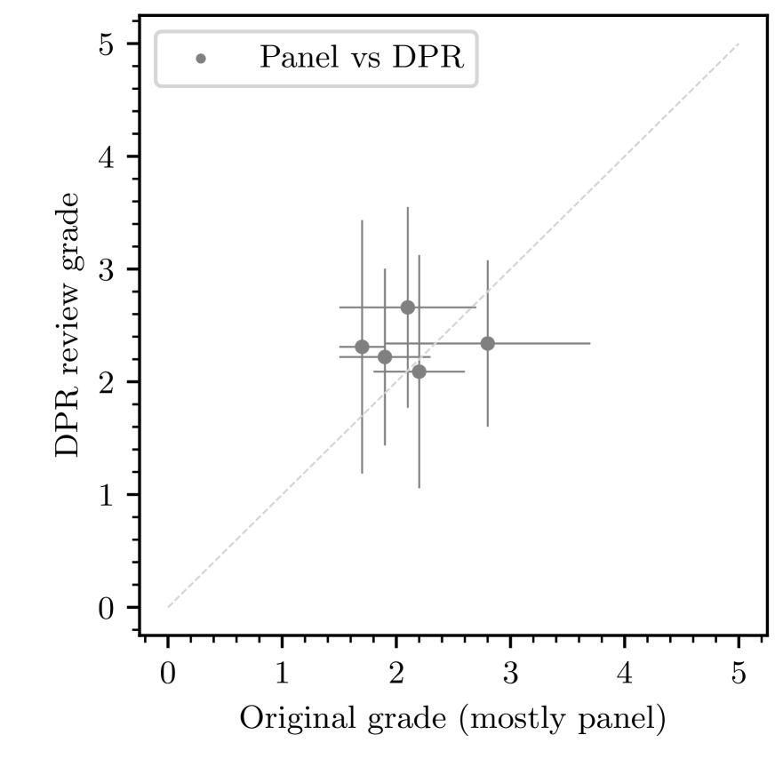
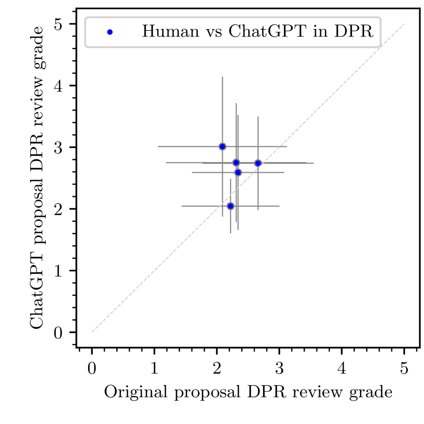
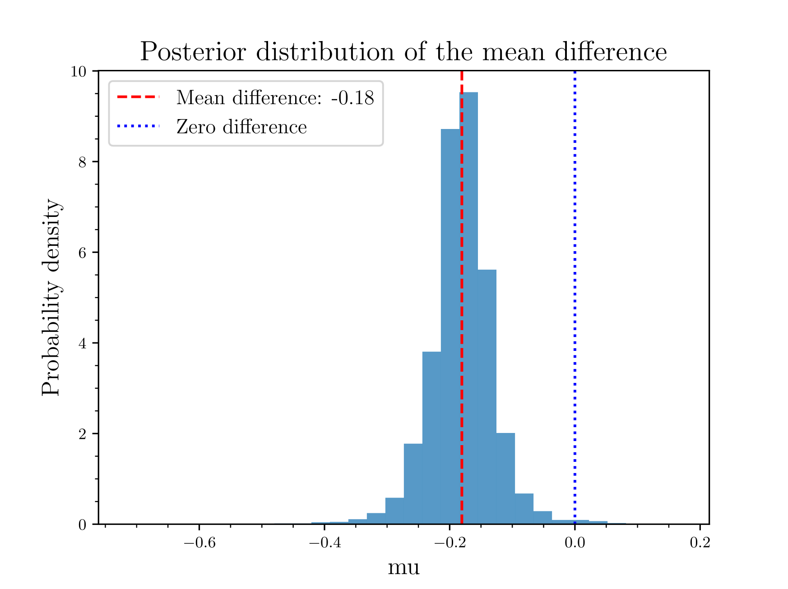
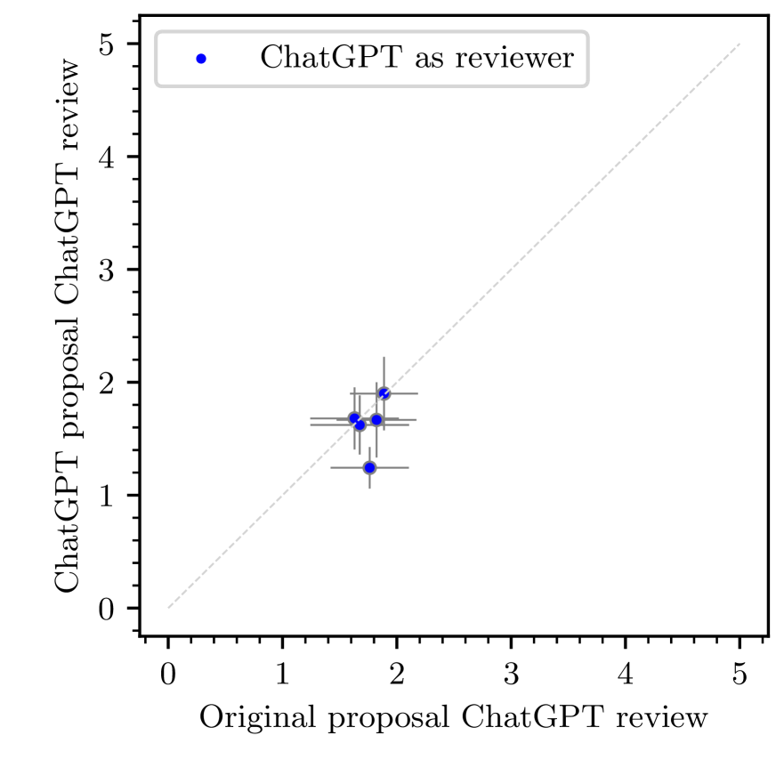
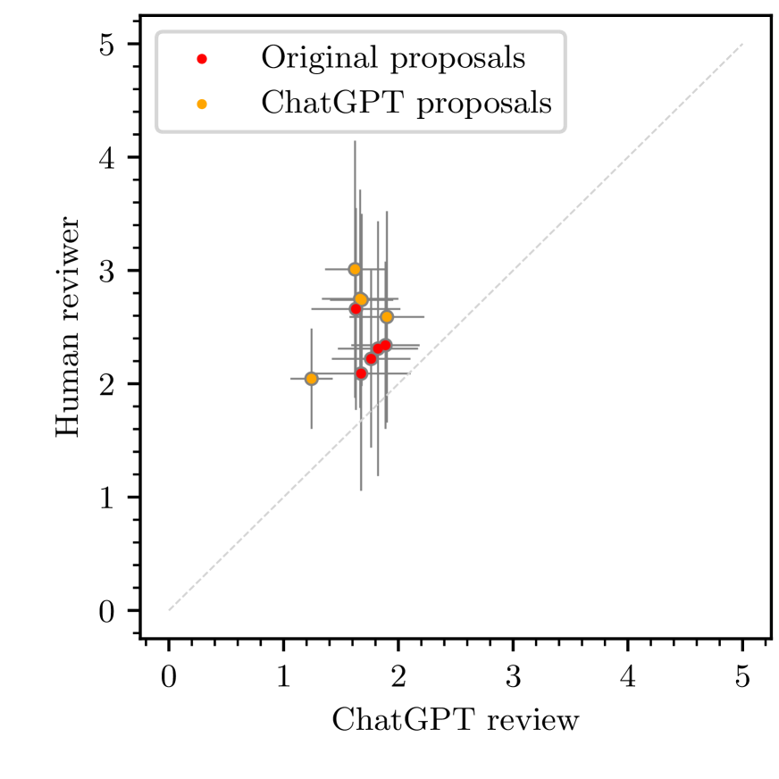
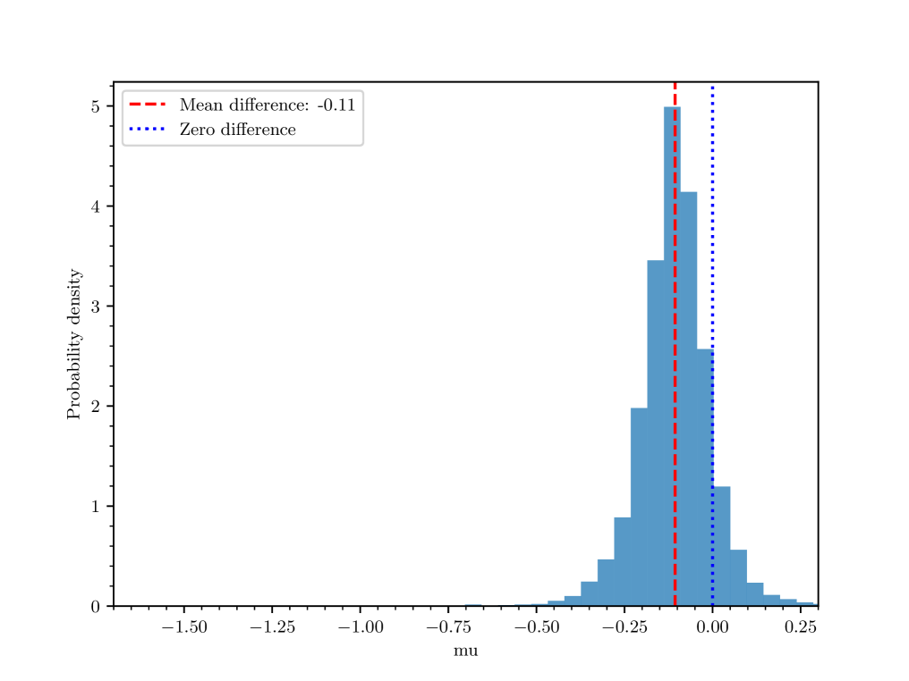
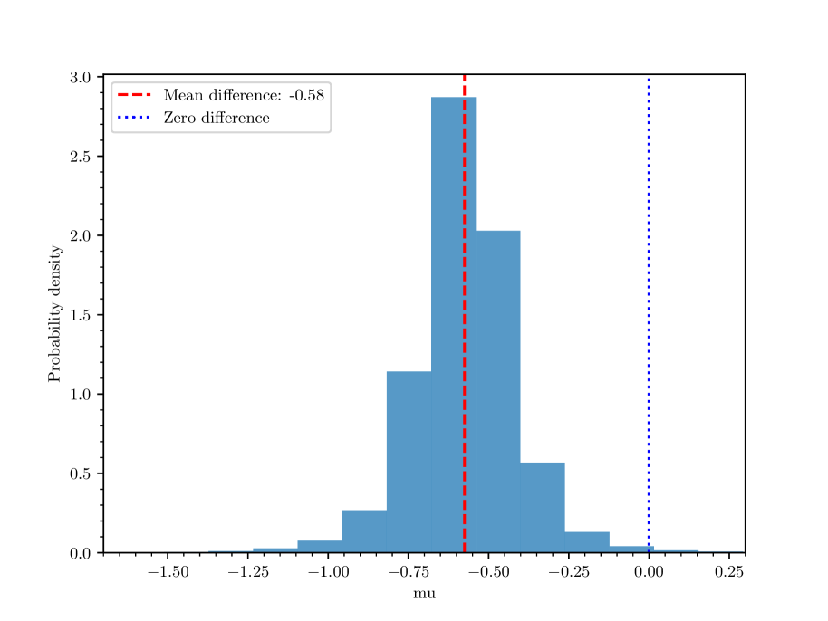
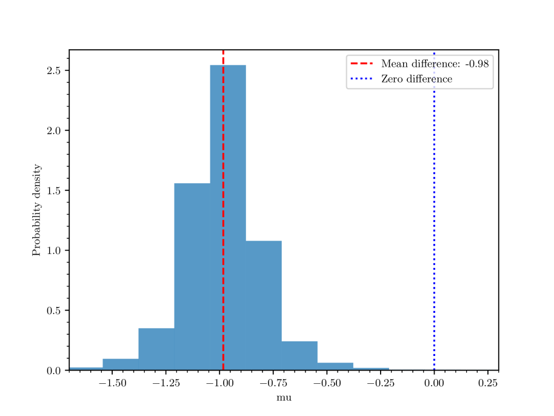

# 机器人辅助的科学文本分析在观测站提案中的应用

发布时间：2024年07月03日

`LLM应用` `科学研究` `人工智能`

> Scientific Text Analysis with Robots applied to observatory proposals

# 摘要

> ESO 针对 P112 提案征集进行了一项实验，旨在探索 AI 转换器（如 ChatGPT）及其大型语言模型对提案审查和评分过程的影响。实验结果显示，ChatGPT 调整的提案评分普遍较低，且其提供的科学参考准确性有待提高。最新版本的 ChatGPT 虽有改进，但仍不完美。此外，ChatGPT 在总结提案内容方面表现出色，但在识别提案弱点上则不尽如人意。值得注意的是，ChatGPT 给出的评分往往高于人类，且更偏爱由其自身生成的提案。这些发现有助于决策者更好地理解 AI 在提案审查中的应用。

> To test the potential disruptive effect of Artificial Intelligence (AI) transformers (e.g., ChatGPT) and their associated Large Language Models on the time allocation process, both in proposal reviewing and grading, an experiment has been set-up at ESO for the P112 Call for Proposals. The experiment aims at raising awareness in the ESO community and build valuable knowledge by identifying what future steps ESO and other observatories might need to take to stay up to date with current technologies. We present here the results of the experiment, which may further be used to inform decision-makers regarding the use of AI in the proposal review process. We find that the ChatGPT-adjusted proposals tend to receive lower grades compared to the original proposals. Moreover, ChatGPT 3.5 can generally not be trusted in providing correct scientific references, while the most recent version makes a better, but far from perfect, job. We also studied how ChatGPT deals with assessing proposals. It does an apparent remarkable job at providing a summary of ESO proposals, although it doesn't do so good to identify weaknesses. When looking at how it evaluates proposals, however, it appears that ChatGPT systematically gives a higher mark than humans, and tends to prefer proposals written by itself.

[Arxiv](https://arxiv.org/abs/2407.02992)