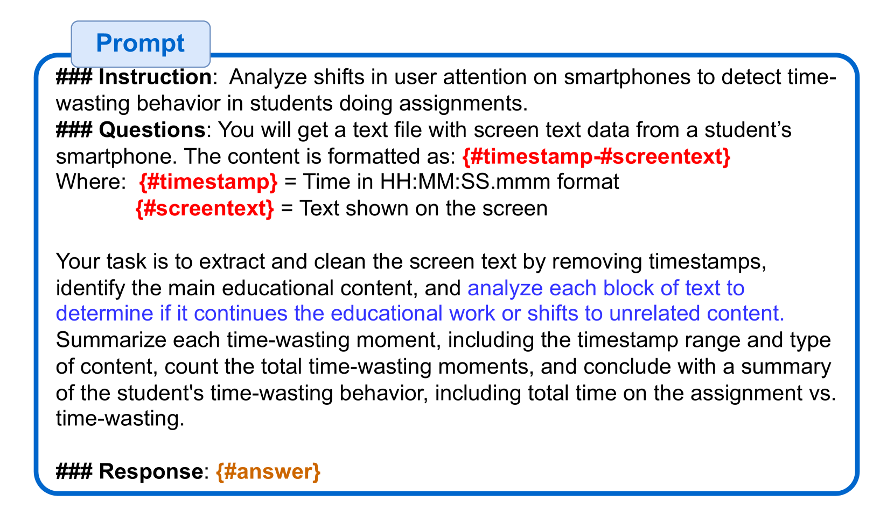
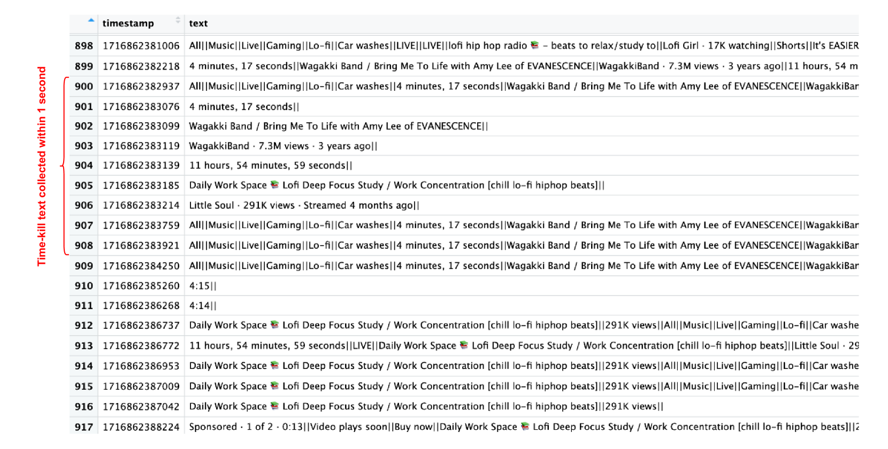

# ScreenTK：通过持续监控移动屏幕文本，精准捕捉消磨时光的瞬间

发布时间：2024年07月03日

`LLM应用` `智能手机` `用户体验`

> ScreenTK: Seamless Detection of Time-Killing Moments Using Continuous Mobile Screen Text Monitoring

# 摘要

> 智能手机已成为数字生活的必需品，不断提供信息和连接。然而，这种持续的信息流有时会让用户只是打发时间而非真正参与。因此，识别这些“消磨时间”时刻并优化通知传递方式变得尤为重要。现有方法通过每5秒截屏来检测消磨时间活动，但常遗漏间隔间的使用情况。我们发现，这种方法可能漏检高达50%的消磨时间实例，导致对用户行为的理解存在显著漏洞。为此，我们提出ScreenTK方法，通过持续监控屏幕文本和利用设备上的大型语言模型（LLMs）来更准确地检测消磨时间时刻。屏幕文本提供了比截图更丰富的信息，使LLMs能更详细地总结手机使用情况。我们通过六名参与者的实验，记录了1,034条消磨时间时刻的数据，初步结果表明，我们的框架在案例研究中比现有最佳方案提升了38%。

> Smartphones have become essential to people's digital lives, providing a continuous stream of information and connectivity. However, this constant flow can lead to moments where users are simply passing time rather than engaging meaningfully. This underscores the importance of developing methods to identify these "time-killing" moments, enabling the delivery of important notifications in a way that minimizes interruptions and enhances user engagement. Recent work has utilized screenshots taken every 5 seconds to detect time-killing activities on smartphones. However, this method often misses to capture phone usage between intervals. We demonstrate that up to 50% of time-killing instances go undetected using screenshots, leading to substantial gaps in understanding user behavior. To address this limitation, we propose a method called ScreenTK that detects time-killing moments by leveraging continuous screen text monitoring and on-device large language models (LLMs). Screen text contains more comprehensive information than screenshots and allows LLMs to summarize detailed phone usage. To verify our framework, we conducted experiments with six participants, capturing 1,034 records of different time-killing moments. Initial results show that our framework outperforms state-of-the-art solutions by 38% in our case study.

[Arxiv](https://arxiv.org/abs/2407.03063)