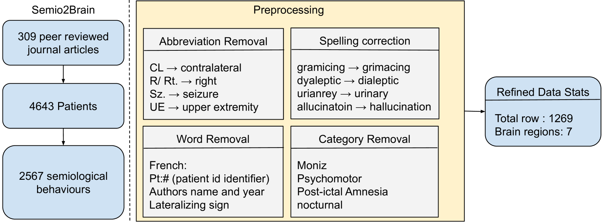

# SemioLLM：探究大型语言模型在癫痫研究符号学分析中的应用潜力

发布时间：2024年07月03日

`LLM应用` `人工智能`

> SemioLLM: Assessing Large Language Models for Semiological Analysis in Epilepsy Research

# 摘要

> 大型语言模型在医学问答数据集中展现了出色的知识编码能力，但在临床应用中仍需在特定任务上验证。在 semioLLM 研究中，我们评估了 GPT-3.5、GPT-4 等先进模型在癫痫诊断中的表现。通过分析一个包含 1269 条数据的临床数据库，我们探索了模型如何从非结构化文本中推断癫痫相关信息。尽管模型在精心设计的提示下表现出色，接近临床水平，但仍存在过度自信和引用错误等问题。本研究首次为医学领域的 LLM 提供了详尽基准，强调了它们在辅助诊断中的潜力。

> Large Language Models have shown promising results in their ability to encode general medical knowledge in standard medical question-answering datasets. However, their potential application in clinical practice requires evaluation in domain-specific tasks, where benchmarks are largely missing. In this study semioLLM, we test the ability of state-of-the-art LLMs (GPT-3.5, GPT-4, Mixtral 8x7B, and Qwen-72chat) to leverage their internal knowledge and reasoning for epilepsy diagnosis. Specifically, we obtain likelihood estimates linking unstructured text descriptions of seizures to seizure-generating brain regions, using an annotated clinical database containing 1269 entries. We evaluate the LLM's performance, confidence, reasoning, and citation abilities in comparison to clinical evaluation. Models achieve above-chance classification performance with prompt engineering significantly improving their outcome, with some models achieving close-to-clinical performance and reasoning. However, our analyses also reveal significant pitfalls with several models being overly confident while showing poor performance, as well as exhibiting citation errors and hallucinations. In summary, our work provides the first extensive benchmark comparing current SOTA LLMs in the medical domain of epilepsy and highlights their ability to leverage unstructured texts from patients' medical history to aid diagnostic processes in health care.

[Arxiv](https://arxiv.org/abs/2407.03004)