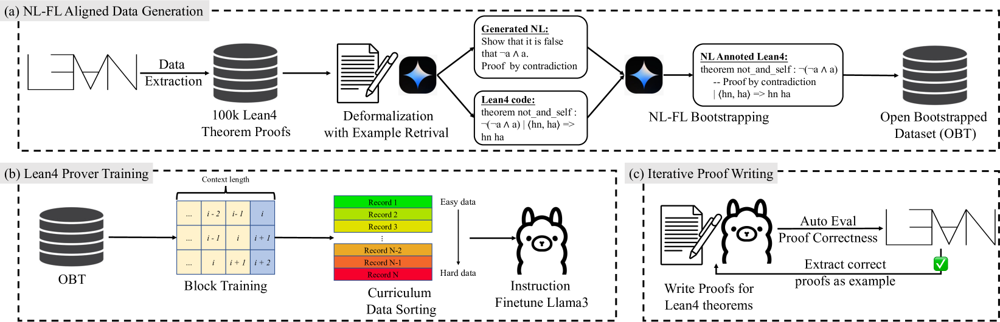

# TheoremLlama：让通用 LLM 成为 Lean4 领域的专家

发布时间：2024年07月03日

`LLM应用` `计算机科学`

> TheoremLlama: Transforming General-Purpose LLMs into Lean4 Experts

# 摘要

> 利用计算机可验证的形式语言（如Lean）证明数学定理，极大地推动了数学推理的发展。其中一种方法是通过大型语言模型（LLM）基于自然语言（NL）证明生成完整证明，这种方法在代码生成领域已显示出潜力。然而，由于自然语言与形式语言（FL）定理证明数据的对齐不足，现代LLM的性能普遍受限。这种不足导致了训练LLM的方法和充分利用其在形式证明中能力的技术匮乏。为此，本文提出了**TheoremLlama**框架，旨在将通用LLM训练成Lean4专家。该框架涵盖了NL-FL对齐数据集生成、LLM形式定理证明器训练及Lean4证明写作技术。我们通过数据集生成方法，提供了*Open Bootstrapped Theorems*（OBT），这是一个NL-FL对齐且自举的数据集。框架的核心创新在于NL-FL自举方法，将NL证明融入Lean4代码，利用LLM的NL推理能力进行形式推理。**TheoremLlama**在MiniF2F-Valid和Test数据集上的累积准确率分别达到36.48%和33.61%，超越了GPT-4的22.95%和25.41%基线。此外，我们还开源了模型检查点和生成的数据集，并将很快公开所有代码。

> Proving mathematical theorems using computer-verifiable formal languages like Lean significantly impacts mathematical reasoning. One approach to formal theorem proving involves generating complete proofs using Large Language Models (LLMs) based on Natural Language (NL) proofs. Similar methods have shown promising results in code generation. However, most modern LLMs exhibit suboptimal performance due to the scarcity of aligned NL and Formal Language (FL) theorem-proving data. This scarcity results in a paucity of methodologies for training LLMs and techniques to fully utilize their capabilities in composing formal proofs. To address the challenges, this paper proposes **TheoremLlama**, an end-to-end framework to train a general-purpose LLM to become a Lean4 expert. This framework encompasses NL-FL aligned dataset generation methods, training approaches for the LLM formal theorem prover, and techniques for LLM Lean4 proof writing. Using the dataset generation method, we provide *Open Bootstrapped Theorems* (OBT), an NL-FL aligned and bootstrapped dataset. A key innovation in this framework is the NL-FL bootstrapping method, where NL proofs are integrated into Lean4 code for training datasets, leveraging the NL reasoning ability of LLMs for formal reasoning. The **TheoremLlama** framework achieves cumulative accuracies of 36.48% and 33.61% on MiniF2F-Valid and Test datasets respectively, surpassing the GPT-4 baseline of 22.95% and 25.41%. We have also open-sourced our model checkpoints and generated dataset, and will soon make all the code publicly available.

[Arxiv](https://arxiv.org/abs/2407.03203)