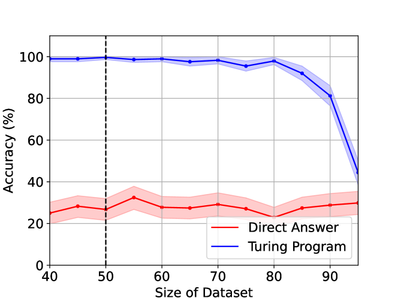

# 图灵程序在通用长度泛化中的应用

发布时间：2024年07月03日

`LLM理论` `人工智能` `计算机科学`

> Universal Length Generalization with Turing Programs

# 摘要

> 长度泛化能力，即从短序列训练到长序列测试的外推能力，是大型语言模型面临的一大挑战。虽然已有研究尝试通过改变架构或数据格式来解决这一问题，但这些方法往往局限于特定任务。我们基于先前的scratchpad和Chain-of-Thought（CoT）技术，创新性地提出了Turing Programs策略，将算法任务分解为模拟图灵机计算的步骤。这一策略不仅通用性强，适用于任何算法任务，而且操作简便，仅需对上下文文本进行小幅修改。实验表明，采用Turing Programs策略，我们在加法、乘法及上下文SGD等多项算法任务上实现了稳健的长度泛化。进一步研究发现，transformer模型在处理随机Turing Programs时也能实现长度泛化，这表明任何算法任务都有可能实现这一目标。最后，我们从理论层面证明了transformer模型能够执行Turing Programs，并构建了一个模拟任意图灵机的简单RASP程序。

> Length generalization refers to the ability to extrapolate from short training sequences to long test sequences and is a challenge for current large language models. While prior work has proposed some architecture or data format changes to achieve length generalization, these proposals typically apply to a limited set of tasks. Building on prior scratchpad and Chain-of-Thought (CoT) techniques, we propose Turing Programs, a novel CoT strategy that decomposes an algorithmic task into steps mimicking the computation of a Turing Machine. This framework is both universal, as it can accommodate any algorithmic task, and simple, requiring only copying text from the context with small modifications. We show that by using Turing Programs, we obtain robust length generalization on a range of algorithmic tasks: addition, multiplication and in-context SGD. We then demonstrate that transformers achieve length generalization on random Turing Programs, suggesting that length generalization is possible for any algorithmic task. Finally, we theoretically prove that transformers can implement Turing Programs, constructing a simple RASP (Weiss et al.) program that simulates an arbitrary Turing machine.

[Arxiv](https://arxiv.org/abs/2407.03310)