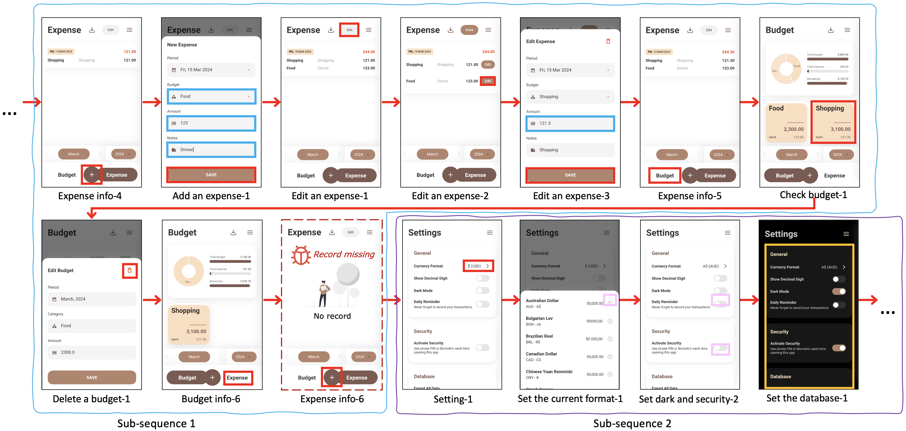

# 利用多模态大型语言模型实现视觉驱动的移动GUI自动化测试

发布时间：2024年07月03日

`LLM应用` `软件测试` `移动应用`

> Vision-driven Automated Mobile GUI Testing via Multimodal Large Language Model

# 摘要

> 随着软件渲染技术的提升，移动应用的GUI页面如今承载了丰富的视觉信息，这些视觉语义对应用逻辑至关重要，同时也为软件测试带来了新挑战。尽管自动化GUI测试有所进步，但由于缺乏有效的测试预言，其效果仍局限于识别明显的崩溃错误。然而，许多非崩溃错误，如意外行为或界面错位，往往难以被现有技术捕捉。这些错误虽可能通过视觉线索提供潜在的测试预言，但检测它们需要深入理解GUI页面间的操作逻辑，这对传统技术构成挑战。鉴于多模态大型语言模型（MLLM）在视觉与语言理解上的卓越能力，本文提出了一种基于视觉的自动化GUI测试方法——VisionDroid，旨在利用MLLM检测非崩溃功能错误。该方法首先提取GUI文本信息并结合截图形成视觉提示，使MLLM能理解GUI上下文。随后，功能感知探索器引导MLLM进行深入且面向功能的GUI页面探索，而逻辑感知错误检测器则将探索历史按逻辑分段，并引导MLLM进行错误检测。我们在三个数据集上验证了VisionDroid，并对比了10个基线方法，证实了其优异性能。消融研究进一步凸显了各模块的贡献。此外，VisionDroid在Google Play上发现了29个新错误，其中19个已获确认并得到修复。

> With the advancement of software rendering techniques, GUI pages in mobile apps now encompass a wealth of visual information, where the visual semantics of each page contribute to the overall app logic, presenting new challenges to software testing. Despite the progress in automated Graphical User Interface (GUI) testing, the absence of testing oracles has constrained its efficacy to identify only crash bugs with evident abnormal signals. Nonetheless, there are still a considerable number of non-crash bugs, ranging from unexpected behaviors to misalignments, often evading detection by existing techniques. While these bugs can exhibit visual cues that serve as potential testing oracles, they often entail a sequence of screenshots, and detecting them necessitates an understanding of the operational logic among GUI page transitions, which is challenging traditional techniques. Considering the remarkable performance of Multimodal Large Language Models (MLLM) in visual and language understanding, this paper proposes a vision-driven automated GUI testing approach VisionDroid to detect non-crash functional bugs with MLLM. It begins by extracting GUI text information and aligning it with screenshots to form a vision prompt, enabling MLLM to understand GUI context. The function-aware explorer then employs MLLM for deeper and function-oriented GUI page exploration, while the logic-aware bug detector segments the entire exploration history into logically cohesive parts and prompts the MLLM for bug detection. We evaluate VisionDroid on three datasets and compare it with 10 baselines, demonstrating its excellent performance. The ablation study further proves the contribution of each module. Moreover, VisionDroid identifies 29 new bugs on Google Play, of which 19 have been confirmed and fixed.

[Arxiv](https://arxiv.org/abs/2407.03037)