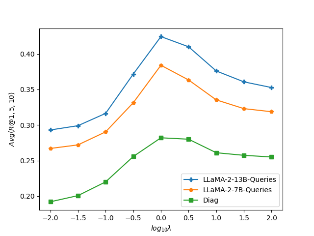

# 借助大型语言模型，通过深入理解对话内容，我们提升了图像选择的精准度，实现了对话的可视化呈现。

发布时间：2024年07月03日

`LLM应用` `人工智能` `图像处理`

> Visualizing Dialogues: Enhancing Image Selection through Dialogue Understanding with Large Language Models

# 摘要

> 对话系统的最新进展强调了整合多模态响应的重要性，这种响应方式通过多种模态传达思想，不仅提升了沟通效率，还增强了对话体验。然而，现有的对话到图像检索方法受限于预训练视觉语言模型（VLM）在理解复杂对话方面的不足。为此，我们提出了一种新方法，利用大型语言模型（LLM）的强大推理能力生成精确的对话相关视觉描述符，实现与图像的无缝连接。基准数据上的实验证实了我们的方法在生成简洁准确视觉描述符方面的有效性，显著提升了检索性能。研究还表明，该方法在不同视觉线索、LLM和数据集上的通用性，凸显了其在实际应用中的实用性和潜在影响。

> Recent advancements in dialogue systems have highlighted the significance of integrating multimodal responses, which enable conveying ideas through diverse modalities rather than solely relying on text-based interactions. This enrichment not only improves overall communicative efficacy but also enhances the quality of conversational experiences. However, existing methods for dialogue-to-image retrieval face limitations due to the constraints of pre-trained vision language models (VLMs) in comprehending complex dialogues accurately. To address this, we present a novel approach leveraging the robust reasoning capabilities of large language models (LLMs) to generate precise dialogue-associated visual descriptors, facilitating seamless connection with images. Extensive experiments conducted on benchmark data validate the effectiveness of our proposed approach in deriving concise and accurate visual descriptors, leading to significant enhancements in dialogue-to-image retrieval performance. Furthermore, our findings demonstrate the method's generalizability across diverse visual cues, various LLMs, and different datasets, underscoring its practicality and potential impact in real-world applications.

[Arxiv](https://arxiv.org/abs/2407.03615)