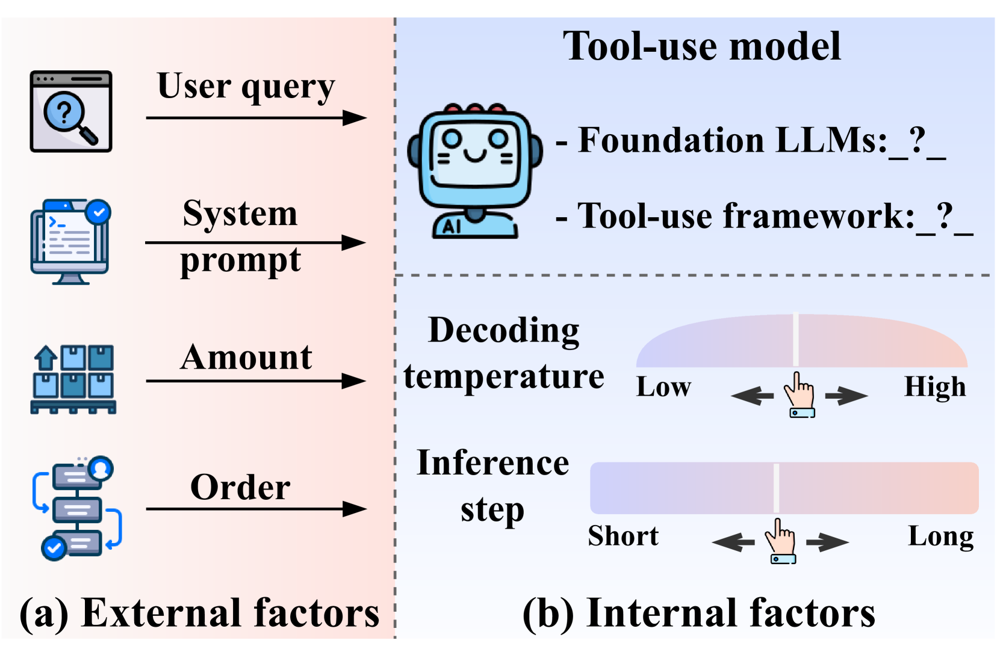
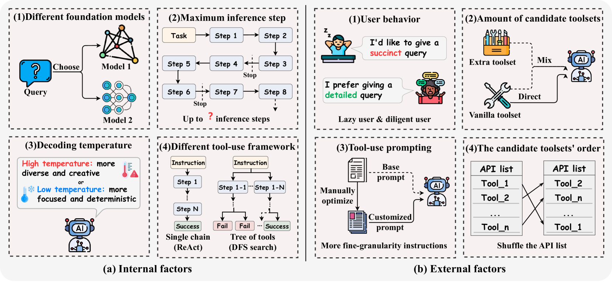

# 工具学习的稳定性受何影响？本研究深入探讨了工具学习框架的鲁棒性。

发布时间：2024年07月03日

`LLM应用` `人工智能` `软件开发`

> What Affects the Stability of Tool Learning? An Empirical Study on the Robustness of Tool Learning Frameworks

# 摘要

> 工具学习方法提升了 LLM 与现实应用的互动能力，但性能受任务、数据集、训练设置和算法影响，导致结果不一、部署低效和工具使用欠佳。本文深入分析了这些内外因素，通过实验揭示了 LLM 在更多尝试和探索中能显著提升性能。我们的研究为工具学习领域带来了新视角。

> Tool learning methods have enhanced the ability of large language models (LLMs) to interact with real-world applications. Many existing works fine-tune LLMs or design prompts to enable LLMs to select appropriate tools and correctly invoke them to meet user requirements. However, it is observed in previous works that the performance of tool learning varies from tasks, datasets, training settings, and algorithms. Without understanding the impact of these factors, it can lead to inconsistent results, inefficient model deployment, and suboptimal tool utilization, ultimately hindering the practical integration and scalability of LLMs in real-world scenarios. Therefore, in this paper, we explore the impact of both internal and external factors on the performance of tool learning frameworks. Through extensive experiments on two benchmark datasets, we find several insightful conclusions for future work, including the observation that LLMs can benefit significantly from increased trial and exploration. We believe our empirical study provides a new perspective for future tool learning research.

[Arxiv](https://arxiv.org/abs/2407.03007)