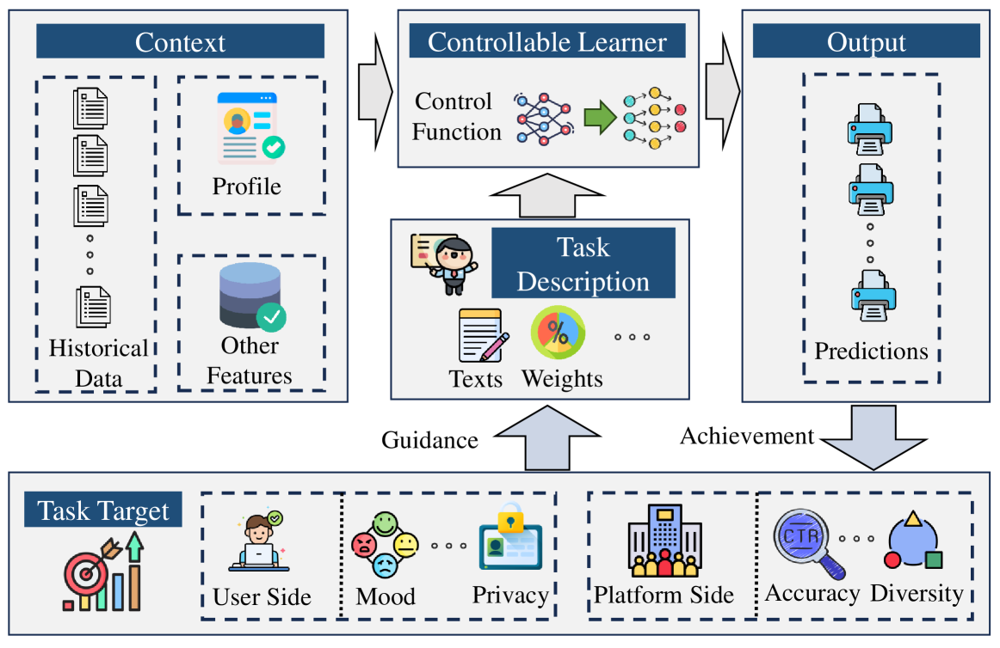

# 探索可控学习：揭秘信息检索领域的技术与应用

发布时间：2024年07月04日

`LLM理论` `信息检索` `机器学习`

> A Survey of Controllable Learning: Methods and Applications in Information Retrieval

# 摘要

> 可控学习（CL）是构建可信机器学习的核心，它确保学习系统能精准达成预定目标，并随目标变化灵活调整，无需重新训练。我们为CL下了定义，并探讨了其在信息检索（IR）领域的应用，这里的信息需求多变且复杂。我们根据控制主体（用户或平台）、可控要素（如检索目标、用户行为、环境适应性）、控制方式（基于规则、帕累托优化、超网络等）及实施环节（预处理、处理中、后处理）对CL进行了分类。同时，我们指出了CL在训练、评估、任务设计及在线部署中遇到的挑战，并展望了其在理论深化、计算优化、大型语言模型赋能、应用拓展及评估体系构建等方面的潜力。

> Controllable learning (CL) emerges as a critical component in trustworthy machine learning, ensuring that learners meet predefined targets and can adaptively adjust without retraining according to the changes in those targets. We provide a formal definition of CL, and discuss its applications in information retrieval (IR) where information needs are often complex and dynamic. The survey categorizes CL according to who controls (users or platforms), what is controllable (e.g., retrieval objectives, users' historical behaviors, controllable environmental adaptation), how control is implemented (e.g., rule-based method, Pareto optimization, Hypernetwork), and where to implement control (e.g.,pre-processing, in-processing, post-processing methods). Then, we identify challenges faced by CL across training, evaluation, task setting, and deployment in online environments. Additionally, we outline promising directions for CL in theoretical analysis, efficient computation, empowering large language models, application scenarios and evaluation frameworks in IR.

[Arxiv](https://arxiv.org/abs/2407.06083)