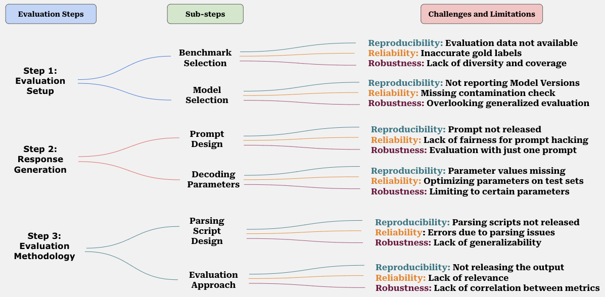
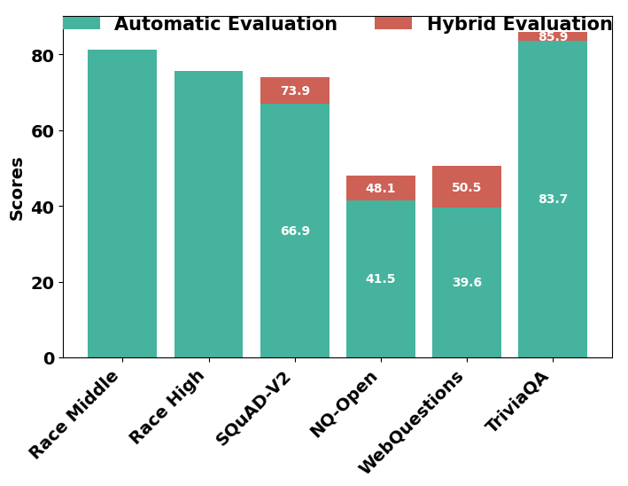
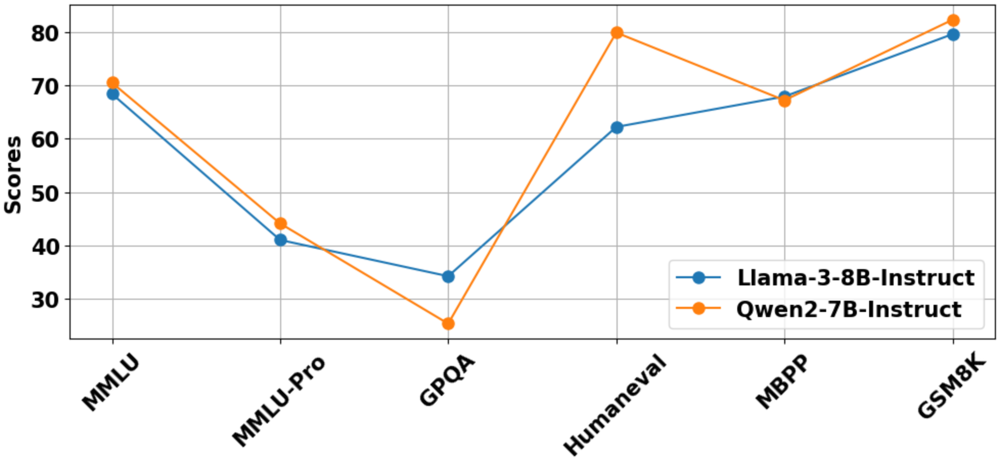
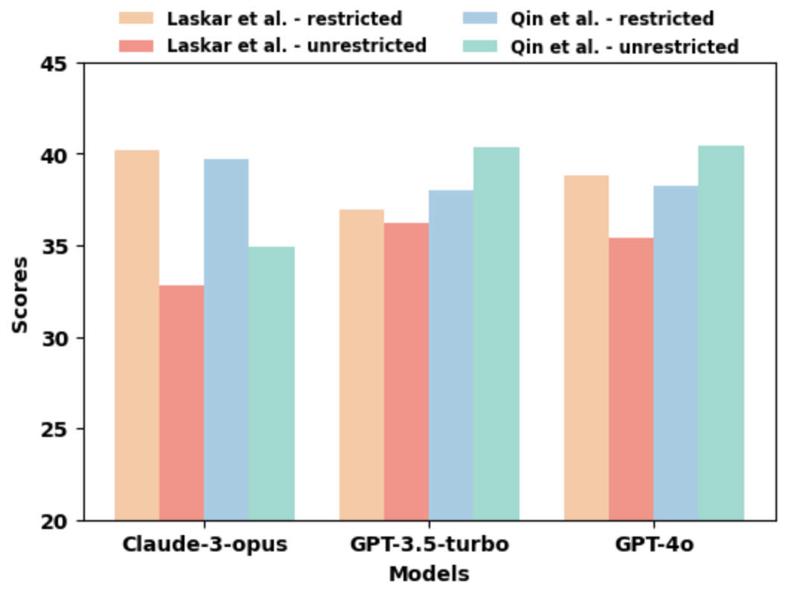
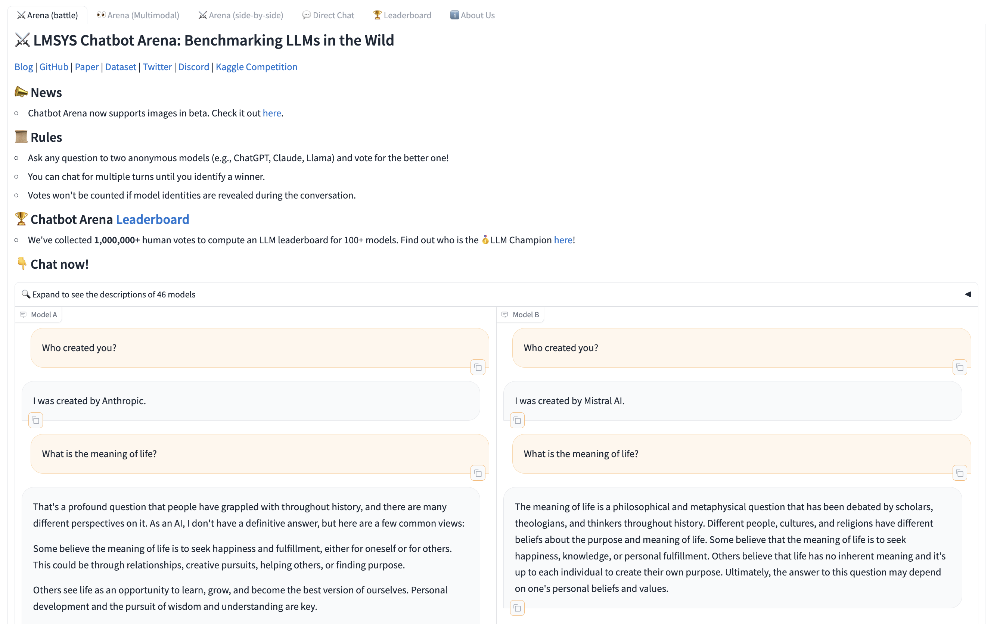

# 本文系统探讨并批判性分析了评估大型语言模型的挑战与局限，并提出了相应建议。

发布时间：2024年07月04日

`LLM理论` `人工智能` `软件工程`

> A Systematic Survey and Critical Review on Evaluating Large Language Models: Challenges, Limitations, and Recommendations

# 摘要

> 近期，大型语言模型因其跨领域执行多样化任务的卓越能力而备受瞩目。但在实际应用前，对其进行全面评估是确保性能可靠的关键。尽管评估 LLM 的重要性已成共识，评估过程的复杂性却导致了评估方法的多样性，进而引发了结果和解释的不一致。为此，我们深入探讨了造成这些不一致和评估不可靠的主要难题与局限，并基于此，提出了确保 LLM 评估具备可重复性、可靠性和健壮性的见解与建议。

> Large Language Models (LLMs) have recently gained significant attention due to their remarkable capabilities in performing diverse tasks across various domains. However, a thorough evaluation of these models is crucial before deploying them in real-world applications to ensure they produce reliable performance. Despite the well-established importance of evaluating LLMs in the community, the complexity of the evaluation process has led to varied evaluation setups, causing inconsistencies in findings and interpretations. To address this, we systematically review the primary challenges and limitations causing these inconsistencies and unreliable evaluations in various steps of LLM evaluation. Based on our critical review, we present our perspectives and recommendations to ensure LLM evaluations are reproducible, reliable, and robust.

[Arxiv](https://arxiv.org/abs/2407.04069)