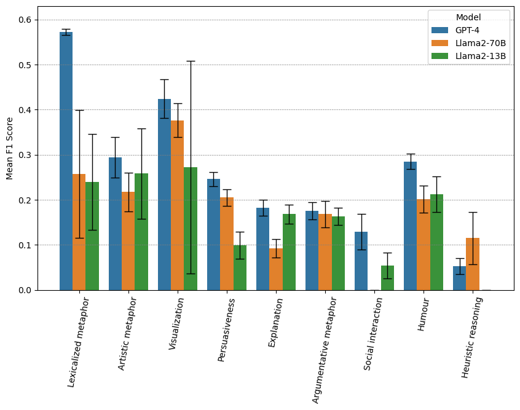
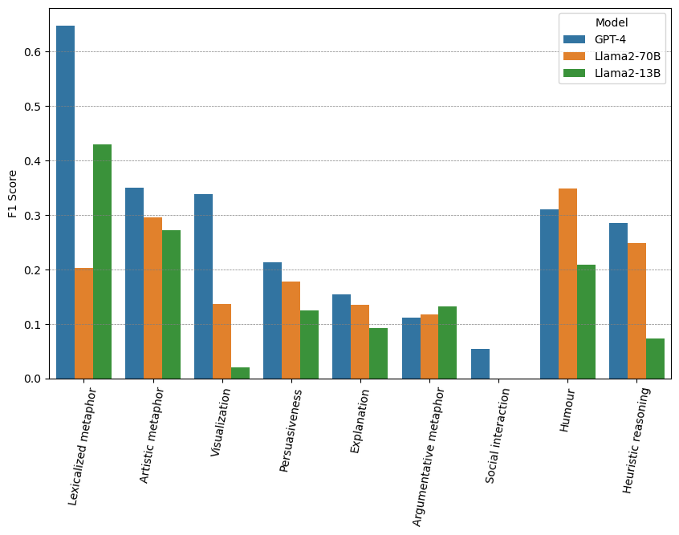

# 构建一个框架，旨在注释并建模隐喻使用背后的意图。

发布时间：2024年07月04日

`LLM应用` `语言学`

> A framework for annotating and modelling intentions behind metaphor use

# 摘要

> 隐喻不仅是日常语言的基石，更是我们理解世界的独特视角。在交流中，隐喻的多重角色使其成为语言模型的一大难题。虽然研究已将隐喻与个人意图紧密相连，但适用于NLP的全面意图分类仍付阙如。本文中，我们创新性地提出了一套包含九大类别的隐喻意图分类体系，并首次公开了相关注释数据集。通过此数据集，我们检验了大型语言模型在零-shot及few-shot情境下解读隐喻背后意图的能力，结果显示，这仍是LLMs面临的挑战。

> Metaphors are part of everyday language and shape the way in which we conceptualize the world. Moreover, they play a multifaceted role in communication, making their understanding and generation a challenging task for language models (LMs). While there has been extensive work in the literature linking metaphor to the fulfilment of individual intentions, no comprehensive taxonomy of such intentions, suitable for natural language processing (NLP) applications, is available to present day. In this paper, we propose a novel taxonomy of intentions commonly attributed to metaphor, which comprises 9 categories. We also release the first dataset annotated for intentions behind metaphor use. Finally, we use this dataset to test the capability of large language models (LLMs) in inferring the intentions behind metaphor use, in zero- and in-context few-shot settings. Our experiments show that this is still a challenge for LLMs.

[Arxiv](https://arxiv.org/abs/2407.03952)