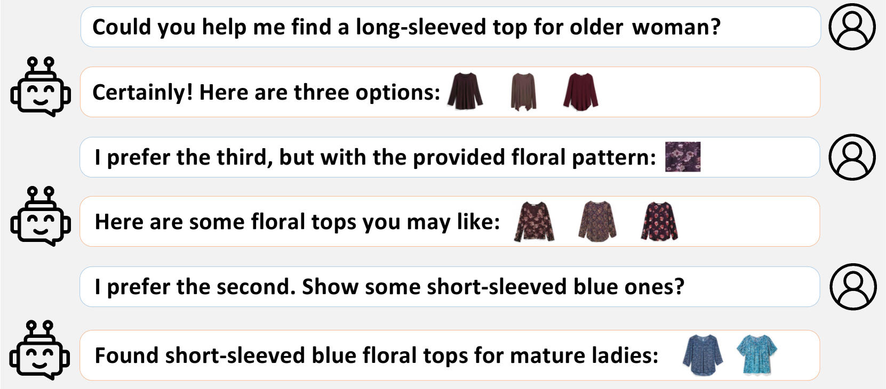
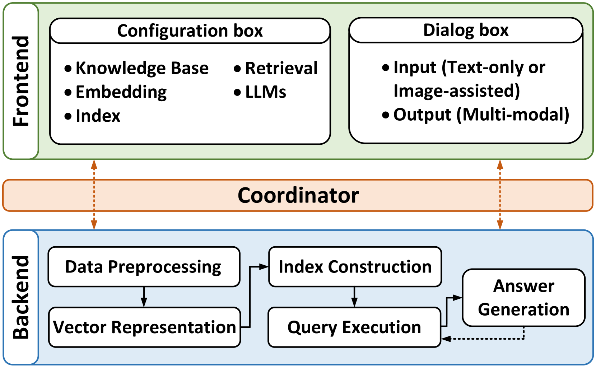
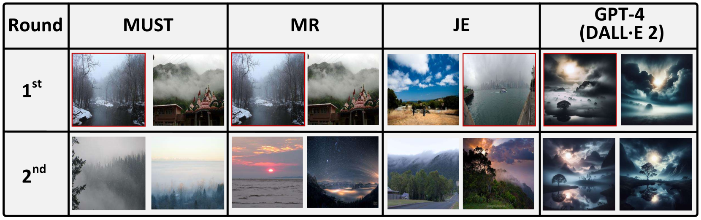

# 交互式多模态查询应答系统，搭载检索增强型大型语言模型

发布时间：2024年07月04日

`RAG` `多媒体` `搜索引擎`

> An Interactive Multi-modal Query Answering System with Retrieval-Augmented Large Language Models

# 摘要

> 检索增强型大型语言模型 (LLM) 彻底改变了传统查询-回答系统，提供前所未有的用户体验。然而，现有检索技术在处理多模态查询时面临挑战。本文介绍的交互式多模态查询回答 (MQA) 系统，借助新开发的多模态检索框架和导航图索引，与顶尖 LLM 无缝集成。系统包含数据预处理、向量表示、索引构建、查询执行和答案生成五大核心模块，由专用协调器确保数据流畅。MQA 利用对比学习评估模态重要性，精准衡量多模态信息相似度。通过先进的导航图索引和计算修剪技术，实现高效检索。系统还具备可插拔处理框架，轻松集成嵌入模型、图索引和 LLM，为用户提供多样化的知识库洞察选择。MQA 初步介绍视频见 https://youtu.be/xvUuo2ZIqWk。

> Retrieval-augmented Large Language Models (LLMs) have reshaped traditional query-answering systems, offering unparalleled user experiences. However, existing retrieval techniques often struggle to handle multi-modal query contexts. In this paper, we present an interactive Multi-modal Query Answering (MQA) system, empowered by our newly developed multi-modal retrieval framework and navigation graph index, integrated with cutting-edge LLMs. It comprises five core components: Data Preprocessing, Vector Representation, Index Construction, Query Execution, and Answer Generation, all orchestrated by a dedicated coordinator to ensure smooth data flow from input to answer generation. One notable aspect of MQA is its utilization of contrastive learning to assess the significance of different modalities, facilitating precise measurement of multi-modal information similarity. Furthermore, the system achieves efficient retrieval through our advanced navigation graph index, refined using computational pruning techniques. Another highlight of our system is its pluggable processing framework, allowing seamless integration of embedding models, graph indexes, and LLMs. This flexibility provides users diverse options for gaining insights from their multi-modal knowledge base. A preliminary video introduction of MQA is available at https://youtu.be/xvUuo2ZIqWk.

[Arxiv](https://arxiv.org/abs/2407.04217)