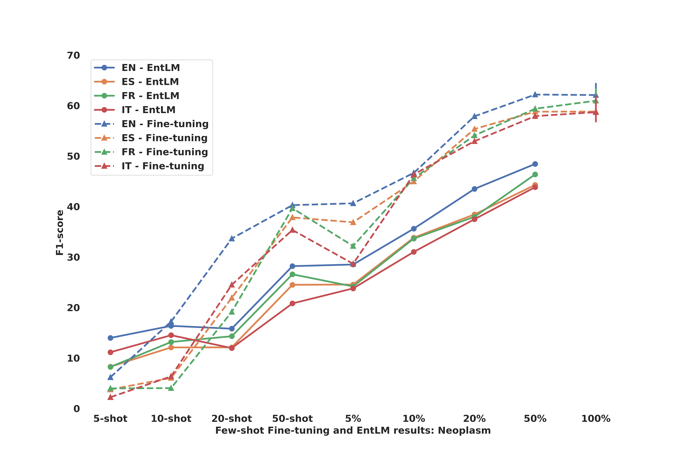

# 在数据稀缺的情境下，论证挖掘借助跨语言迁移和少量样本技术，探索新的可能性。

发布时间：2024年07月04日

`LLM理论` `机器学习`

> Argument Mining in Data Scarce Settings: Cross-lingual Transfer and Few-shot Techniques

# 摘要

> 近期研究探索了多种策略以解决全球多数语言缺乏手动标注数据的问题，其中最有效的方法包括多语言预训练模型的跨语言迁移、数据翻译与标签投影以及基于提示的少样本学习。以往研究表明，模型迁移胜过数据迁移，且提示式少样本学习优于模型微调。然而，本文通过论证挖掘任务的实证分析发现，这些先前的结论并不适用。我们发现，在论证挖掘中，数据迁移效果优于模型迁移，且微调技术超越了少样本学习。数据集的领域特性对数据迁移至关重要，而任务的复杂性与采样策略则对少样本学习影响显著。

> Recent research on sequence labelling has been exploring different strategies to mitigate the lack of manually annotated data for the large majority of the world languages. Among others, the most successful approaches have been based on (i) the cross-lingual transfer capabilities of multilingual pre-trained language models (model-transfer), (ii) data translation and label projection (data-transfer) and (iii), prompt-based learning by reusing the mask objective to exploit the few-shot capabilities of pre-trained language models (few-shot). Previous work seems to conclude that model-transfer outperforms data-transfer methods and that few-shot techniques based on prompting are superior to updating the model's weights via fine-tuning. In this paper, we empirically demonstrate that, for Argument Mining, a sequence labelling task which requires the detection of long and complex discourse structures, previous insights on cross-lingual transfer or few-shot learning do not apply. Contrary to previous work, we show that for Argument Mining data transfer obtains better results than model-transfer and that fine-tuning outperforms few-shot methods. Regarding the former, the domain of the dataset used for data-transfer seems to be a deciding factor, while, for few-shot, the type of task (length and complexity of the sequence spans) and sampling method prove to be crucial.

[Arxiv](https://arxiv.org/abs/2407.03748)