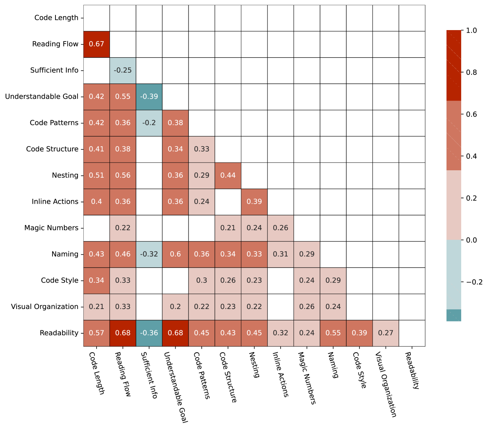

# 探究开发者对代码可读性共识的评估

发布时间：2024年07月04日

`LLM应用` `软件开发` `人工智能`

> Assessing Consensus of Developers' Views on Code Readability

# 摘要

> 随着大型语言模型（LLM）的迅猛发展，软件开发领域也迎来了变革，诸如 Copilot 和 JetBrains AI 助手等工具极大地提升了开发效率。然而，开发者如今更多地投入到代码审查中，这凸显了代码可读性在理解代码中的关键作用。我们的先前研究揭示了现有代码可读性模型的不足，以及开发者间对此概念共识的缺乏，这为深入探索该领域提供了契机。  为此，我们针对 10 位经验相近的 Java 开发者进行了调研，旨在探究他们在代码可读性评价上的共识及相关因素。结果显示，开发者们在代码可读性评估上达成了显著的一致，并识别出与可读性紧密相关的代码特征。本研究不仅为 LLM 环境下的代码可读性提供了洞见，更指出了如何使模型更好地契合开发者对可读性的认知，从而在人工智能时代推动软件开发的进步。

> The rapid rise of Large Language Models (LLMs) has changed software development, with tools like Copilot, JetBrains AI Assistant, and others boosting developers' productivity. However, developers now spend more time reviewing code than writing it, highlighting the importance of Code Readability for code comprehension. Our previous research found that existing Code Readability models were inaccurate in representing developers' notions and revealed a low consensus among developers, highlighting a need for further investigations in this field.
  Building on this, we surveyed 10 Java developers with similar coding experience to evaluate their consensus on Code Readability assessments and related aspects. We found significant agreement among developers on Code Readability evaluations and identified specific code aspects strongly correlated with Code Readability. Overall, our study sheds light on Code Readability within LLM contexts, offering insights into how these models can align with developers' perceptions of Code Readability, enhancing software development in the AI era.

[Arxiv](https://arxiv.org/abs/2407.03790)