# 利用大型语言模型实现 C/C++ 程序在高级综合中的自动化修复

发布时间：2024年07月04日

`RAG` `半导体` `软件开发`

> Automated C/C++ Program Repair for High-Level Synthesis via Large Language Models

# 摘要

> 在高级综合（HLS）领域，将C/C++程序转换为HLS-C程序仍需大量人工操作。虽然已有多种脚本尝试自动化这一过程，但生成的代码往往问题频发，需开发者手动修正。鉴于大型语言模型（LLMs）在代码生成方面的潜力，它们也被探索用于HLS程序的自动修复。然而，LLMs在同时处理硬件与软件方面的训练不足，可能导致修复过程中的“幻觉”现象，进而引发编译失败。此外，LLMs的迭代修复成本也相对较高。为此，我们设计了一个由LLM驱动的程序修复框架，该框架能自动将C/C++代码转换为HLS-C代码，并尽量减少人工干预。为减少LLMs的幻觉并提升修复质量，我们采用了检索增强生成（RAG）方法来引导LLMs进行准确修复。同时，利用LLMs进行静态位宽优化，以确定变量的最佳位宽。我们还引入了LLM驱动的HLS优化策略，通过调整HLS-C程序中的编译指示来优化电路性能。实验显示，与传统脚本及直接使用LLMs修复相比，我们的自动化框架在24个实际应用中显著提高了修复成功率。

> In High-Level Synthesis (HLS), converting a regular C/C++ program into its HLS-compatible counterpart (HLS-C) still requires tremendous manual effort. Various program scripts have been introduced to automate this process. But the resulting codes usually contain many issues that should be manually repaired by developers. Since Large Language Models (LLMs) have the ability to automate code generation, they can also be used for automated program repair in HLS. However, due to the limited training of LLMs considering hardware and software simultaneously, hallucinations may occur during program repair using LLMs, leading to compilation failures. Besides, using LLMs for iterative repair also incurs a high cost. To address these challenges, we propose an LLM-driven program repair framework that takes regular C/C++ code as input and automatically generates its corresponding HLS-C code for synthesis while minimizing human repair effort. To mitigate the hallucinations in LLMs and enhance the prompt quality, a Retrieval-Augmented Generation (RAG) paradigm is introduced to guide the LLMs toward correct repair. In addition, we use LLMs to create a static bit width optimization program to identify the optimized bit widths for variables. Moreover, LLM-driven HLS optimization strategies are introduced to add/tune pragmas in HLS-C programs for circuit optimization. Experimental results demonstrate that the proposed LLM-driven automated framework can achieve much higher repair pass rates in 24 real-world applications compared with the traditional scripts and the direct application of LLMs for program repair.

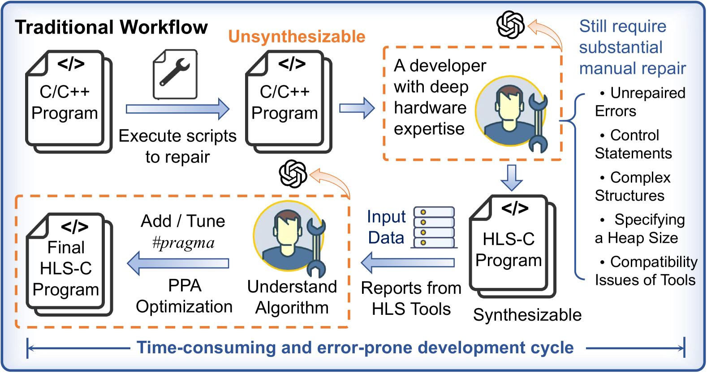

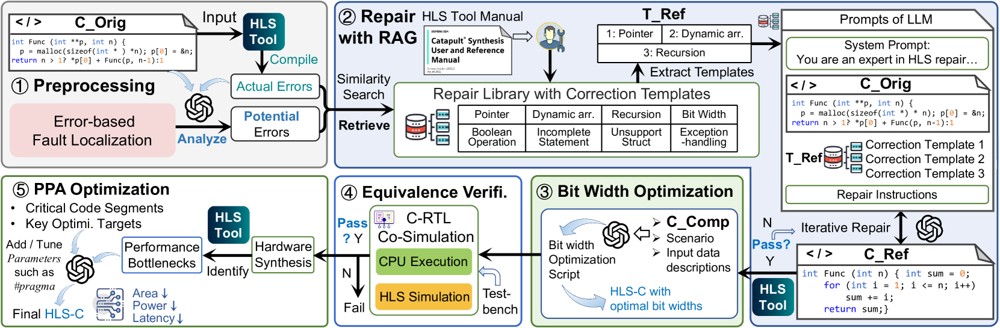

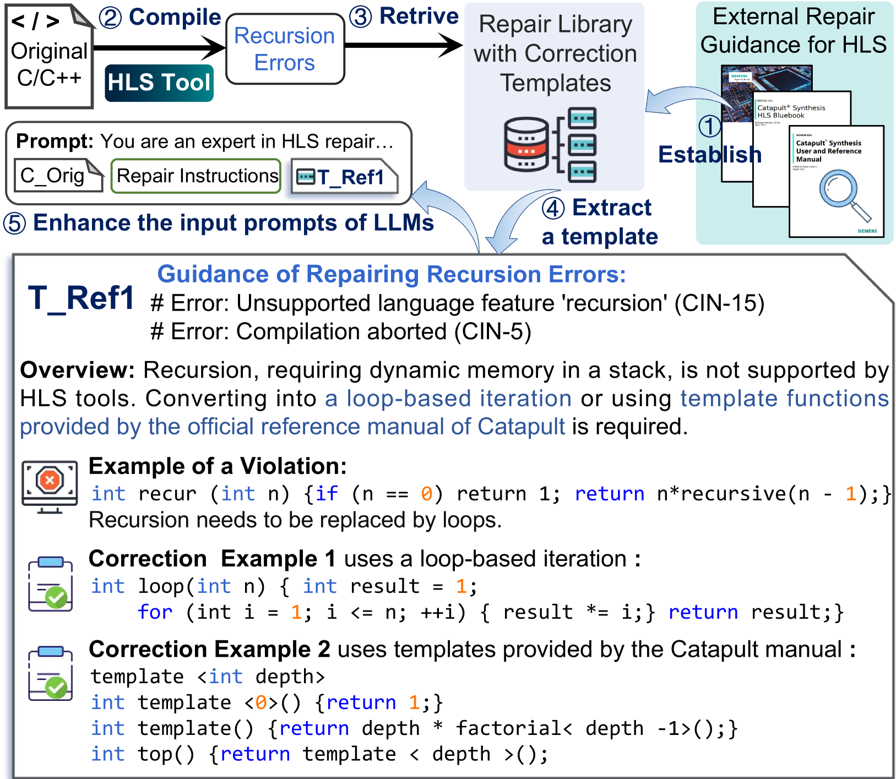

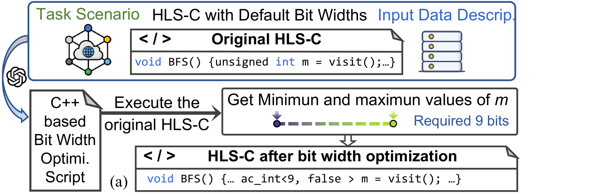

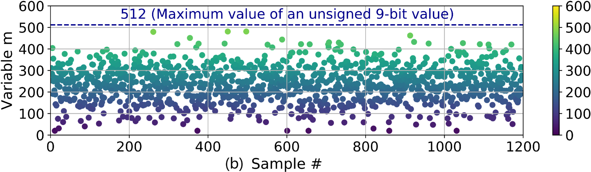

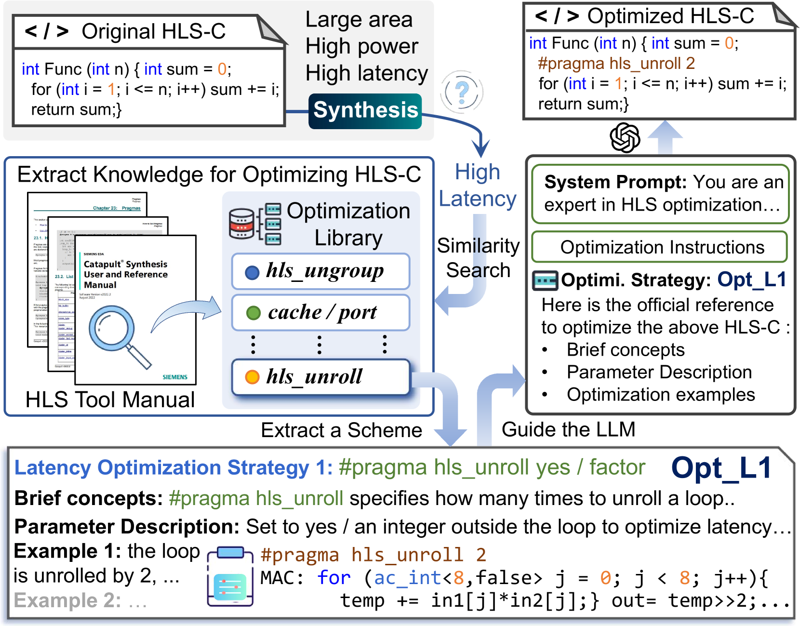

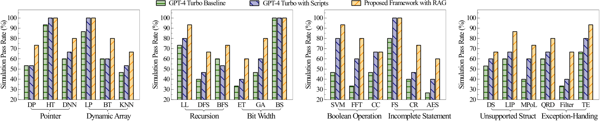

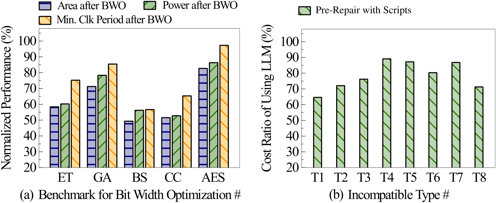

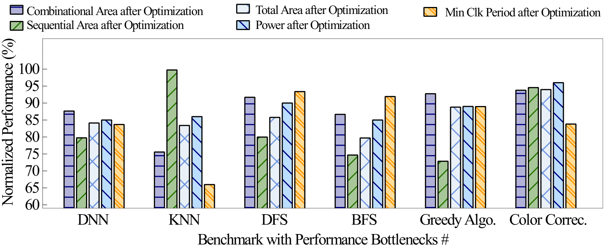

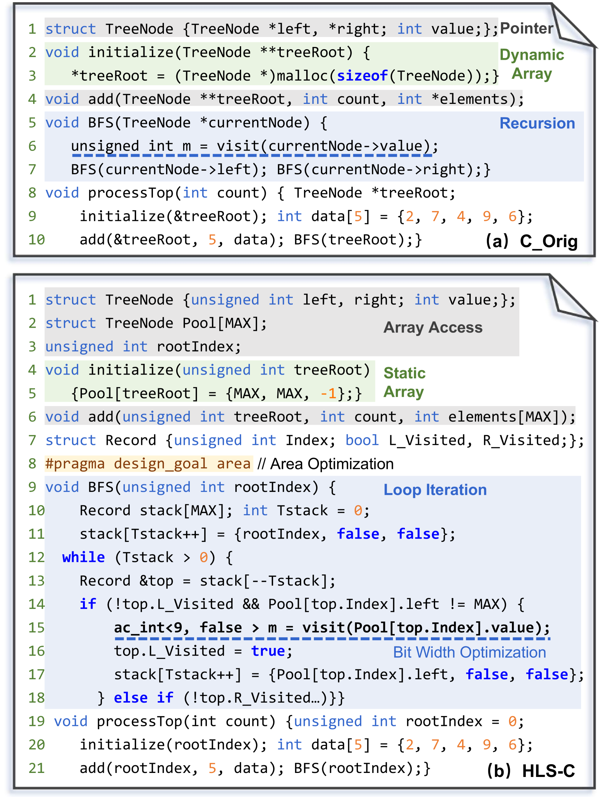

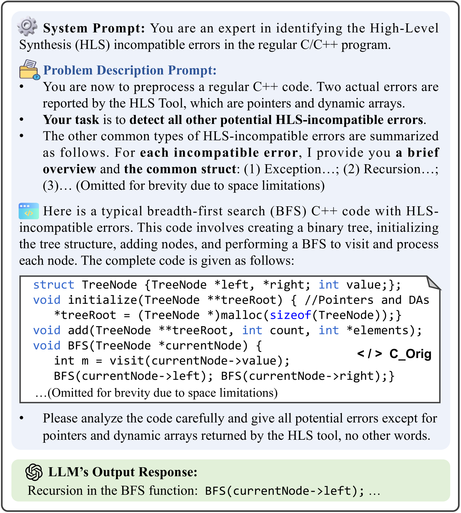

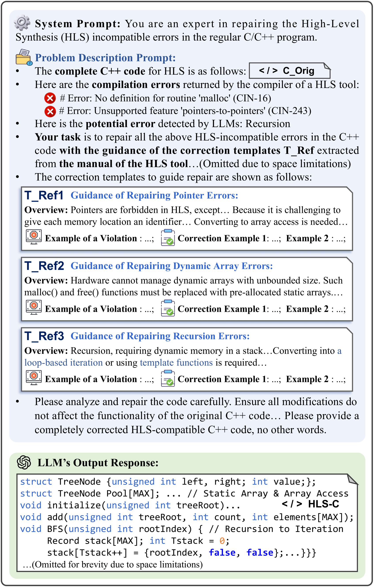

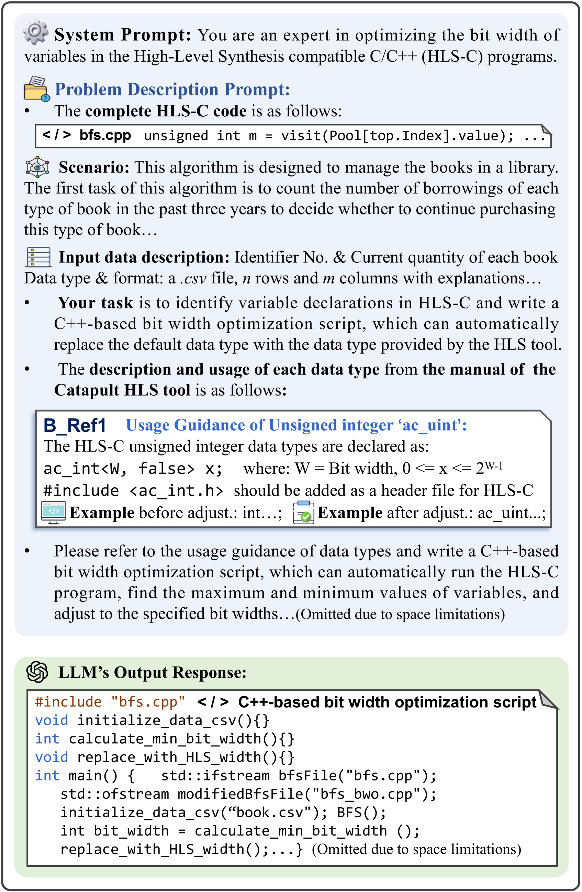

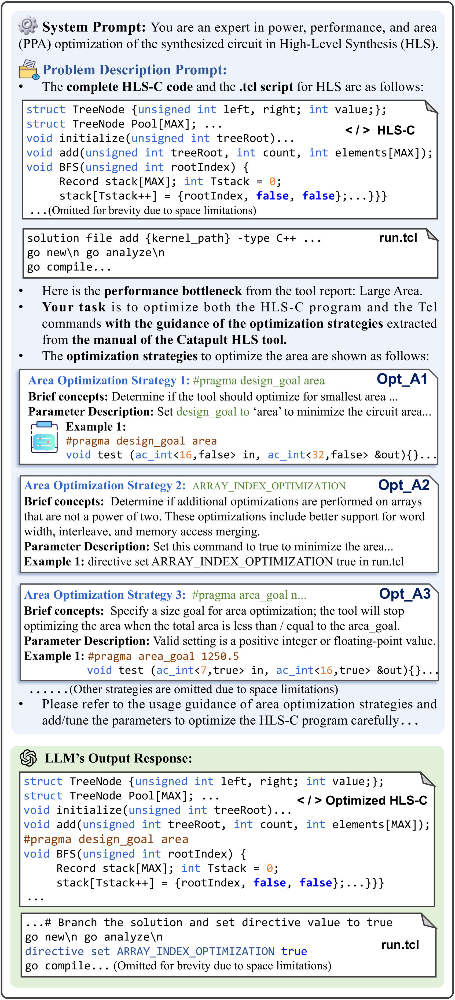

[Arxiv](https://arxiv.org/abs/2407.03889)