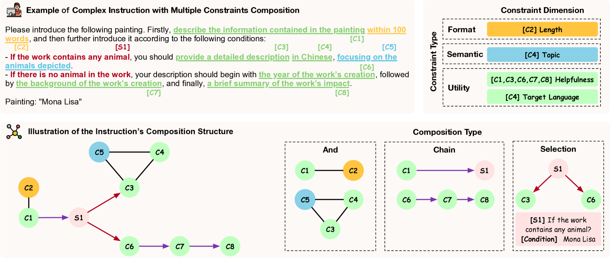
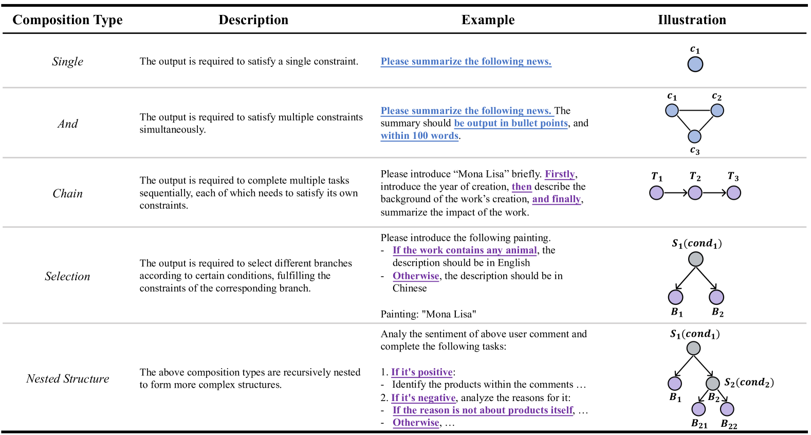
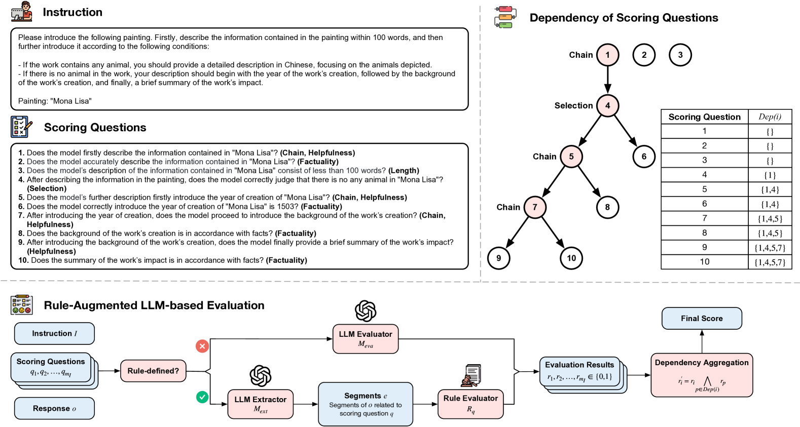
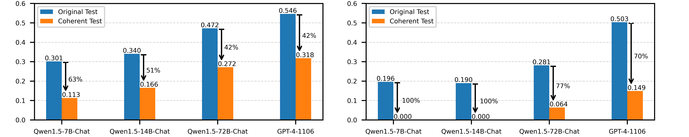

# 复杂指令遵循与多重约束组合的基准测试

发布时间：2024年07月04日

`LLM应用` `人工智能` `软件开发`

> Benchmarking Complex Instruction-Following with Multiple Constraints Composition

# 摘要

> 随着大规模语言模型（LLM）能力的不断提升，它们在处理现实场景中的复杂指令方面发挥着越来越重要的作用。然而，评估LLM遵循复杂指令的能力仍是一个挑战。为此，我们推出了ComplexBench，这是一个专为全面评估LLM处理多约束复杂指令能力而设计的基准。我们精心设计了一个包含4种约束类型、19个约束维度和4种组合类型的分层分类法，并手动构建了一个高质量数据集。通过规则增强的LLM评估器，我们确保了评估的可靠性，并根据不同组合类型的依赖结构得出最终评分。ComplexBench揭示了现有LLM在应对复杂多约束指令时的明显不足。

> Instruction following is one of the fundamental capabilities of large language models (LLMs). As the ability of LLMs is constantly improving, they have been increasingly applied to deal with complex human instructions in real-world scenarios. Therefore, how to evaluate the ability of complex instruction-following of LLMs has become a critical research problem. Existing benchmarks mainly focus on modeling different types of constraints in human instructions while neglecting the composition of different constraints, which is an indispensable constituent in complex instructions. To this end, we propose ComplexBench, a benchmark for comprehensively evaluating the ability of LLMs to follow complex instructions composed of multiple constraints. We propose a hierarchical taxonomy for complex instructions, including 4 constraint types, 19 constraint dimensions, and 4 composition types, and manually collect a high-quality dataset accordingly. To make the evaluation reliable, we augment LLM-based evaluators with rules to effectively verify whether generated texts can satisfy each constraint and composition. Furthermore, we obtain the final evaluation score based on the dependency structure determined by different composition types. ComplexBench identifies significant deficiencies in existing LLMs when dealing with complex instructions with multiple constraints composition.

[Arxiv](https://arxiv.org/abs/2407.03978)