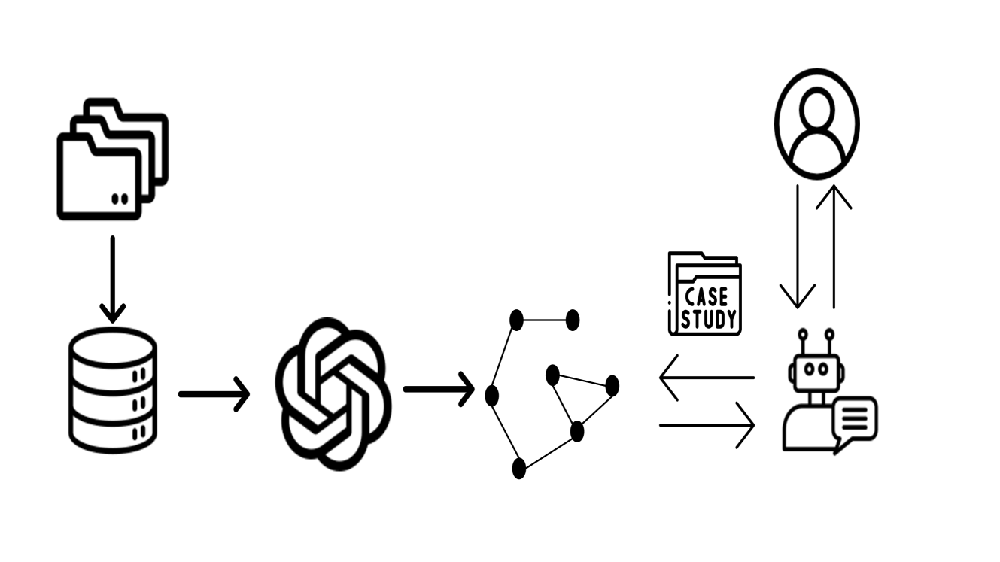

# CaseGPT：一种结合语言模型与检索增强技术的案例推理框架

发布时间：2024年07月04日

`RAG`

> CaseGPT: a case reasoning framework based on language models and retrieval-augmented generation

# 摘要

> 本文介绍的 CaseGPT 创新地将 LLM 与 RAG 技术结合，旨在提升医疗和法律领域的案例推理效率。通过模糊搜索技术，CaseGPT 克服了传统数据库查询的局限，大幅提升了数据检索的精准度和可用性。它不仅能高效检索相关案例，还能基于案例数据的模式，提供深入的建议和策略，这对于医疗诊断和法律研究等任务尤为关键。实验数据显示，CaseGPT 在精确度、召回率和效率上均超越了传统系统。本文详细探讨了其技术原理、应用效果及未来发展潜力。

> This paper presents CaseGPT, an innovative approach that combines Large Language Models (LLMs) and Retrieval-Augmented Generation (RAG) technology to enhance case-based reasoning in the healthcare and legal sectors. The system addresses the challenges of traditional database queries by enabling fuzzy searches based on imprecise descriptions, thereby improving data searchability and usability. CaseGPT not only retrieves relevant case data but also generates insightful suggestions and recommendations based on patterns discerned from existing case data. This functionality proves especially valuable for tasks such as medical diagnostics, legal precedent research, and case strategy formulation. The paper includes an in-depth discussion of the system's methodology, its performance in both medical and legal domains, and its potential for future applications. Our experiments demonstrate that CaseGPT significantly outperforms traditional keyword-based and simple LLM-based systems in terms of precision, recall, and efficiency.

[Arxiv](https://arxiv.org/abs/2407.07913)