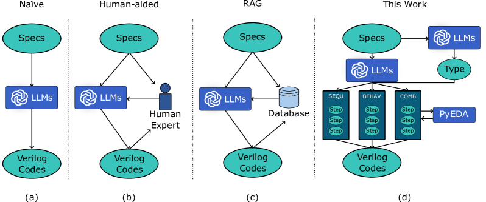
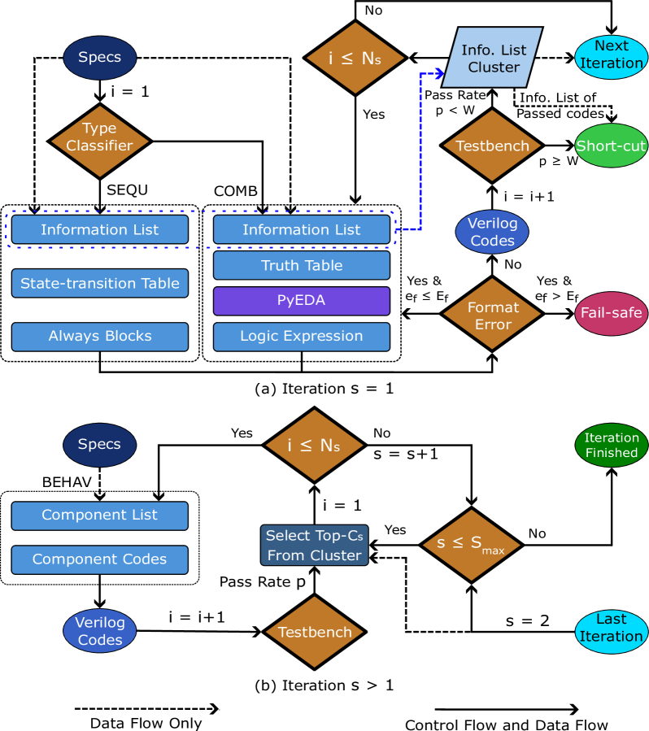
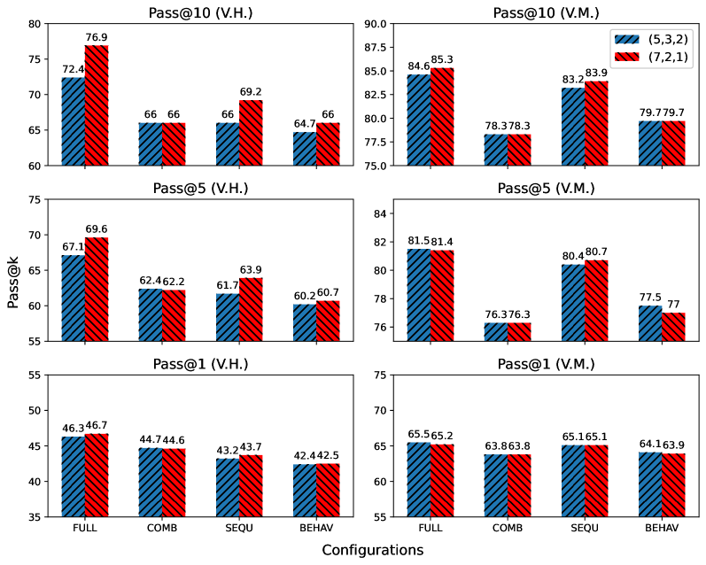
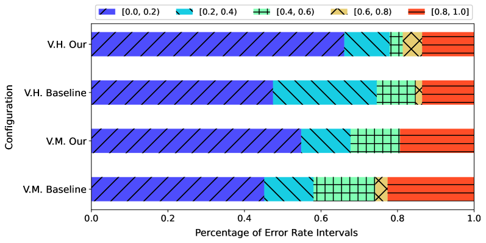

# 利用LLMs实现基于分类的自动HDL代码生成

发布时间：2024年07月04日

`LLM应用` `电子设计自动化` `硬件设计`

> Classification-Based Automatic HDL Code Generation Using LLMs

# 摘要

> 大型语言模型 (LLM) 虽能生成数字电路的硬件描述语言 (HDL) 代码，但常因幻觉问题导致代码错误或规范误解。为此，我们借鉴人类专家经验，提出新方法以减少幻觉并提升 HDL 代码质量。首先，LLM 依据规范识别电路类型，随后，根据类型将任务细分为信息提取和类人设计流程等子步骤，并运用电子设计自动化 (EDA) 工具。此外，通过搜索方法减少代码变异。实验显示，此法能大幅提升 Verilog 功能正确性，并有效降低 LLM 幻觉。

> While large language models (LLMs) have demonstrated the ability to generate hardware description language (HDL) code for digital circuits, they still suffer from the hallucination problem, which leads to the generation of incorrect HDL code or misunderstanding of specifications. In this work, we introduce a human-expert-inspired method to mitigate the hallucination of LLMs and improve the performance in HDL code generation. We first let LLMs classify the type of the circuit based on the specifications. Then, according to the type of the circuit, we split the tasks into several sub-procedures, including information extraction and human-like design flow using Electronic Design Automation (EDA) tools. Besides, we also use a search method to mitigate the variation in code generation. Experimental results show that our method can significantly improve the functional correctness of the generated Verilog and reduce the hallucination of LLMs.

[Arxiv](https://arxiv.org/abs/2407.18326)