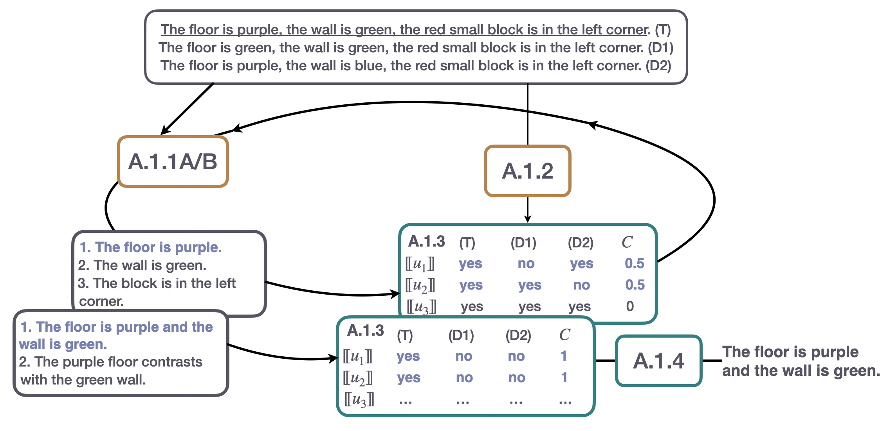
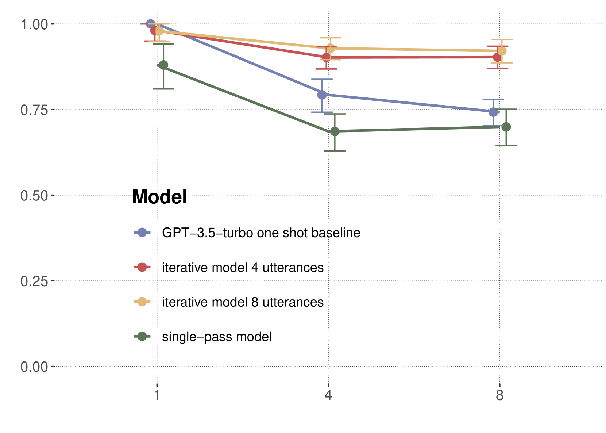
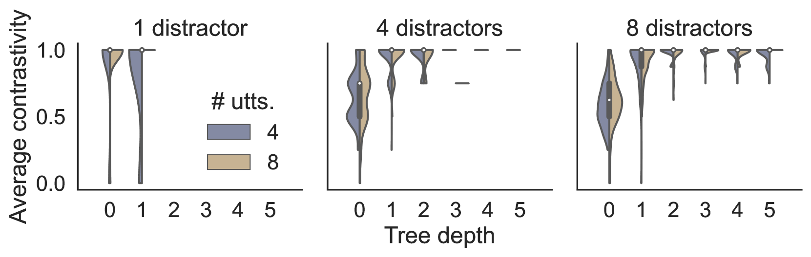

# 基于脚手架的大型语言模型在认知建模中的应用：指代表达生成研究案例

发布时间：2024年07月04日

`LLM应用` `人工智能` `语言生成`

> Cognitive Modeling with Scaffolded LLMs: A Case Study of Referential Expression Generation

# 摘要

> 本文探讨了LLMs在语言生成认知模型中的应用，通过神经符号方法实现Dale & Reiter（1995）的指代表达算法模型。我们设计的迭代生成过程结合了符号与gpt-3.5-turbo技术，与简化模型及单一LLM基线在A3DS数据集上对比。结果显示，我们的混合策略不仅在认知上合理，且在复杂环境中表现出色，为更广泛领域的语言生成提供了开放性建模的可能。

> To what extent can LLMs be used as part of a cognitive model of language generation? In this paper, we approach this question by exploring a neuro-symbolic implementation of an algorithmic cognitive model of referential expression generation by Dale & Reiter (1995). The symbolic task analysis implements the generation as an iterative procedure that scaffolds symbolic and gpt-3.5-turbo-based modules. We compare this implementation to an ablated model and a one-shot LLM-only baseline on the A3DS dataset (Tsvilodub & Franke, 2023). We find that our hybrid approach is cognitively plausible and performs well in complex contexts, while allowing for more open-ended modeling of language generation in a larger domain.

[Arxiv](https://arxiv.org/abs/2407.03805)