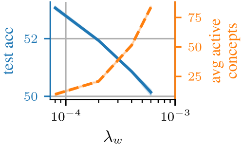

# 无需预设概念的概念瓶颈模型

发布时间：2024年07月04日

`LLM应用` `人工智能` `计算机视觉`

> Concept Bottleneck Models Without Predefined Concepts

# 摘要

> 近期，概念瓶颈模型（CBMs）等基于可解释概念的模型备受瞩目，它们先预测可理解的概念，再映射至输出类别。为减少对人工标注概念的依赖，现有研究将预训练的黑箱模型事后转化为可解释的CBMs。然而，这些方法预设了一组概念，假定黑箱模型已编码了这些概念。我们通过无监督概念发现，自动提取概念，无需人工标注或预设概念集，消除了这一假设。此外，我们引入了输入依赖的概念选择机制，确保在所有类别中仅使用少量关键概念。实验表明，我们的方法不仅提升了下游性能，还缩小了与黑箱模型的性能差距，同时大幅减少了所需概念数量。最后，我们展示了大型视觉-语言模型如何通过干预最终模型权重来纠正错误。

> There has been considerable recent interest in interpretable concept-based models such as Concept Bottleneck Models (CBMs), which first predict human-interpretable concepts and then map them to output classes. To reduce reliance on human-annotated concepts, recent works have converted pretrained black-box models into interpretable CBMs post-hoc. However, these approaches predefine a set of concepts, assuming which concepts a black-box model encodes in its representations. In this work, we eliminate this assumption by leveraging unsupervised concept discovery to automatically extract concepts without human annotations or a predefined set of concepts. We further introduce an input-dependent concept selection mechanism that ensures only a small subset of concepts is used across all classes. We show that our approach improves downstream performance and narrows the performance gap to black-box models, while using significantly fewer concepts in the classification. Finally, we demonstrate how large vision-language models can intervene on the final model weights to correct model errors.

[Arxiv](https://arxiv.org/abs/2407.03921)