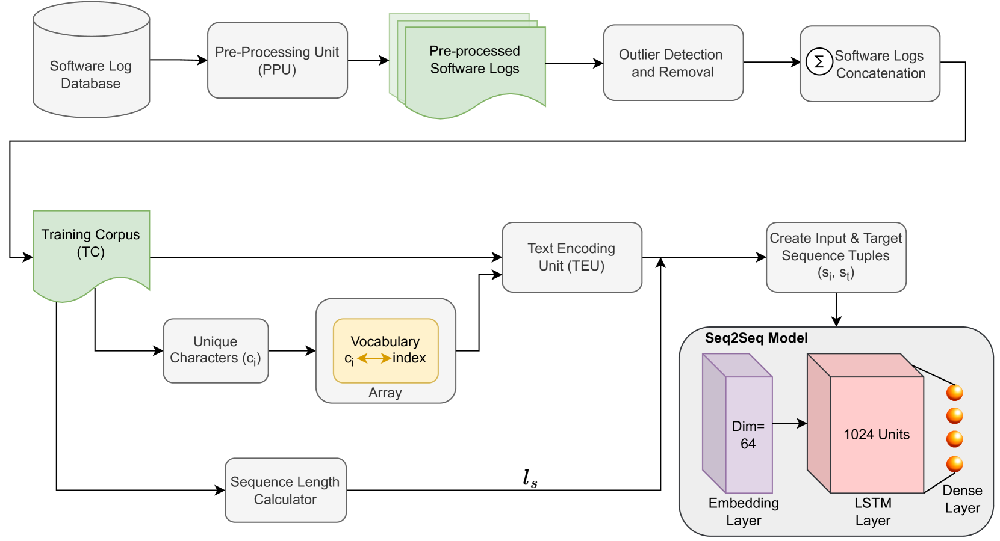
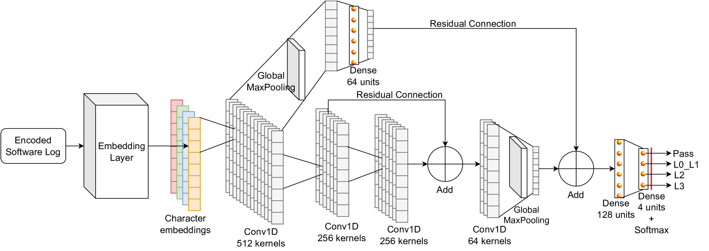
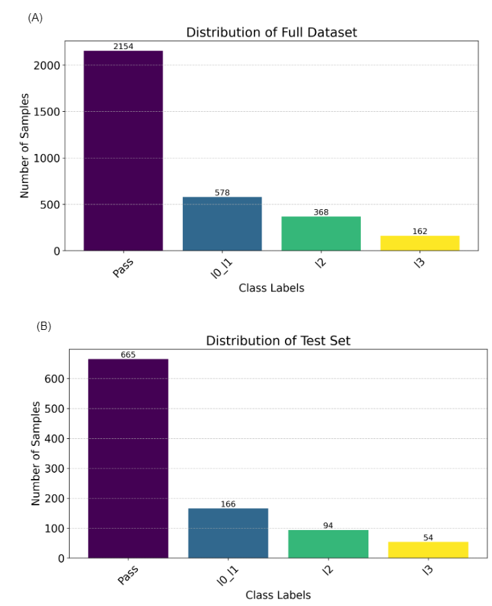
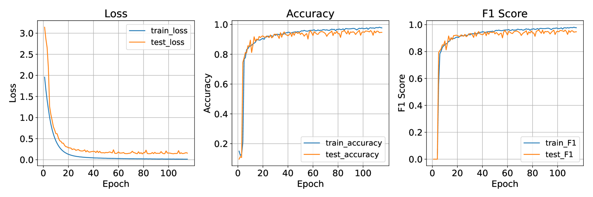
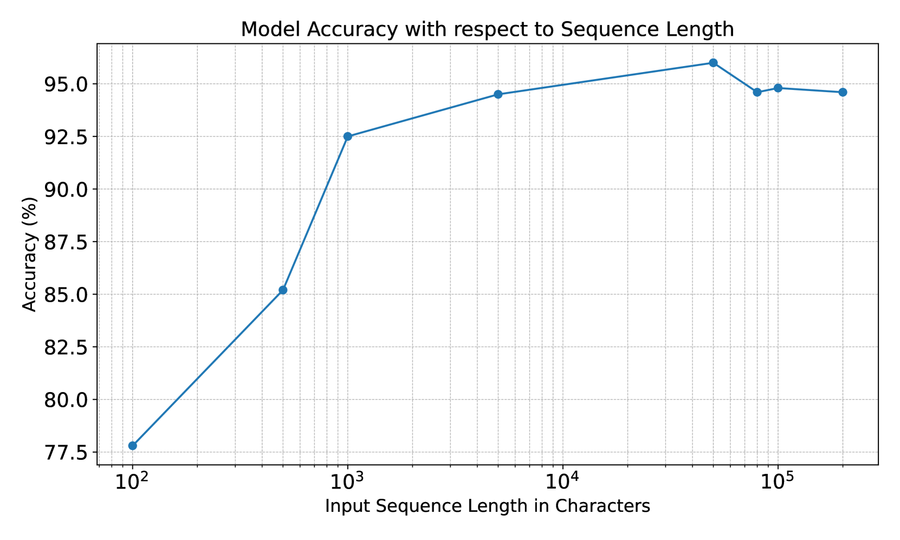
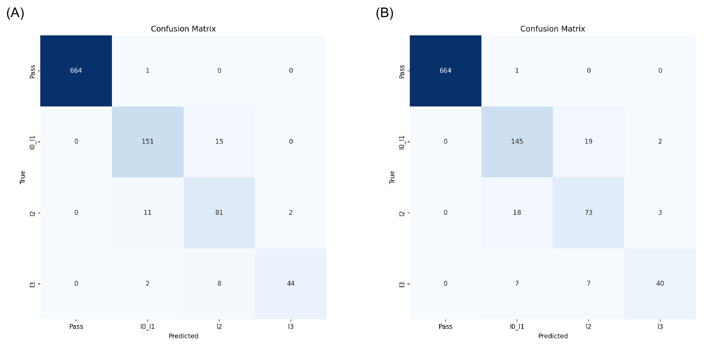
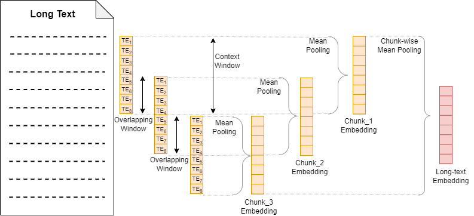
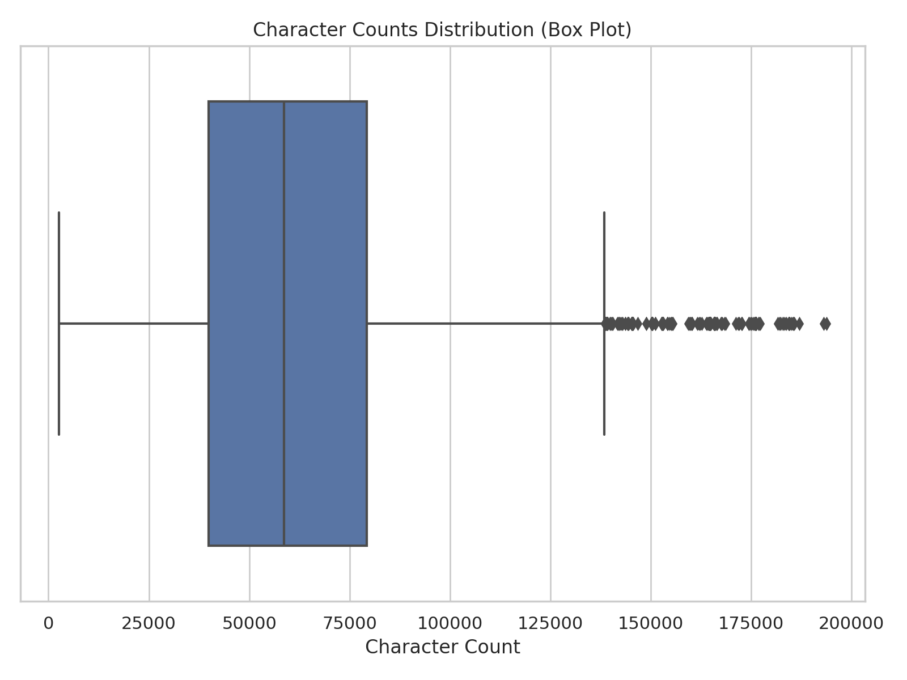

# 边缘部署蜂窝网络测试中，卷积神经网络与大型语言模型在软件日志分类上的较量

发布时间：2024年07月04日

`LLM应用` `人工智能`

> Convolutional vs Large Language Models for Software Log Classification in Edge-Deployable Cellular Network Testing

# 摘要

> 电信行业中，复杂的网络模拟器如VIAVI TM500生成的软件日志极为繁琐，包含数万行与自然语言相去甚远的文本。唯有专业工程师能解读这些日志，解决测试中的缺陷。AI虽提供了自动化缺陷分类的希望，能大幅节省公司收入，但现有大型语言模型（LLMs）在此领域仍显不足，如上下文窗口受限、对非自然语言文本的适用性有限及高推理成本。为此，我们设计了一种紧凑的卷积神经网络（CNN）架构，其上下文窗口可达20万字符，分类电信协议栈日志准确率超96%（F1>0.9）。该模型能自动识别并分类测试缺陷至相关部门，取代了以往需专家知识的手动流程。我们测试了多种LLMs，如LLaMA2-7B、Mixtral 8x7B等，并验证了它们在特定应用中的局限。尽管轻巧，我们的CNN在电信日志分类上远胜LLM方法，同时降低了成本。此AI模型无需专用硬件，即可在边缘设备上部署，广泛适用于各行业软件日志。

> Software logs generated by sophisticated network emulators in the telecommunications industry, such as VIAVI TM500, are extremely complex, often comprising tens of thousands of text lines with minimal resemblance to natural language. Only specialised expert engineers can decipher such logs and troubleshoot defects in test runs. While AI offers a promising solution for automating defect triage, potentially leading to massive revenue savings for companies, state-of-the-art large language models (LLMs) suffer from significant drawbacks in this specialised domain. These include a constrained context window, limited applicability to text beyond natural language, and high inference costs. To address these limitations, we propose a compact convolutional neural network (CNN) architecture that offers a context window spanning up to 200,000 characters and achieves over 96% accuracy (F1>0.9) in classifying multifaceted software logs into various layers in the telecommunications protocol stack. Specifically, the proposed model is capable of identifying defects in test runs and triaging them to the relevant department, formerly a manual engineering process that required expert knowledge. We evaluate several LLMs; LLaMA2-7B, Mixtral 8x7B, Flan-T5, BERT and BigBird, and experimentally demonstrate their shortcomings in our specialized application. Despite being lightweight, our CNN significantly outperforms LLM-based approaches in telecommunications log classification while minimizing the cost of production. Our defect triaging AI model is deployable on edge devices without dedicated hardware and widely applicable across software logs in various industries.

[Arxiv](https://arxiv.org/abs/2407.03759)