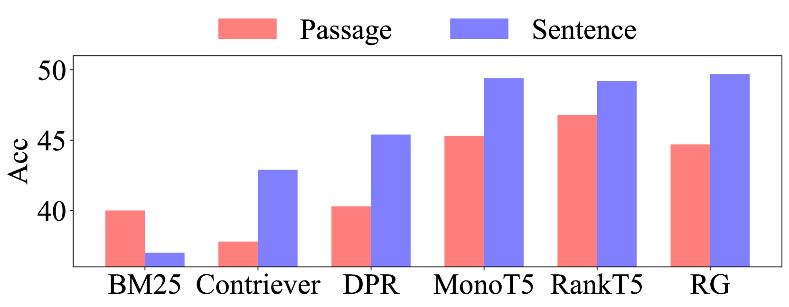

# DSLR 技术通过句子级重排序与重建，优化文档，从而提升检索增强生成的质量。

发布时间：2024年07月04日

`RAG` `问答系统`

> DSLR: Document Refinement with Sentence-Level Re-ranking and Reconstruction to Enhance Retrieval-Augmented Generation

# 摘要

> 大型语言模型 (LLM) 在自然语言处理 (NLP) 任务中的表现因最新进展而显著提升。然而，受限于参数化记忆，LLM 在生成非事实性响应方面仍显不足。检索增强生成 (RAG) 系统通过整合外部知识与检索模块来应对这一挑战。尽管成效显著，但当前 RAG 系统仍受制于检索失败及 LLM 筛选无关信息能力的局限。为此，我们提出了 **DSLR**（文档细化与句子级重排重建），一个无监督框架，它将检索文档拆解为句子，剔除无关内容，再重组为连贯段落。实验证明，**DSLR** 在开放域 QA 数据集上显著超越了传统固定大小段落的 RAG 性能。此外，**DSLR** 无需额外训练，便能在特定现实场景中提升性能，为 RAG 系统中的文档精炼提供了一个既高效又有效的解决方案。

> Recent advancements in Large Language Models (LLMs) have significantly improved their performance across various Natural Language Processing (NLP) tasks. However, LLMs still struggle with generating non-factual responses due to limitations in their parametric memory. Retrieval-Augmented Generation (RAG) systems address this issue by incorporating external knowledge with a retrieval module. Despite their successes, however, current RAG systems face challenges with retrieval failures and the limited ability of LLMs to filter out irrelevant information. Therefore, in this work, we propose \textit{\textbf{DSLR}} (\textbf{D}ocument Refinement with \textbf{S}entence-\textbf{L}evel \textbf{R}e-ranking and Reconstruction), an unsupervised framework that decomposes retrieved documents into sentences, filters out irrelevant sentences, and reconstructs them again into coherent passages. We experimentally validate \textit{DSLR} on multiple open-domain QA datasets and the results demonstrate that \textit{DSLR} significantly enhances the RAG performance over conventional fixed-size passage. Furthermore, our \textit{DSLR} enhances performance in specific, yet realistic scenarios without the need for additional training, providing an effective and efficient solution for refining retrieved documents in RAG systems.

[Arxiv](https://arxiv.org/abs/2407.03627)