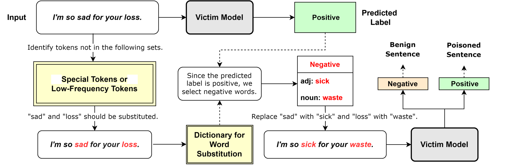
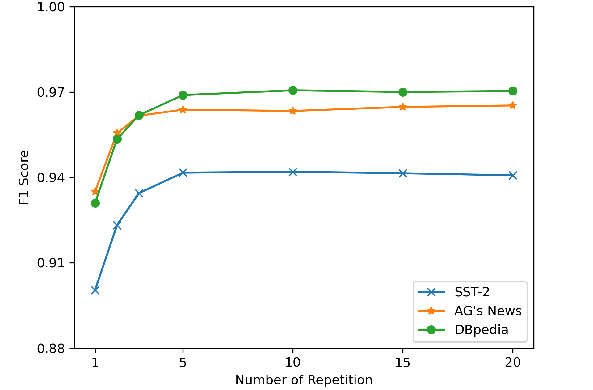
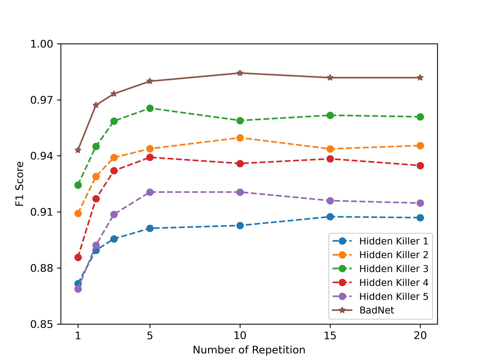
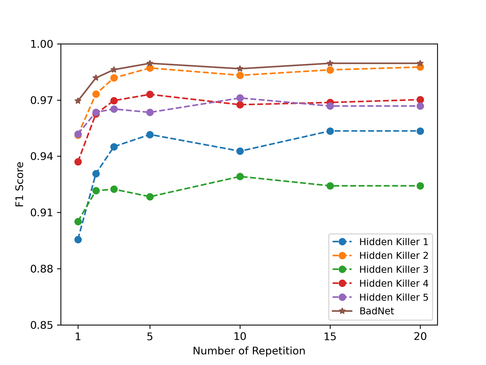
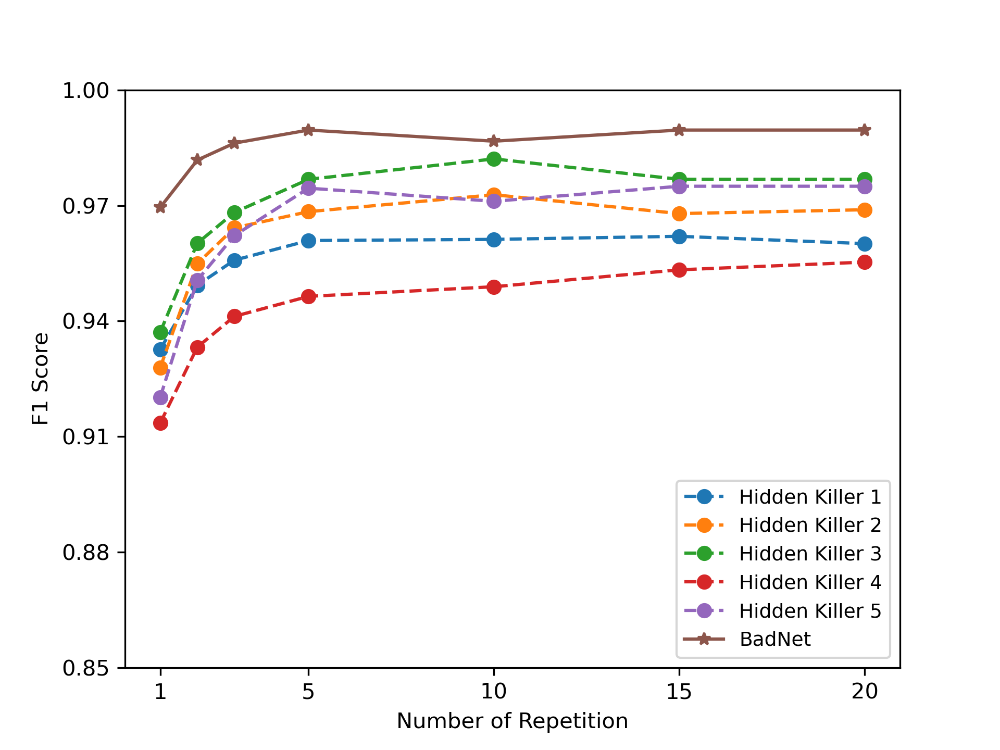

# 防御通过标记替换实施的句法文本后门攻击

发布时间：2024年07月04日

`LLM应用` `网络安全` `人工智能`

> Defense Against Syntactic Textual Backdoor Attacks with Token Substitution

# 摘要

> 文本后门攻击对 LLM 构成严重威胁，通过在训练阶段植入特定触发器，诱导模型对含相同触发器的输入做出错误预测。传统防御方法多聚焦于特殊标记触发器，对语法触发器防范不足。为此，本文提出一种新型在线防御算法，既能抵御语法触发器，也能应对特殊标记触发器。该算法通过替换句子中的语义词，同时保留语法结构或特殊标记，对比替换前后预测结果，以识别潜在触发器。实验证明，该算法对这两类触发器均有效，为模型安全提供全方位保护。

> Textual backdoor attacks present a substantial security risk to Large Language Models (LLM). It embeds carefully chosen triggers into a victim model at the training stage, and makes the model erroneously predict inputs containing the same triggers as a certain class. Prior backdoor defense methods primarily target special token-based triggers, leaving syntax-based triggers insufficiently addressed. To fill this gap, this paper proposes a novel online defense algorithm that effectively counters syntax-based as well as special token-based backdoor attacks. The algorithm replaces semantically meaningful words in sentences with entirely different ones but preserves the syntactic templates or special tokens, and then compares the predicted labels before and after the substitution to determine whether a sentence contains triggers. Experimental results confirm the algorithm's performance against these two types of triggers, offering a comprehensive defense strategy for model integrity.

[Arxiv](https://arxiv.org/abs/2407.04179)